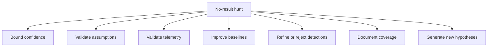

---

title: "No Result Hunts"
description: "A practical explanation of why threat hunts with no findings can still create value, and how hunters should interpret, document and learn from clean results."
date: 2024-11-03T09:48:57+01:00
lastmod: 2026-07-13
draft: false
hidden: false
weight: 7
tags:
  - threat hunting
  - no result hunts
  - hunting outcomes
  - visibility gaps
  - documentation
  - baselines
keywords:
  - no result hunts
  - threat hunting outcomes
  - clean hunt
  - no findings
  - visibility gaps
  - detection validation
  - hunt documentation
  - baselines
  - hypothesis-driven hunting
  - threat hunting value
---

**Author:** *Roger C.B. Johnsen*

## Introduction

**A threat hunt can be valuable even when no threat is found That statement is important because many people instinctively measure threat hunting by whether it produces a confirmed incident, a detection, a compromised host or an interesting finding. That is understandable.**

Security work is often judged by visible outcomes. But threat hunting does not only create value when it finds an adversary. A hunt can also validate assumptions, test telemetry, improve baselines, reveal visibility gaps, refine detection logic, strengthen documentation and teach the team more about the environment.

A clean result is therefore not automatically a failed hunt. It is also not automatically proof that everything is fine. A no-result hunt should be treated as an investigative outcome that needs interpretation.

The useful question is not:

```text
Did we find anything?
```

The better question is:

```text
What did this hunt allow us to test, and what did we learn from the result?
```

Sometimes the answer is reassuring. Sometimes the answer is uncomfortable. Both can be valuable.

> A hunt with no findings is not worthless. It is only worthless if the team learns nothing from it.
>
> -- Roger Johnsen

## What a No-Result Hunt Is

A no-result hunt is a hunt where the team does not identify confirmed malicious activity, suspicious behaviour or actionable findings within the defined scope. It is a result, not an absence of work. That does not mean that there was no adversary activity anywhere in the environment. It means that the hunt did not find evidence of the behaviour being tested, within the data, scope, time range and assumptions used.

A no-result hunt may mean:

* the behaviour was not present
* the hypothesis was not supported
* the environment is not exposed to the tested technique
* existing controls disrupted the behaviour
* the data did not contain the required evidence
* the time range was wrong
* the scope was too narrow
* the query logic was weak
* the telemetry was incomplete
* the adversary used a variation not covered by the hunt

The result is not only “nothing found”. The result is what can be concluded from the test. A good no-result hunt should therefore document what was tested, what data was used, what was not covered and how much confidence the team has in the result.

## Clean Does Not Mean Certain

One of the most common mistakes in threat hunting is treating a clean result as certainty. A clean result may increase confidence, but it should not remove doubt.

The hunter should avoid statements such as:

```text
There is no compromise.
The environment is clean.
The threat is not present.
```

Those statements are usually too broad. A stronger statement would be:

```text
Within the scoped systems, time range and available telemetry, we did not observe evidence supporting this hypothesis.
```

That wording is less dramatic, but it is more accurate. It tells the reader what was tested and avoids pretending that the hunt proved more than it actually did.

Threat hunting is not magic. It depends on telemetry, scope, retention, query logic, assumptions, environmental knowledge and analyst judgement. If any of those are weak, a no-result hunt may say more about the hunt design than about the absence of an adversary.

## Why No-Result Hunts Still Matter

A no-result hunt can create value in several ways.



The important part is that the team actively extracts value from the result. If the team simply closes the hunt with “nothing found”, most of the value is lost.

## Bounding Confidence

A no-result hunt can bound confidence when the hunt was well designed and the relevant telemetry was available. For example, if the hypothesis was narrow, the scope was appropriate, the data sources were strong and the logic was reviewed, a clean result may suggest that the tested behaviour was not present in that part of the environment during the selected time period.

That is useful. It can help the team reduce uncertainty and prioritise other work. But confidence should always be bounded.

A strong conclusion might look like this:

```text
No evidence of encoded PowerShell execution was observed on the scoped user workstations during the selected 14-day period.
The conclusion is based on available endpoint process telemetry.
Confidence is medium to high for the scoped systems.
```

That is better than saying:

```text
No PowerShell abuse found.
```

The first version explains the scope, evidence and confidence. The second version hides the limitations.

## Testing Assumptions

Every hunt tests assumptions. A hypothesis-driven hunt tests whether a specific belief is supported by evidence. An intelligence-driven hunt tests whether reported behaviour appears locally. An anomaly-driven hunt tests whether unusual behaviour has security meaning.

When a hunt returns no findings, the team should ask:

```text
Was the assumption wrong, or was the test unable to evaluate it properly?
```

Those are different outcomes. If the assumption was wrong, the hunt still helped reduce uncertainty. If the test was weak, the hunt revealed a process, telemetry or logic problem.

Both are useful.

Examples:

| Hunt assumption                                                        | No-result interpretation                                                                                                                           |
| ---------------------------------------------------------------------- | -------------------------------------------------------------------------------------------------------------------------------------------------- |
| Users are executing encoded PowerShell from workstations.              | The behaviour was not observed in the scoped telemetry and time range. The conclusion depends on endpoint coverage and command-line visibility.    |
| A reported actor technique is relevant locally.                        | The technique may not apply locally, or the organisation may need to validate whether the required telemetry exists.                               |
| A service account is being abused for lateral movement.                | The account behaviour may be normal, but authentication paths, peer groups and administrative patterns should be reviewed before closing the hunt. |
| Rare parent-child process relationships indicate suspicious execution. | The rare pattern may not exist, or the baseline may be too weak to distinguish rare-but-normal from suspicious.                                    |

A no-result hunt should therefore improve the team’s understanding of the original assumption.

## Validating Telemetry

A clean result is only meaningful if the team knows whether the right data was available. This is one of the most important uses of no-result hunts.

The hunt may show that:

* the required logs exist
* the logs are retained long enough
* fields are populated consistently
* endpoint coverage is sufficient
* cloud audit logs contain the required events
* identity telemetry can support the hypothesis
* network telemetry does not cover the relevant path
* the environment cannot currently test the behaviour properly

This can be more valuable than finding a single suspicious event. A hunt that reveals missing telemetry has found a visibility gap.

A visibility gap is a valid hunt outcome.

For example:

```text
The hunt could not determine whether OAuth consent abuse occurred because the required audit events were not retained for the period under review.
```

That is not failure. It is a finding about the organisation’s ability to investigate.

## Improving Baselines

No-result hunts can improve the team’s understanding of normal behaviour. This is especially important in anomaly-driven and baseline-driven hunting. A hunt may show that certain activity is normal for a specific group, system, application or time period. It may also show that what the team assumed was normal is not actually well understood.

For example:

* which service accounts normally access which systems
* which administrators normally use PowerShell
* which users travel frequently
* which applications create scheduled tasks
* which systems generate high authentication volume
* which cloud applications normally receive OAuth consent
* which processes are normal for specific server roles

This knowledge is valuable because future hunts and detections depend on environmental context. Without baselines, everything rare looks suspicious. With better baselines, the team can separate unusual from meaningful.

## Refining Detection Logic

A no-result hunt can also help refine detection logic. Many detections start as hunt queries. A hunt may show that a query is too narrow, too broad, too expensive, too noisy or not aligned with how the environment actually behaves.

A clean result may mean that the behaviour is absent. It may also mean that the query logic is wrong.

The team should ask:

| Question                                           | Why it matters                                          |
| -------------------------------------------------- | ------------------------------------------------------- |
| Did the query actually test the behaviour?         | Prevents false confidence from weak logic.              |
| Were the right data sources used?                  | Ensures the evidence could exist in the searched data.  |
| Was the time range appropriate?                    | Prevents missing activity outside the selected period.  |
| Was the scope too narrow?                          | Prevents excluding relevant systems or users.           |
| Were field names, event types and parsing correct? | Prevents technical query mistakes.                      |
| Would the query detect a known test case?          | Helps validate that the logic works.                    |
| Is the query reusable as detection logic?          | Determines whether the hunt can produce durable output. |

A no-result hunt should not automatically become a detection. It may also invalidate a detection idea. If the behaviour cannot be observed reliably, cannot be scoped meaningfully or would only create noise, the right outcome may be to stop the detection work rather than promote weak logic into production.

But it may produce improved query logic, clearer detection requirements, better tuning or a validation test.

## Documentation and Audit Value

A no-result hunt also has documentation value. It shows that the team proactively investigated a defined risk, hypothesis, behaviour or intelligence report.

That can matter for:

* internal assurance
* audit readiness
* regulatory evidence
* management reporting
* incident preparedness
* detection coverage mapping
* future hunt planning
* knowledge transfer

The documentation should not simply say:

```text
No findings.
```

It should explain:

* what was tested
* why it was tested
* what data was used
* what was in scope
* what was out of scope
* what was observed
* what was not observed
* what limitations existed
* what confidence the team has
* what should happen next

This turns “nothing found” into reusable knowledge.

## Knowledge About the Organisation

Every hunt teaches the team something about the organisation. Even when no threat is found, the team may learn:

* how systems behave
* where important logs are stored
* which teams own which platforms
* which business processes create unusual activity
* which accounts are critical
* which telemetry is unreliable
* which detections are noisy
* which assumptions were wrong
* which parts of the environment are poorly understood

This knowledge is extremely useful during future hunts and incidents. During an incident, the team that already understands the environment moves faster. It knows what normal looks like, where to find evidence, which owners to contact and which systems matter.

No-result hunts help build that institutional knowledge.

## How to Document a No-Result Hunt

A no-result hunt should be documented with enough detail that another analyst can understand what was tested and what the result means.

A useful structure is:

```text
Hunt name:
[Short name]

Trigger:
[Hypothesis, intelligence, anomaly, incident, risk, gap or previous hunt]

Question:
[What the hunt tried to answer]

Scope:
[Systems, users, data sources, time range and exclusions]

Method:
[Short explanation of how the hunt was performed]

Result:
[No evidence observed / no suspicious activity identified / hypothesis not supported]

Limitations:
[Missing telemetry, retention, scope, parsing, confidence or other constraints]

Confidence:
[Low, medium or high, with reason]

Output:
[Detection improvement, baseline update, visibility gap, documentation, follow-up hunt or no further action]

Next steps:
[What should happen next]
```

This does not need to be long.

It needs to be clear and reproducible. Another analyst should be able to understand what was tested, how it was tested and why the conclusion was reached.

## Example: No-Result Hunt Documentation

```text
Hunt name:
Encoded PowerShell from User Workstations

Trigger:
Hypothesis-driven hunt based on recent phishing activity and common post-exploitation behaviour.

Question:
Are users executing encoded PowerShell commands from standard workstations after receiving phishing emails?

Scope:
- User workstations associated with the phishing campaign
- Device process telemetry
- 14-day period after campaign delivery
- PowerShell command-line activity
- Excludes administrative jump hosts and known automation systems

Method:
Reviewed PowerShell process execution where command lines contained encoded command flags or suspicious obfuscation patterns. Compared results against affected users and campaign timing.

Result:
No evidence of encoded PowerShell execution was observed on the scoped user workstations during the selected period.

Limitations:
The hunt only covered devices with available endpoint telemetry. It did not cover unmanaged personal devices or systems without process command-line logging. The hunt also did not test for payload execution through non-PowerShell interpreters.

Confidence:
Medium to high for managed workstations in scope.
Low for unmanaged devices and execution methods outside the tested behaviour.

Output:
- No incident escalation based on this hypothesis.
- Query saved as a reusable hunt query.
- Follow-up hunt recommended for suspicious script interpreter activity beyond PowerShell.

Next steps:
Run follow-up hunt for unusual use of cmd.exe, wscript.exe, cscript.exe, mshta.exe and rundll32.exe among affected users.
```

This example does not pretend to prove that nothing happened.

It explains what was tested, what was not observed and where the conclusion is limited.

That is the correct posture for no-result hunts.

## When a Clean Result Should Worry You

A no-result hunt should not always be comforting. Sometimes a clean result is a warning sign.

The team should be sceptical when:

* the hypothesis was vague
* the scope was too narrow
* the data source was incomplete
* the query was not validated
* the hunt depended only on low-level indicators
* the expected data was missing
* the environment is poorly understood
* the hunt repeatedly returns nothing across many different behaviours
* no visibility gaps are ever documented
* every clean result is treated as success

If every hunt returns no findings and no learning, something may be wrong.

* The team may not be hunting deeply enough.
* The telemetry may be too weak.
* The hypotheses may be too safe.
* The team may be avoiding uncomfortable parts of the environment.

The purpose of threat hunting is not to produce interesting findings every time. But it should produce learning.

## Refining Future Hunts After a Clean Result

A clean result should feed the next hunt.

The team should ask:

```text
What should we do differently next time?
```

Possible refinements include:

| Refinement               | Example                                                                           |
| ------------------------ | --------------------------------------------------------------------------------- |
| Expand scope             | Include additional systems, identities, cloud platforms or business units.        |
| Improve telemetry        | Add missing logs, increase retention or fix parsing problems.                     |
| Adjust the hypothesis    | Make the hypothesis more specific, testable or realistic.                         |
| Test adjacent behaviour  | Move from one technique to related techniques or procedures.                      |
| Improve query logic      | Validate fields, event types, joins, filters and edge cases.                      |
| Add baselines            | Compare behaviour against peer groups, roles or historical patterns.              |
| Incorporate intelligence | Use updated threat intelligence or recent incident reporting to refine the hunt.  |
| Create validation data   | Use red team, purple team or simulation activity to test whether the logic works. |
| Automate reusable parts  | Save repeatable queries, documentation patterns or enrichment steps.              |

The goal is not to force findings. The goal is to improve the next investigation.

## Working Position for This Book

For this book, a no-result hunt is a valid outcome when the hunt was properly scoped, tested and documented. But it must be interpreted carefully.

A clean result should never be treated as a universal statement that the environment is safe. It should be treated as a scoped conclusion based on the data available at the time.

The practical standard is simple:

```text
Can another analyst understand what we tested, what we did not test and what we learned?
```

If the answer is yes, the hunt created value. Even if no adversary was found.

## Resources

* [The PEAK Threat Hunting Framework](https://www.splunk.com/en_us/pdfs/gated/ebooks/splunk-peak-threat-hunting-framework.pdf)
* [Introducing the PEAK Threat Hunting Framework](https://www.splunk.com/en_us/blog/security/peak-threat-hunting-framework.html)
* [ThreatHunting.org](https://threathunting.org)
* [The DFIR Report](https://thedfirreport.com/)
* [Pyramid of Pain by David Bianco](https://detect-respond.blogspot.com/2013/03/the-pyramid-of-pain.html)
* [MITRE ATT&CK](https://attack.mitre.org/)

## Revision

| Revised Date | Comment                                                                                                                                                                                            |
| ------------ | -------------------------------------------------------------------------------------------------------------------------------------------------------------------------------------------------- |
| 2026-07-10   | Major rewrite. Reframed no-result hunts as scoped investigative outcomes that can validate assumptions, reveal gaps, improve baselines, refine or reject detections and create reusable knowledge. |
| 2024-11-03   | Page added                                                                                                                                                                                         |
