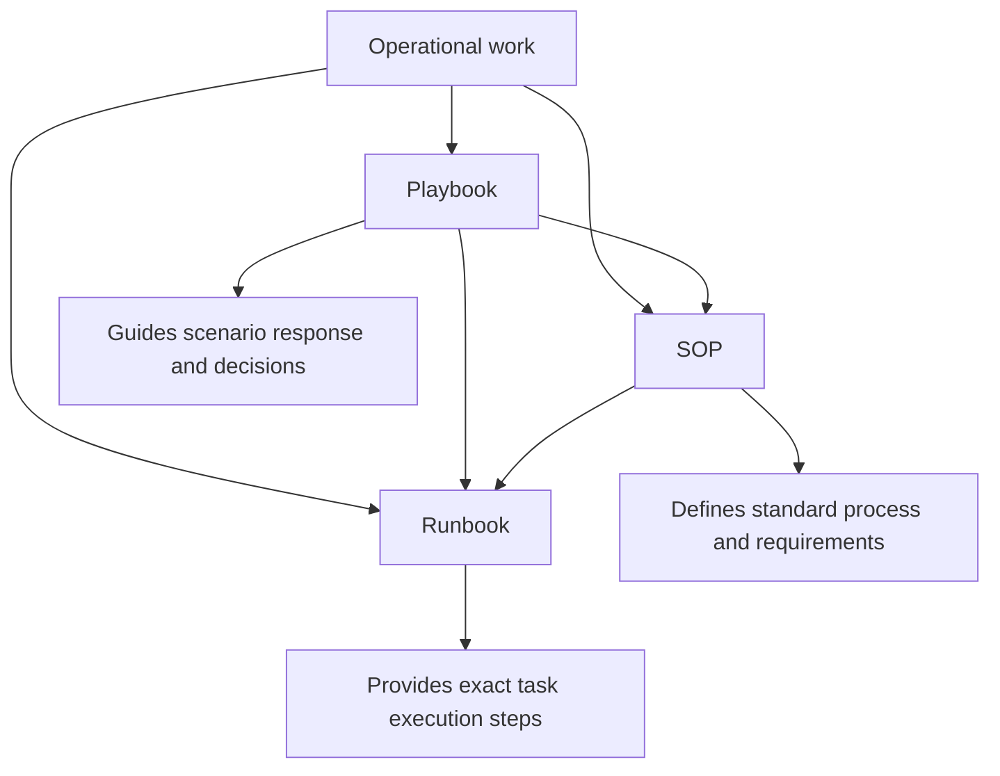

+++
title = "Process Documentation"
description = "An overview of process documentation in security operations, and how SOPs, playbooks and runbooks support consistent, repeatable and effective SOC and threat hunting work."
date = 2024-10-26T10:00:00+02:00
lastmod = 2026-07-10
draft = false
weight = 1
chapter = false
tags = [
"process documentation",
"SOC",
"threat hunting",
"playbooks",
"runbooks",
"SOP"
]
keywords = [
"process documentation",
"security operations documentation",
"SOC documentation",
"SOP",
"standard operating procedure",
"playbook",
"runbook",
"threat hunting documentation",
"incident response documentation"
]
+++

**Author:** *Roger C.B. Johnsen*

## Introduction

**Process documentation helps security teams turn knowledge into repeatable practice. In SOC operations, threat hunting and incident management, good work should not depend entirely on who happens to be on shift, who remembers a previous case, or who knows where the right query is stored. Documentation helps reduce that dependency. Without it, security operations do not scale.**

It gives analysts a shared way of working. It helps teams respond consistently, hand over work, train new people, preserve lessons learned and improve over time. It also makes security operations easier to review, audit and mature.

Threat hunters contribute to this documentation in an important way. A hunt may reveal a new behaviour, a visibility gap, a useful query, a detection opportunity, a triage pattern or a better way to investigate a class of activity. If that knowledge stays in the hunter’s notebook, chat history or memory, much of the value is lost.

If it becomes structured documentation, it can help the SOC long after the hunt is finished.That is why process documentation matters. It turns individual learning into team capability.

## Why Process Documentation Matters

Security operations are full of repeated patterns:

* A suspicious login needs triage.
* A malware alert needs validation.
* A phishing report needs intake.
* A host isolation request needs approval and execution.
* A threat hunt finding needs handover.
* A detection needs tuning.
* An incident needs escalation.

Without process documentation, each analyst may solve these problems in a slightly different way. Some variation is healthy, because investigation requires judgement. But too much variation creates risk:

* The team may miss steps.
* Escalations may be inconsistent.
* Evidence may not be preserved.
* Communication may be unclear.
* Lessons may not survive beyond the person who discovered them.

Good process documentation helps with operational consistency, training, handover and escalation. It also supports quality control, auditability, automation, incident readiness, continuous improvement and knowledge retention.

The purpose is not to remove thinking from security work. The purpose is to make sure analysts do not have to reinvent the basics every time.

> Documentation should not replace judgement. It should protect the team from forgetting what good judgement already learned.
>
> -- Roger Johnsen

## The Main Documentation Types

This section introduces three common types of process documentation used in security operations:

| Document type | Main purpose                                            |
| ------------- | ------------------------------------------------------- |
| SOP           | Defines the standard way a process should be performed. |
| Playbook      | Guides response or investigation for a scenario.        |
| Runbook       | Provides exact steps for completing a specific task.    |

They are related, but they are not the same. A simple way to separate them is:

```text
SOP      → what must be done consistently
Playbook → how to handle a scenario
Runbook  → how to execute a task
```

For example, an organisation may have:

* an SOP for incident escalation
* a playbook for ransomware response
* a runbook for isolating an endpoint in EDR

The SOP defines the expected standard. The playbook helps the team navigate the incident. The runbook gives the exact operational steps for one task inside that response.

## SOPs

A Standard Operating Procedure, or SOP, defines the standard way a recurring process should be performed. An SOP is usually formal. It describes expectations, responsibilities, requirements and boundaries. It helps ensure that important processes are handled consistently across people, shifts and teams.

In security operations, SOPs may cover areas such as:

* alert triage
* incident escalation
* evidence handling
* ticket classification
* shift handover
* stakeholder notification
* vulnerability exception handling
* threat hunt documentation
* detection change management
* communication during incidents

An SOP should answer:

```text
What is the required way of doing this process?
```

It does not need to include every technical click or command. That level of detail often belongs in a runbook.

## Playbooks

A playbook guides the team through a scenario. It is usually more adaptive than an SOP and less granular than a runbook. A playbook helps analysts understand what to consider, which decisions may be needed, what evidence to collect, who to involve and what response paths may apply.

In security operations, playbooks may cover scenarios such as:

* phishing
* ransomware
* suspected account compromise
* malware infection
* data exfiltration
* suspicious PowerShell activity
* cloud token abuse
* insider risk
* critical vulnerability exploitation
* threat hunting follow-up

A playbook should answer:

```text
How should we approach this type of situation?
```

A playbook may reference SOPs and runbooks. For example, a ransomware playbook may reference the incident escalation SOP, the communication SOP, the endpoint isolation runbook and the backup validation runbook.

## Runbooks

A runbook provides detailed, repeatable steps for completing a specific operational task. Runbooks are often task-oriented and practical. They may include commands, screenshots, tool instructions, queries, decision checks, validation steps and rollback guidance.

In security operations, runbooks may cover tasks such as:

* isolating a host in EDR
* revoking user sessions
* resetting credentials
* collecting endpoint artefacts
* exporting sign-in logs
* blocking a domain
* disabling a service account
* running a hunt query
* collecting email headers
* preserving evidence from a mailbox
* opening an incident bridge

A runbook should answer:

```text
Exactly how do I perform this task?
```

A good runbook should be clear enough that a trained analyst can execute the task consistently without guessing.

## How They Work Together

SOPs, playbooks and runbooks support different layers of operational work. They do not need to form a strict hierarchy. In practice, they often reference each other.



A practical example:

```text
Scenario:
Suspected compromised account

Relevant documentation:
SOP      → Incident escalation and evidence handling
Playbook → Account compromise investigation
Runbook  → Revoke sessions in identity platform
Runbook  → Reset password
Runbook  → Review recent sign-ins
Runbook  → Check mailbox rules
```

This is usually how documentation works in the real world.

* The playbook gives the scenario structure.
* The SOP defines the required standards.
* The runbooks explain how to execute specific tasks.

## Comparison

The table below summarises the practical differences.

| Document type | Level    | Focus                            | Typical content                                                                         | Example                      |
| ------------- | -------- | -------------------------------- | --------------------------------------------------------------------------------------- | ---------------------------- |
| SOP           | Standard | Consistency and governance       | Roles, requirements, approval points, escalation rules, evidence standards              | Incident escalation SOP      |
| Playbook      | Scenario | Investigation and response logic | Decision points, evidence to collect, response paths, stakeholders, containment options | Ransomware response playbook |
| Runbook       | Task     | Repeatable technical execution   | Commands, tool steps, queries, validation checks, rollback steps                        | Isolate host in EDR runbook  |

A useful shortcut is:

```text
If the question is “what is the required process?”, write an SOP.
If the question is “how do we handle this scenario?”, write a playbook.
If the question is “how do I perform this task?”, write a runbook.
```

## Threat Hunters and Process Documentation

Threat hunters should not work in isolation from process documentation. A good hunt often produces knowledge that should become operational.

For example, a threat hunt may produce:

* a useful investigation pattern
* a reusable query
* a detection candidate
* analyst guidance
* a visibility gap
* a new escalation criterion
* a better triage question
* a known-good baseline
* a list of artefacts to collect
* a recommendation for response handling

Those outputs can improve process documentation.

| Hunt output                | Possible documentation update                   |
| -------------------------- | ----------------------------------------------- |
| New investigation pattern  | Add to a playbook.                              |
| Reusable query             | Add to a runbook or hunt library.               |
| Detection candidate        | Add to detection engineering backlog.           |
| New escalation criterion   | Update SOP or playbook.                         |
| Visibility gap             | Add to improvement backlog or logging standard. |
| Better triage question     | Update analyst guidance.                        |
| Repeated manual task       | Create or improve a runbook.                    |
| New response consideration | Update relevant playbook.                       |

This is one of the ways threat hunting creates value beyond the individual investigation. The hunt does not only find or fail to find adversaries. It can improve how the SOC works.

## Documentation Should Be Maintained

Process documentation decays if nobody owns it. If a document cannot be trusted, analysts will stop using it.

* Tools change.
* Logging changes.
* Teams change.
* Threats change.
* Organisational requirements change.

A runbook that was correct last year may be dangerous today if the tool interface, command syntax, permissions or approval flow has changed.

A playbook that never incorporates lessons from incidents and hunts will slowly become theoretical.

An SOP that nobody follows is not an operating procedure. It is archived intent.

Each document should therefore have:

* an owner
* a review cadence
* a last reviewed date
* a clear scope
* version history
* approval requirements where needed
* links to related documents
* a way to submit improvements

Documentation should be treated as living operational material. Not as a one-time writing exercise. It should also be updated as part of the work, not only after the work is finished. If documentation is always treated as afterwork, it will often be skipped, rushed or disconnected from what actually happened.

## Common Failure Modes

Process documentation often fails in predictable ways.

| Failure mode                    | Why it hurts                                                                       |
| ------------------------------- | ---------------------------------------------------------------------------------- |
| Too generic                     | Analysts cannot use it during real work.                                           |
| Too detailed at the wrong level | SOPs become bloated with technical steps that belong in runbooks.                  |
| No owner                        | Nobody updates the document when tools or processes change.                        |
| No review cadence               | Documentation slowly becomes stale.                                                |
| Too much theory                 | The document explains concepts but does not help execution.                        |
| No link to operations           | Lessons from hunts, incidents and alerts never update the documentation.           |
| Hidden documentation            | Analysts cannot find it when they need it.                                         |
| Blind compliance                | People follow the document without thinking when the situation requires judgement. |

Documentation should support thinking, not replace it.

## How to Read This Section

The subchapters explain each documentation type in more detail:

* Read the SOP article to understand how standard operating procedures define the required way of working.
* Read the Playbook article to understand how scenario-based guidance supports response, investigation and decision-making.
* Read the Runbook article to understand how exact task execution steps help analysts perform operational work consistently.

The three document types are complementary. A mature SOC usually needs all of them.

## Working Position for This Book

For this book, process documentation is treated as a way to preserve and operationalise knowledge.

It is not bureaucracy for its own sake.

It is how a team turns experience into repeatable capability.

The practical standard is simple:

```text
Can the right person find the document, understand it and use it correctly when the situation requires it?
```

If the answer is no, the documentation is not doing its job.

## Resources

* [ATC RE&CT Framework](https://atc-project.github.io/atc-react/)
* [The RE&CT Framework](https://github.com/atc-project/atc-react)
* [What is a Runbook? - PagerDuty](https://www.pagerduty.com/resources/learn/what-is-a-runbook/)
* [Runbook vs. Playbook, SOP, User Guide - Scribe](https://scribehow.com/library/runbook-vs-playbook)
* [How To Create A Runbook For SOC: Practical Guide](https://www.neumetric.com/journal/how-to-create-a-runbook-for-soc-practical-guide/)
* [Open Threat Hunting Framework](https://github.com/TactiKoolSec/OTHF)

## Revision

| Revised Date | Comment                                                                                                                                                |
| ------------ | ------------------------------------------------------------------------------------------------------------------------------------------------------ |
| 2026-07-10   | Major rewrite. Reframed the article as a parent page explaining how SOPs, playbooks and runbooks support repeatable SOC and threat hunting operations. |
| 2024-10-26   | Revised text with regards to sub-chapters                                                                                                              |
