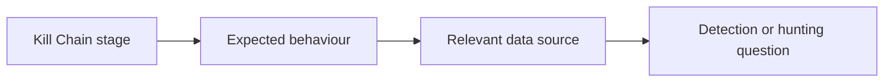

**Author:** *Roger C.B. Johnsen*

## Introduction

**The Lockheed Martin Cyber Kill Chain is a framework for understanding cyber intrusions as a sequence of stages, from early preparation to the attacker’s final objective.**

The model helps defenders reason about where an intrusion may be disrupted. If an organisation can detect or interrupt an attack at an earlier stage, the attacker may never reach command and control, lateral movement, data theft or other final objectives.

For threat hunters, the value of the Kill Chain is not that every intrusion follows the model perfectly. Many real intrusions are messy, iterative and non-linear. The value is that the model gives the hunter a structured way to ask:

* Where in the intrusion lifecycle are we looking?
* What evidence would appear at this stage?
* Which data sources can show it?
* Which controls should have interrupted it?
* What might have happened before or after this activity?

That makes the Kill Chain useful as a reasoning tool, a detection coverage model and a way to think about defensive disruption.

> The Cyber Kill Chain is most useful when it helps defenders ask where an intrusion could have been detected, disrupted or understood earlier.
>
> -- Roger Johnsen

## The Seven Stages

The Cyber Kill Chain consists of seven stages:


Further explanation:

| Stage                 | Meaning                                                                                        |
| --------------------- | ---------------------------------------------------------------------------------------------- |
| Reconnaissance        | The attacker gathers information about the target.                                             |
| Weaponization         | The attacker prepares a payload, exploit or attack package.                                    |
| Delivery              | The attacker transmits the payload or attack mechanism to the target.                          |
| Exploitation          | The attacker triggers code execution or otherwise exploits a weakness.                         |
| Installation          | The attacker installs malware, persistence or another foothold.                                |
| Command and Control   | The attacker establishes communication with controlled infrastructure.                         |
| Actions on Objectives | The attacker performs the intended objective, such as theft, disruption or further compromise. |

The model describes the attacker’s path from preparation to objective. In practice, defenders may only observe part of the chain. A SOC may see delivery through email. EDR may show exploitation or installation. Network telemetry may show command and control. Data logs may show actions on objectives.

The threat hunter’s job is often to connect those fragments.

Many behaviours do not map cleanly to only one stage. PowerShell, for example, may appear during exploitation, installation, command and control, lateral movement or actions on objectives. Forcing a strict classification can reduce analytical clarity. The stage should help the hunter reason about the activity, not constrain the interpretation.

## Reconnaissance

Reconnaissance is the stage where the attacker gathers information about the target. This may include:

* public website review
* employee and role discovery
* social media research
* exposed service enumeration
* DNS and subdomain discovery
* technology fingerprinting
* credential leak research
* supplier or third-party mapping

Reconnaissance may be difficult to see if it happens outside the organisation’s telemetry. Some of it occurs entirely in public sources. But defenders may still observe parts of it, especially when it involves scanning, probing or authentication attempts.

Reconnaissance should not only be understood as something that happens before initial access. Attackers may also perform internal reconnaissance after compromise. That may include Active Directory enumeration, cloud tenant discovery, permission mapping, SharePoint or file share discovery, network scanning, group membership review or attempts to understand which systems and identities matter.

This is important because reconnaissance can appear both before and after delivery. A hunter should therefore ask whether discovery activity represents external targeting, post-compromise exploration or normal administrative behaviour.

Possible hunting questions:

| Question                                                         | Possible data                                                      |
| ---------------------------------------------------------------- | ------------------------------------------------------------------ |
| Are public-facing systems being scanned unusually?               | Firewall, WAF, proxy, IDS, internet-facing telemetry               |
| Are login portals seeing password spraying or enumeration?       | Identity logs, VPN logs, cloud sign-in logs                        |
| Are specific users being targeted repeatedly?                    | Email logs, identity logs, phishing reports                        |
| Are exposed services receiving abnormal traffic?                 | Web logs, load balancer logs, EDR, vulnerability data              |
| Are internal systems being enumerated unexpectedly?              | EDR, authentication logs, directory service logs, cloud audit logs |
| Are users or identities mapping permissions or groups unusually? | Identity logs, cloud audit logs, directory logs                    |

Reconnaissance hunting often overlaps with exposure management and threat intelligence. The hunter should be careful not to overstate what reconnaissance means. Scanning alone is not an intrusion, but it may show attacker interest or preparation.

## Weaponization

Weaponization is where the attacker prepares the payload, exploit or attack package. This stage is often hard for defenders to observe directly because it may occur in attacker-controlled environments before delivery. Examples include:

* creating a malicious document
* preparing a phishing kit
* modifying malware
* building an exploit chain
* staging payloads
* configuring command-and-control infrastructure
* preparing scripts or loaders

Even if weaponization itself is not visible, its artefacts may appear later during delivery, exploitation or installation.

Possible hunting questions:

| Question                                                           | Possible data                                        |
| ------------------------------------------------------------------ | ---------------------------------------------------- |
| Are delivered files similar to known malicious tooling?            | Email security, sandbox, EDR, file metadata          |
| Are payloads staged on infrastructure seen in threat intelligence? | Proxy, DNS, threat intelligence, web logs            |
| Do files contain suspicious macros, scripts or embedded content?   | Email gateway, sandbox, endpoint file telemetry      |
| Are users receiving payloads matching current campaign reporting?  | Email logs, attachment analysis, threat intelligence |

For threat hunters, weaponization is often inferred rather than observed.

The useful question is usually:

```text
What weaponized artefacts reached our environment, and what behaviour did they produce?
```

Weaponization is often observed indirectly. The organisation may not see the attacker building the payload, but it may see reusable artefacts later: macro patterns, file structures, loader behaviour, script templates, command-line patterns or staging infrastructure. Those artefacts can sometimes become detection logic, hunting leads or sandboxing requirements.

## Delivery

Delivery is the stage where the attacker sends or places the payload where the victim can interact with it. Delivery may occur through:

* phishing email
* malicious attachment
* malicious link
* drive-by download
* compromised website
* supply chain update
* removable media
* exposed service exploitation
* cloud sharing link
* messaging platform

Delivery is often visible in email, proxy, DNS, endpoint and web logs.

Possible hunting questions:

| Question                                      | Possible data                                  |
| --------------------------------------------- | ---------------------------------------------- |
| Did suspicious emails reach users?            | Email logs, secure email gateway, user reports |
| Did users click malicious or rare links?      | Proxy logs, DNS logs, browser telemetry        |
| Were suspicious attachments opened?           | Email logs, EDR file and process telemetry     |
| Did external sharing links deliver files?     | Cloud audit logs, proxy, CASB, SaaS logs       |
| Did exposed services receive exploit traffic? | WAF, web logs, IDS, vulnerability telemetry    |

Delivery is an important defensive opportunity because many intrusions can be disrupted before execution. But delivery alone is not enough to conclude compromise. The hunter should look for what happened next.

## Exploitation

Exploitation is where the attacker triggers a weakness to gain execution, access or control. This may involve:

* exploiting a software vulnerability
* exploiting a misconfiguration
* abusing a macro or script feature
* using stolen credentials
* bypassing authentication controls
* exploiting an exposed service
* tricking a user into executing content

In modern environments, exploitation does not always mean code execution on an endpoint. It may also mean successful use of stolen credentials, abuse of OAuth consent, exploitation of excessive permissions, misconfigured cloud services or weak identity controls.

Possible hunting questions:

| Question                                                   | Possible data                                        |
| ---------------------------------------------------------- | ---------------------------------------------------- |
| Did a delivered file lead to process execution?            | EDR process telemetry, command-line logs             |
| Did a web request trigger abnormal server behaviour?       | Web logs, EDR, application logs                      |
| Did a suspicious login follow credential theft attempts?   | Identity logs, MFA logs, risk events                 |
| Did an exploit attempt create a child process?             | EDR, server telemetry, application logs              |
| Did exploitation lead to unusual network activity?         | DNS, proxy, firewall, EDR network events             |
| Were valid credentials or permissions abused unexpectedly? | Identity logs, cloud audit logs, SaaS logs, PAM logs |

Exploitation is often where the investigation becomes more concrete. Delivery shows that the attacker reached the target. Exploitation suggests that the target may have been affected.

## Installation

Installation is where the attacker establishes a foothold. This may include:

* malware installation
* persistence creation
* scheduled tasks
* services
* registry run keys
* startup folder entries
* web shells
* malicious browser extensions
* remote access tools
* new accounts
* cloud persistence mechanisms

Possible hunting questions:

| Question                                             | Possible data                               |
| ---------------------------------------------------- | ------------------------------------------- |
| Were new persistence mechanisms created?             | EDR, Windows event logs, registry telemetry |
| Were suspicious services or scheduled tasks added?   | EDR, Windows logs, task scheduler logs      |
| Were remote access tools installed unexpectedly?     | EDR, software inventory, network telemetry  |
| Were new accounts, roles or credentials created?     | Identity logs, cloud audit logs             |
| Did a server receive a web shell or suspicious file? | Web server logs, file telemetry, EDR        |

Installation is a key detection stage because it often produces durable artefacts. Those artefacts may remain after the initial delivery and exploitation evidence has disappeared.

## Command and Control

Command and Control, often shortened to C2, is where the attacker establishes communication with systems they control or influence. This may include:

* beaconing
* remote access sessions
* DNS tunnelling
* HTTPS callbacks
* cloud service abuse
* messaging platform abuse
* proxy-aware malware communication
* command retrieval
* payload staging

In modern environments, command and control may not always look like traditional malware beaconing. Attackers may abuse legitimate SaaS platforms, cloud APIs, remote management tools or valid sessions to maintain control. This makes context, identity telemetry and service usage patterns just as important as network indicators.

Possible hunting questions:

| Question                                                     | Possible data                                            |
| ------------------------------------------------------------ | -------------------------------------------------------- |
| Are hosts making periodic outbound connections?              | DNS, proxy, firewall, NetFlow, EDR                       |
| Are endpoints contacting rare or newly seen domains?         | DNS, proxy, threat intelligence                          |
| Is traffic going to suspicious infrastructure?               | Firewall, proxy, TI enrichment                           |
| Are legitimate cloud services being abused?                  | Proxy, CASB, SaaS logs, EDR network events               |
| Does network timing suggest beaconing?                       | NetFlow, proxy logs, DNS logs                            |
| Are valid sessions or cloud APIs being used in unusual ways? | Identity logs, SaaS audit logs, cloud control-plane logs |

C2 hunting should not only search for known bad domains or IP addresses. The stronger approach is to look for communication patterns, rarity, timing, destination context and host behaviour.

> Command and control is not always visible because the destination is known bad. Sometimes it is visible because the communication does not fit the host.
>
> -- Roger Johnsen

## Actions on Objectives

Actions on Objectives is the stage where the attacker performs the intended goal. This may include:

* data theft
* credential theft
* lateral movement
* privilege escalation
* ransomware deployment
* sabotage
* fraud
* espionage
* persistence expansion
* business email compromise
* cloud resource abuse

The name can be slightly misleading because many “objectives” involve multiple actions across time. Attackers may stage data, expand access, disable security tools, steal credentials and then deploy ransomware.

Possible hunting questions:

| Question                                       | Possible data                                  |
| ---------------------------------------------- | ---------------------------------------------- |
| Is sensitive data being accessed unusually?    | File logs, DLP, database logs, SaaS audit logs |
| Are large archives being created?              | EDR, file telemetry, command-line logs         |
| Is data leaving through rare destinations?     | Proxy, DNS, firewall, cloud storage logs       |
| Are backup systems being accessed or disabled? | Backup logs, identity logs, EDR                |
| Are security tools being tampered with?        | EDR, system logs, admin audit logs             |
| Are privileged accounts used unusually?        | Identity logs, PAM logs, cloud audit logs      |

This stage is where impact becomes more likely. But threat hunters should not only hunt here. If the organisation only detects actions on objectives, it is detecting late.

## Using the Kill Chain During Threat Hunting

The Cyber Kill Chain can help threat hunters organise a hunt around intrusion stages. A simple approach is:



For example:

| Kill Chain stage      | Hunting focus                                                                          |
| --------------------- | -------------------------------------------------------------------------------------- |
| Reconnaissance        | External scanning, login enumeration, targeting patterns, internal discovery           |
| Delivery              | Phishing, malicious links, suspicious attachments                                      |
| Exploitation          | Process execution, exploit behaviour, abnormal server activity, valid credential abuse |
| Installation          | Persistence, malware installation, new services or tasks, cloud persistence            |
| Command and Control   | Beaconing, rare destinations, suspicious outbound traffic, SaaS or API abuse           |
| Actions on Objectives | Data staging, exfiltration, destructive actions, credential theft                      |

The model helps the hunter ask what may have happened before or after an observed event.

If the SOC sees C2-like traffic, the hunter can ask:

* What happened before command and control?
* Was there delivery?
* Was there exploitation?
* Was persistence installed?
* Are there other victims?
* What objective might the attacker be moving towards?

If the SOC sees suspicious data movement, the hunter can ask:

* What activity led to this?
* Was there credential access?
* Was there lateral movement?
* Was the data staged?
* Was the account used normally before this?


This is where the Kill Chain becomes practical. It gives the hunter a way to reason forward and backward across intrusion activity.

## Pivoting Through the Kill Chain

Like the Diamond Model, the Kill Chain can be used for pivoting. The hunter can move backwards or forwards through the model.

| Starting point     | Pivot direction                                                     |
| ------------------ | ------------------------------------------------------------------- |
| Delivery event     | Look forward for exploitation, installation or C2.                  |
| Exploitation event | Look backward for delivery and forward for persistence or C2.       |
| C2 activity        | Look backward for initial access and forward for objectives.        |
| Data staging       | Look backward for access path, credential use and lateral movement. |
| Persistence        | Look backward for installation path and forward for later activity. |

This is useful because alerts often show only one part of the intrusion. An EDR alert may show suspicious PowerShell execution. That could belong to exploitation, installation, C2, lateral movement or actions on objectives depending on context.

The hunter should ask:

* Where does this behaviour fit in the chain?
* What would likely come before it?
* What would likely come after it?

Many behaviours span multiple stages. That is not a weakness in the investigation. It is a reminder that the model is a reasoning aid, not a classification prison.

> The Kill Chain helps the hunter avoid treating one alert as the whole intrusion.
>
> -- Roger Johnsen

## Practical Example: Phishing Against a Financial Institution

Consider a simplified scenario where a financial institution is targeted through phishing.

| Kill Chain stage      | Example activity                                                                                                           |
| --------------------- | -------------------------------------------------------------------------------------------------------------------------- |
| Reconnaissance        | Attackers identify finance employees through public sources and social media.                                              |
| Weaponization         | Attackers prepare a malicious PDF or link designed to capture credentials or execute code.                                 |
| Delivery              | The phishing email is sent to selected employees.                                                                          |
| Exploitation          | A user opens the document or enters credentials into a phishing page.                                                      |
| Installation          | A remote access tool or persistence mechanism is established on the endpoint, or the account is used for continued access. |
| Command and Control   | The compromised endpoint or account communicates with attacker-controlled infrastructure.                                  |
| Actions on Objectives | Attackers attempt to access financial systems, steal data or move laterally.                                               |

A hunter can use this chain to build questions:

| Stage                 | Hunting question                                                        |
| --------------------- | ----------------------------------------------------------------------- |
| Delivery              | Which users received similar emails or clicked similar links?           |
| Exploitation          | Did any endpoint execute content after the email was opened?            |
| Installation          | Were new persistence mechanisms created after the user interaction?     |
| Command and Control   | Did affected endpoints contact rare domains or infrastructure?          |
| Actions on Objectives | Did the user or endpoint access financial systems unusually afterwards? |

This makes the model practical. The hunter is not only describing the attack. The hunter is asking what evidence should exist at each stage.

## Detection and Disruption Opportunities

The Kill Chain is often described as a way to disrupt attacks. For threat hunting, it can also be used to identify where detections or controls should exist.

| Stage                 | Detection or disruption opportunity                                                        |
| --------------------- | ------------------------------------------------------------------------------------------ |
| Reconnaissance        | Monitor exposed services, authentication portals and targeting patterns.                   |
| Weaponization         | Use sandboxing, file analysis and threat intelligence to identify malicious artefacts.     |
| Delivery              | Block or detect malicious email, links, attachments and exploit attempts.                  |
| Exploitation          | Detect exploit behaviour, abnormal child processes and suspicious authentication patterns. |
| Installation          | Detect persistence, new services, scheduled tasks and unauthorised software.               |
| Command and Control   | Detect beaconing, rare destinations, suspicious DNS and outbound patterns.                 |
| Actions on Objectives | Detect unusual access, data staging, exfiltration, tampering and destructive activity.     |

This helps the organisation ask:

* Where would we detect this?
* Where would we block this?
* Where would we be blind?
* Where would the SOC need better context?

That turns the Kill Chain into a detection coverage and visibility discussion.

## Strengths of the Kill Chain

The Cyber Kill Chain is useful because it is simple and intuitive. It helps defenders:

* understand intrusion stages
* reason about attacker progression
* identify defensive opportunities
* organise detection coverage
* structure hunting questions
* explain attacks to non-specialists
* think about disruption before impact

It is especially useful when explaining that defenders do not need to wait until the final stage of an attack. Earlier detection and disruption may prevent later impact.

## Limitations of the Kill Chain

The Kill Chain is useful, but it is not perfect. Real intrusions do not always follow a clean linear path. Attackers may skip stages, repeat stages, use valid credentials, live off the land, abuse cloud services or enter through supply chains where delivery and exploitation look very different from traditional malware scenarios.

Some limitations include:

| Limitation                | Why it matters                                                                             |
| ------------------------- | ------------------------------------------------------------------------------------------ |
| Linear structure          | Real intrusions may be iterative or non-linear.                                            |
| Perimeter bias            | The model can feel focused on external intrusion into a network.                           |
| Malware bias              | Some stages imply payloads, installation and C2 more strongly than identity-based attacks. |
| Cloud and SaaS complexity | Modern attacks may not involve traditional endpoint installation.                          |
| Insider scenarios         | The adversary may already have authorised access.                                          |
| Post-compromise activity  | Later-stage behaviour can loop through multiple objectives.                                |

Threat hunters should therefore use the model as a guide, not as a rigid truth. The model helps structure thinking, but it should not force the evidence to fit the model.

> Frameworks should help explain the evidence. They should not pressure the analyst into reshaping the evidence.
>
> -- Roger Johnsen

## Combining the Kill Chain With Other Frameworks

The Kill Chain works well with other models.

| Framework          | How it complements the Kill Chain                                              |
| ------------------ | ------------------------------------------------------------------------------ |
| MITRE ATT&CK       | Provides detailed techniques and behaviours within stages.                     |
| Diamond Model      | Connects adversary, infrastructure, capability and victim.                     |
| Unified Kill Chain | Expands intrusion modelling beyond the original seven stages.                  |
| OODA Loop          | Helps reason about decision-making and response tempo.                         |
| Pyramid of Pain    | Helps prioritise which indicators and behaviours are more valuable to disrupt. |

For example, the Kill Chain may tell the hunter that the activity appears to be in the Command and Control stage. MITRE ATT&CK can help describe the specific technique. The Diamond Model can help connect the infrastructure, capability and victim. The Pyramid of Pain can help decide whether the detection is based on a weak indicator or a more durable behaviour.

The frameworks should support each other. They should not become competing taxonomies.

## What Usually Goes Wrong

Several problems appear when teams use the Kill Chain poorly.

| Problem                                 | Why it hurts                                                       |
| --------------------------------------- | ------------------------------------------------------------------ |
| Treating the model as strictly linear   | The team may miss repeated or looping activity.                    |
| Forcing every observation into a stage  | Some behaviour may span multiple stages.                           |
| Focusing only on indicators             | The team may miss behaviour and context.                           |
| Treating late-stage detection as enough | The organisation detects impact but misses earlier opportunities.  |
| Ignoring identity and cloud attacks     | The model may be applied too narrowly to modern environments.      |
| Mapping without action                  | The team labels stages but does not improve detection or response. |

The Kill Chain should help defenders ask better questions. It should not become a labelling exercise.

## Working Position for This Book

The Lockheed Martin Cyber Kill Chain is useful because it gives threat hunters a simple way to reason about intrusion progression.

It helps the hunter ask:

* Where are we in the intrusion lifecycle?
* What would likely come before this?
* What would likely come after this?
* Where should we detect or disrupt the activity?
* Where are we blind?

For this book, the Kill Chain is best treated as a practical thinking model. It helps organise hunting questions, detection coverage and disruption opportunities.

It should not be treated as a perfect representation of every intrusion.

> Use the Kill Chain to reason about progression and disruption, not to force every intrusion into a neat line.
>
> -- Roger Johnsen

## Resources

* [Lockheed Martin Cyber Kill Chain](https://www.lockheedmartin.com/en-us/capabilities/cyber/cyber-kill-chain.html)
* [MITRE ATT&CK](https://attack.mitre.org/)
* [The Hacker Playbook 3: Practical Guide To Penetration Testing](https://www.amazon.com/Hacker-Playbook-Practical-Penetration-Testing/dp/1980901759)
* [Pyramid of Pain](https://detect-respond.blogspot.com/2013/03/the-pyramid-of-pain.html)
* [Unified Kill Chain](https://www.unifiedkillchain.com/)

## Revision

| Revised Date | Comment                                                                                                                                                     |
| ------------ | ----------------------------------------------------------------------------------------------------------------------------------------------------------- |
| 2026-07-10   | Major rewrite. Reframed the article as a practical guide for using the Cyber Kill Chain during threat hunting, detection coverage and defensive disruption. |
| 2024-10-06   | Improved formatting and wording                                                                                                                             |
| 2024-06-22   | Added page                                                                                                                                                  |
