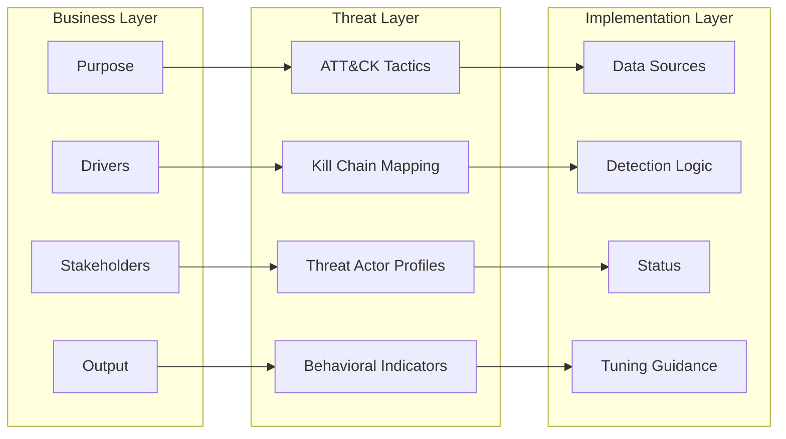
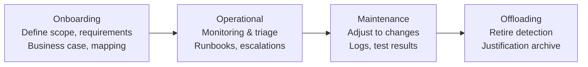
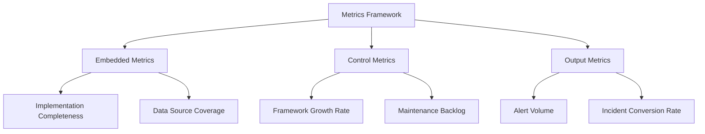
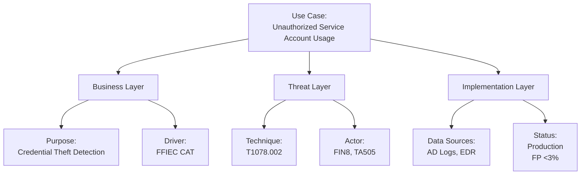

| Revised | Author         | Comment        |
| ------- | -------------- | -------------- |
| 13.04.2025 | Roger Johnsen  | Article added  |

{}
This article is a work in progress and please consider this as a sneak peak. Quality checks hasn't been applied yet. If you find something off, please contact me directly. 
{}

## Introduction

**The MaGMa Use Case Framework (UCF) is a structured methodology for managing security monitoring scenarios within Security Operations Centers (SOCs). Developed collaboratively by the *Dutch Financial Information Sharing and Analysis Community (FI-ISAC)*, MaGMa (Management, Growth, Metrics & Assessment) provides systematic documentation of detection use cases across three layers and four lifecycle phases.**

---

## Structured Approach to Use Case Management

SOCs typically manage dozens to hundreds of detection use cases, which often become disorganized. MaGMa addresses this by:

- Establishing traceability between business objectives and technical implementations  
- Standardizing documentation through predefined templates  
- Embedding metrics to measure framework maturity  
- Supporting full lifecycle management  

---

## The Three-Layer Model

The MaGMa Use Case Framework is structured across three distinct but interconnected layers: Business, Threat, and Implementation. Each layer captures specific aspects of a use case, ensuring alignment from strategic objectives down to technical execution. The diagram below illustrates how information flows between these layers, with key elements represented at each level:

### 1. Business Layer (Strategic)  

Focuses on why the use case matters to the organization. It documents business objectives, compliance drivers, involved stakeholders, and the intended output (e.g., alerts, reports). Documents organizational relevance with:  

| What | Description |
| ---- | ----------- |
| Purpose | Business value proposition (e.g., fraud prevention) |  
| Drivers | Compliance requirements (e.g., PCI DSS, GDPR) |   
| Stakeholders | Responsible business units |
| Output | Expected deliverables (alerts, reports) |

### 2. Threat Layer (Tactical)  

Bridges the gap between business intent and technical implementation. This layer maps the use case to threat intelligence elements such as MITRE ATT&CK techniques, adversary behaviors, and known threat actors. Aligns with adversary behaviors through:  

| What | Description |
| ---- | ----------- |
| MITRE ATT&CK | techniques and tactics |  
| Kill Chain | positioning | 
| Threat Actor | profiles | 
| Behavioral Indicators | Specific TTP  |

### 3. Implementation Layer (Operational)  

Defines how the use case is executed on a technical level. It includes log source requirements, detection logic (queries/rules), development status, and tuning considerations. Details technical execution:  

| What | Description |
| ---- | ----------- |
| Data Sources | Required logs (Windows Event IDs, EDR) |
| Detection Logic | SIEM queries, correlation rules |  
| Status | Development stage (PoC → Production) |
| Tuning Guidance | Known false positives |

## Lifecycle Management

Effective use case management requires more than initial deployment—it demands continuous oversight. MaGMa structures this through a four-phase lifecycle model that ensures each use case remains relevant, actionable, and aligned with evolving threats and business needs. This lifecycle spans onboarding, daily operations, ongoing maintenance, and eventual retirement.

MaGMa formalizes four management phases:

| Phase | Key Activities | Documentation Requirements |
|-------|----------------|-----------------------------|
| Onboarding | Define scope, document requirements | Business case, threat mapping |
| Operational | Daily monitoring execution | Runbooks, escalation paths |
| Maintenance | Update for threat/IT changes | Change logs, test results |
| Offloading | Archive obsolete use cases | Retirement justification |

## Metrics Framework

To ensure continuous improvement and accountability, MaGMa integrates a structured metrics framework. These metrics allow SOC teams to assess the maturity, effectiveness, and growth of their detection use cases over time. By tracking implementation status, operational output, and strategic alignment, the framework supports data-driven decision-making and justifies resource allocation.

Three metric types are embedded:

1. **Embedded Metrics**  
   - Implementation completeness (0-100%)  
   - Data source availability  

2. **Control Metrics**  
   - Framework growth rate  
   - Maintenance backlog  

3. **Output Metrics**  
   - Alert volume and quality  
   - Incident conversion rates  

## Implementation Tool

To streamline adoption and operationalization of the MaGMa framework, an Excel-based Implementation Tool is provided. This tool includes standardized templates, automated scoring mechanisms, and built-in support for traceability across all layers. It simplifies documentation, promotes consistency, and helps teams track use case development and maturity over time.

The **MaGMa UCF Tool** (Excel-based) provides:  
- Preconfigured templates for all framework elements  
- Automated maturity scoring  
- Cross-layer traceability features  

> **Download**: [MaGMa UCF Tool](https://www.betaalvereniging.nl/wp-content/uploads/Magma-UCF-Tool.xlsx)

## Example Use Case

**Unauthorized Service Account Usage**  
*Business Layer*  
- **Purpose**: Detect credential theft/abuse  
- **Driver**: FFIEC CAT requirements  

*Threat Layer*  
- **Technique**: T1078.002 (Valid Accounts: Domain Accounts)  
- **Actor**: FIN8, TA505  

*Implementation Layer*  
- **Data Sources**: Active Directory logs, EDR  
- **Status**: Production (FP rate <3%)  

## When to Adopt MaGMa

Ideal for organizations that:  
- Manage 50+ detection use cases  
- Require audit-ready documentation  
- Need to demonstrate SOC maturity  
- Experience alert fatigue from unmaintained rules  

---

## Resources

| Resource | Description |
|----------|-------------|
| [Full Documentation](https://www.betaalvereniging.nl/wp-content/uploads/FI-ISAC-Use-Case-Framework-Full-Documentation.pdf) | Official specification document |
| [MaGMa UCF Tool](https://www.betaalvereniging.nl/wp-content/uploads/Magma-UCF-Tool.xlsx) | Excel implementation template | 
| [FI-ISAC Portal](https://www.betaalvereniging.nl/en/safety/magma/) | Framework overview | 
| [Short Whitepaper](https://www.betaalvereniging.nl/wp-content/uploads/FI-ISAC-use-case-framework-verkorte-versie.pdf) | Concise introduction |
