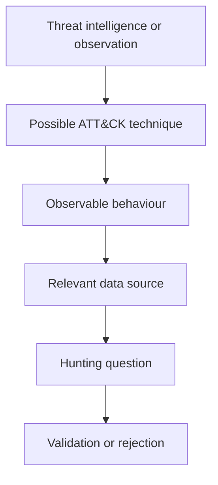

**Author:** *Roger C.B. Johnsen*

## Introduction

**MITRE ATT&CK is a knowledge base of adversary tactics, techniques and procedures based on observed real-world behaviour.**

For threat hunters, the value of ATT&CK is not that it tells us what happened. It does not. The value is that it gives us a common language for describing adversary behaviour in a precise and repeatable way.

That distinction is important. A vague statement such as this may be technically true, but it is not very useful:

```text
The attacker used PowerShell.
```

PowerShell is only an artefact. It does not explain intent, context or outcome. The same observation may be part of execution, discovery, Defense Evasion, credential access, collection or normal administration. A better statement therefore connects the observation to context:

```text
The observed activity may relate to Execution, Discovery, Defense Evasion or Collection depending on context. The specific technique, command-line pattern, parent process and surrounding telemetry decide how it should be interpreted.
```

This is where ATT&CK becomes useful. It helps hunters, SOC analysts, detection engineers, incident responders and threat intelligence teams describe behaviour with a shared vocabulary. It does not prove attribution, replace analysis or explain the environment by itself. It gives structure to the language we use while we investigate.

That makes it useful for creating hunting hypotheses, describing adversary behaviour, mapping detections, identifying coverage gaps, structuring reports, connecting threat intelligence to local telemetry and communicating findings across teams.

> ATT&CK is not the hunt. ATT&CK is the language we can use to describe what the hunt is testing.
>
> -- Roger Johnsen

## What MITRE ATT&CK Is

MITRE ATT&CK stands for **Adversarial Tactics, Techniques, and Common Knowledge**.

At a high level, ATT&CK describes adversary behaviour through tactics, techniques, sub-techniques and procedures. These terms are sometimes used loosely in security conversations, but the distinction matters when the goal is clear hunting, detection engineering or reporting.

| Concept        | Meaning                                                             |
| -------------- | ------------------------------------------------------------------- |
| Tactics        | Why the adversary is performing an action.                          |
| Techniques     | How the adversary achieves that tactical goal.                      |
| Sub-techniques | More specific ways a technique may be performed.                    |
| Procedures     | The concrete implementation used by an adversary, tool or campaign. |

A tactic describes the adversary’s goal. A technique describes the method. A procedure describes how that method was actually carried out.

For example:

| Level         | Example                                                                                            |
| ------------- | -------------------------------------------------------------------------------------------------- |
| Tactic        | Credential Access                                                                                  |
| Technique     | OS Credential Dumping                                                                              |
| Sub-technique | LSASS Memory                                                                                       |
| Procedure     | A specific actor uses a particular command, tool or script to dump LSASS memory on a Windows host. |

This is why ATT&CK is useful during threat hunting. It helps the hunter move from broad intent to concrete behaviour.

## ATT&CK Matrices

MITRE ATT&CK is not a single matrix for every possible environment. It is organised into different matrices for different technology areas and operational contexts.

The main ATT&CK matrices are:

| Matrix     | Focus                                                                                                                                                                  |
| ---------- | ---------------------------------------------------------------------------------------------------------------------------------------------------------------------- |
| Enterprise | Adversary behaviour against enterprise environments such as Windows, macOS, Linux, cloud, SaaS, identity providers, containers, network devices and related platforms. |
| Mobile     | Adversary behaviour against mobile devices and mobile operating systems.                                                                                               |
| ICS        | Adversary behaviour against industrial control systems and operational technology environments.                                                                        |

Most SOC and enterprise threat hunting work uses the **Enterprise** matrix. That is the matrix this article focuses on.

This matters because ATT&CK mapping should match the environment being investigated. A technique that makes sense in an enterprise endpoint investigation may not be the right vocabulary for a mobile or ICS scenario. The model is useful when it helps describe the observed behaviour in the right technical context.

## Enterprise Tactics

The Enterprise ATT&CK matrix currently contains the following tactics:

| ID     | Tactic               | Description                                                                                                                     |
| ------ | -------------------- | ------------------------------------------------------------------------------------------------------------------------------- |
| TA0043 | Reconnaissance       | The adversary is trying to gather information they can use to plan future operations.                                           |
| TA0042 | Resource Development | The adversary is trying to establish resources they can use to support operations.                                              |
| TA0001 | Initial Access       | The adversary is trying to get into your network.                                                                               |
| TA0002 | Execution            | The adversary is trying to run malicious code.                                                                                  |
| TA0003 | Persistence          | The adversary is trying to maintain their foothold.                                                                             |
| TA0004 | Privilege Escalation | The adversary is trying to gain higher-level permissions.                                                                       |
| TA0005 | Stealth              | The adversary is trying to hide and conceal their actions, appearing as normal behaviour.                                       |
| TA0112 | Defense Impairment   | The adversary is trying to break security mechanisms, pipelines and tooling so defenders cannot see or trust what is happening. |
| TA0006 | Credential Access    | The adversary is trying to steal account names and passwords.                                                                   |
| TA0007 | Discovery            | The adversary is trying to figure out your environment.                                                                         |
| TA0008 | Lateral Movement     | The adversary is trying to move through your environment.                                                                       |
| TA0009 | Collection           | The adversary is trying to gather data of interest to their goal.                                                               |
| TA0011 | Command and Control  | The adversary is trying to communicate with compromised systems to control them.                                                |
| TA0010 | Exfiltration         | The adversary is trying to steal data.                                                                                          |
| TA0040 | Impact               | The adversary is trying to manipulate, interrupt or destroy systems and data.                                                   |

The tactics are useful because they describe adversary intent. At the same time, hunters should be careful. The matrix can look like a timeline, but it should not be treated as a strict sequence. Real intrusions are iterative. Techniques may repeat. Some techniques may support several tactical goals. Some attacks may skip entire parts of the matrix.

The tactic should help the analyst reason about why behaviour may be occurring. It should not force the evidence into a neat row.

## Tactics

Tactics are the adversary’s tactical goals. They describe **why** an adversary performs an action.

Examples include:

* Initial Access
* Execution
* Persistence
* Credential Access
* Discovery
* Lateral Movement
* Exfiltration
* Impact

For example, if an attacker dumps credentials, the tactic is usually **Credential Access**. If the attacker uses those credentials to access another system, the tactic may become **Lateral Movement**. If the attacker uses those credentials to maintain long-term access, the behaviour may also relate to **Persistence**.

This is important because the same artefact can support different goals depending on context.

A password hash is not a tactic. A PowerShell command is not a tactic. A scheduled task is not a tactic. The tactic is the adversary’s reason for using it.

## Techniques

Techniques describe **how** an adversary achieves a tactical goal.

Examples include:

* Phishing
* Command and Scripting Interpreter
* OS Credential Dumping
* Remote Services
* Scheduled Task/Job
* Account Discovery
* Exfiltration Over Web Service

Techniques are useful because they turn broad adversary goals into observable behaviours. For hunting, this matters because we cannot usually search directly for a tactic. We search for behaviour.

A hunter does not search for “Discovery” in the abstract. The hunter searches for account enumeration, network share discovery, domain trust discovery, cloud service enumeration or other observable activity that may indicate Discovery. A hunter does not search for “Credential Access” in the abstract. The hunter searches for access to credential stores, suspicious LSASS access, unusual use of credential dumping tools, token theft indicators or suspicious authentication patterns.

One observation may map to multiple techniques, and one technique may support multiple tactics. That is normal. The analyst should not force the activity into a single label just to make the mapping look clean.

For example, PowerShell may relate to Execution, Discovery, Defense Evasion, Credential Access or Collection depending on what the command actually does and what happens around it.

> Tactics explain the reason. Techniques give the hunter something to look for.
>
> -- Roger Johnsen

## Sub-Techniques

Sub-techniques provide more specific ways a technique may be performed.

For example, the broad technique **OS Credential Dumping** contains more specific sub-techniques. Those sub-techniques help describe whether the behaviour involved LSASS memory, the Security Account Manager, cached domain credentials or other credential sources.

This level of detail is useful because detection logic often depends on the specific implementation. A generic mapping to **Credential Access** may be too broad. A mapping to **OS Credential Dumping** is better. A mapping to a specific sub-technique, supported by evidence, is often more useful for detection engineering and reporting.

But the mapping should still be honest. If the evidence only supports the broader technique, do not pretend it supports a precise sub-technique.

## Procedures

Procedures are the specific ways adversaries implement techniques. This is where threat hunting often becomes practical.

For example:

| Technique                         | Possible procedure-level detail                                           |
| --------------------------------- | ------------------------------------------------------------------------- |
| Phishing                          | A specific email template, sender pattern, attachment name or lure theme. |
| Command and Scripting Interpreter | A specific PowerShell command-line structure or encoded command pattern.  |
| OS Credential Dumping             | A specific tool, command, access pattern or process interaction.          |
| Remote Services                   | A specific use of RDP, SMB, WinRM or PsExec-like behaviour.               |
| Exfiltration Over Web Service     | A specific cloud storage service, API path or upload pattern.             |

Procedures matter because they are closer to what appears in logs. A tactic may be useful for communication. A technique may be useful for classification. A procedure is often where the hunting logic starts.

For example, a threat report may say that an actor uses PowerShell for execution and discovery. That is useful, but broad. A hunter needs to translate that into procedure-level questions:

* Which parent processes launch PowerShell?
* Which command-line arguments are used?
* Is the activity encoded?
* Which user ran it?
* Which host ran it?
* What happened before and after?
* Did it touch the network?
* Did it enumerate users, groups, shares or systems?

This is how ATT&CK becomes useful for hunting.

## TTPs

TTP stands for **Tactics, Techniques and Procedures**. The term is widely used, but it is also often used too loosely.

A useful way to think about it is:

| Level     | Meaning                 |
| --------- | ----------------------- |
| Tactic    | Why the adversary acts  |
| Technique | How the adversary acts  |
| Procedure | Exactly how it was done |

For example:

| TTP level | Example                                                                                |
| --------- | -------------------------------------------------------------------------------------- |
| Tactic    | Discovery                                                                              |
| Technique | Account Discovery                                                                      |
| Procedure | A specific command or script enumerates local users, domain users or cloud identities. |

This distinction prevents sloppy reporting.

Weak statement:

```text
The attacker used MITRE Discovery.
```

Better statement:

```text
The observed PowerShell activity appears consistent with account and group discovery. The command-line content, timing and parent process should be reviewed before mapping it to a specific ATT&CK technique.
```

ATT&CK should make reporting clearer, not more vague.

## Using ATT&CK During Threat Hunting

ATT&CK can help threat hunters structure hypotheses and investigations. A practical hunting flow is:



For example:

| Step                               | Example                                                                                            |
| ---------------------------------- | -------------------------------------------------------------------------------------------------- |
| Threat intelligence or observation | Reports describe phishing followed by PowerShell execution.                                        |
| Possible ATT&CK technique          | Phishing and Command and Scripting Interpreter.                                                    |
| Observable behaviour               | Office process spawning PowerShell with unusual arguments.                                         |
| Relevant data source               | EDR process telemetry, email logs, proxy and DNS.                                                  |
| Hunting question                   | Where do Office applications spawn PowerShell in ways that are rare or suspicious?                 |
| Validation                         | Review parent process, command line, user, host, timing, network activity and follow-on behaviour. |

This flow is important because ATT&CK mapping alone is not hunting. A technique gives direction, but the hunter still has to define the observable behaviour, identify the data source and validate the result. A technique becomes useful when it can be translated into observable behaviour, relevant data sources and repeatable detection or hunting logic.

## ATT&CK Is Not a Checklist

One of the most common mistakes is treating ATT&CK as a checklist. A more specific version of the same mistake is treating MITRE ATT&CK as a detection bingo card.

The thinking goes something like this:

```text
One technique.
One rule.
One checkbox.
One green square in Navigator.
```

That is not how detection works.

ATT&CK is not a checklist for detection rules. It does not say that every technique can be covered by one rule, or that a mapped rule gives meaningful coverage. Some techniques require several detections across different data sources. Some require enrichment, baselining or correlation. Some are better handled through preventive controls, hardening or response playbooks. Some cannot be hunted properly unless the organisation has the right telemetry in the first place.

A team may create a spreadsheet of techniques, mark some as covered and assume the environment is well defended. That can be misleading, because coverage depends on much more than whether a detection is mapped to a technique.

Useful questions include:

* What behaviour does the detection actually look for?
* Which data source supports it?
* Which systems produce that data?
* How complete is the telemetry?
* How noisy is the logic?
* Can the detection be bypassed easily?
* Has it been tested?
* What does the analyst need to validate it?

A single detection mapped to a technique does not mean the technique is covered. Likewise, a technique without a detection does not always mean the organisation is blind. There may be compensating controls, preventive measures or other visibility.

ATT&CK can make an environment look well-covered while critical behaviours remain undetected. That is the danger of treating it as a coverage spreadsheet instead of a behavioural knowledge base.

ATT&CK helps structure the conversation. It does not replace engineering judgement.

> ATT&CK coverage is not a colouring exercise. A green box in Navigator does not mean the organisation can actually detect the behaviour.
>
> -- Roger Johnsen

## Detection Coverage and Data Sources

ATT&CK is useful for discussing detection coverage because techniques can be connected to data sources and data components. That connection matters because a detection idea is only useful if the organisation has telemetry that can support it.

For example:

| Technique area       | Possible data needed                                                                  |
| -------------------- | ------------------------------------------------------------------------------------- |
| Phishing             | Email logs, URL click logs, attachment metadata, user reports                         |
| PowerShell execution | Process creation, command line, script block logs, parent-child process relationships |
| Credential dumping   | Process access telemetry, LSASS access, security logs, EDR behavioural events         |
| Discovery            | Command-line telemetry, directory logs, authentication logs, cloud audit logs         |
| Lateral movement     | Authentication logs, remote service activity, network telemetry, EDR                  |
| Exfiltration         | Proxy logs, DNS, firewall, SaaS logs, DLP, cloud storage logs                         |
| Impact               | EDR, file modification telemetry, backup logs, system logs, admin audit logs          |

The practical question is not:

```text
Do we have ATT&CK coverage?
```

The better question is:

```text
Which adversary behaviours can we observe, with which data, on which systems, and with what level of confidence?
```

This is where ATT&CK becomes useful for both hunting and detection engineering.

## Using ATT&CK Navigator

ATT&CK Navigator is a web-based tool for working visually with ATT&CK matrices. It lets analysts create layers, colour techniques, add comments, assign scores and build views that represent observations, coverage, priorities or gaps.

In practice, Navigator is often used as a visual workspace for ATT&CK. A team may use it during a hunt to mark techniques that are relevant to the hypothesis. Detection engineers may use it to show where detection logic exists. Threat intelligence teams may use it to compare local coverage against techniques described in reporting.

That makes Navigator useful, but also easy to misuse.

It can be used to:

* map observed techniques during an investigation
* visualise detection coverage
* compare local coverage against threat intelligence
* prioritise hunting areas
* show gaps to stakeholders
* document what has been tested

A coloured technique does not automatically mean that the organisation has strong coverage. When using Navigator, it helps to distinguish between:

| Layer meaning    | Example                                                                                            |
| ---------------- | -------------------------------------------------------------------------------------------------- |
| Observed         | This technique was seen in an investigation.                                                       |
| Hypothesis       | This technique is relevant to a planned hunt.                                                      |
| Detection exists | There is detection logic mapped to this technique.                                                 |
| Detection tested | The detection has been validated.                                                                  |
| Telemetry gap    | The organisation lacks the data needed to hunt or detect reliably.                                 |
| Priority         | This technique is important because of threat intelligence, business exposure or known weaknesses. |

Those are different things. Mixing them into one colour can make the map look useful while hiding the real issue.

## Practical Example: Manufacturing Company

Consider a simplified intrusion against a manufacturing company.

| ATT&CK tactic        | Example activity                                                                               |
| -------------------- | ---------------------------------------------------------------------------------------------- |
| Reconnaissance       | Attackers gather information about employees, suppliers and exposed services.                  |
| Resource Development | Attackers prepare infrastructure, accounts or tooling to support the operation.                |
| Initial Access       | Spear-phishing emails or valid credentials are used to gain access.                            |
| Execution            | Malicious scripts are executed using PowerShell or another interpreter.                        |
| Persistence          | New accounts, scheduled tasks or cloud persistence mechanisms are created.                     |
| Privilege Escalation | A vulnerability, misconfiguration or permission weakness is abused.                            |
| Stealth              | The attacker attempts to blend into normal activity and avoid attention.                       |
| Defense Impairment   | Security tools, logs or controls are disabled, bypassed or weakened.                           |
| Credential Access    | Password hashes, tokens or credentials are collected.                                          |
| Discovery            | The attacker enumerates systems, users, shares, cloud resources or applications.               |
| Lateral Movement     | Remote services, credentials or management tools are used to move further.                     |
| Collection           | Sensitive design documents or operational data are gathered.                                   |
| Command and Control  | Compromised systems or accounts communicate with attacker-controlled or abused infrastructure. |
| Exfiltration         | Sensitive documents are transferred out of the environment.                                    |
| Impact               | Ransomware or destructive activity disrupts manufacturing operations.                          |

This table is not meant to imply that the attack happens in a perfect sequence. The value is that the team can describe behaviour consistently and ask what evidence supports each mapping.

For example:

| Observation                     | Possible mapping  | Validation question                                              |
| ------------------------------- | ----------------- | ---------------------------------------------------------------- |
| Office spawned PowerShell       | Execution         | Was this expected, rare, malicious or part of normal automation? |
| PowerShell listed domain groups | Discovery         | What account ran it, on which host, and why?                     |
| LSASS access occurred           | Credential Access | Which process accessed it, and was the access expected?          |
| RDP from unusual workstation    | Lateral Movement  | Was this normal for the user and destination?                    |
| Large archive created           | Collection        | What files were included, and who normally accesses them?        |
| Upload to rare cloud service    | Exfiltration      | Was this approved business activity or suspicious transfer?      |

ATT&CK helps name the behaviour. The hunter still needs to prove what happened.

## Combining ATT&CK With the Kill Chain Models

ATT&CK works well with the Lockheed Martin Kill Chain and the Unified Kill Chain. The Kill Chain models help describe progression. ATT&CK helps describe behaviour.

| Framework                  | Main value                                                                      |
| -------------------------- | ------------------------------------------------------------------------------- |
| Lockheed Martin Kill Chain | Simple progression and disruption model                                         |
| Unified Kill Chain         | More detailed operational progression                                           |
| MITRE ATT&CK               | Behavioural vocabulary                                                          |
| Diamond Model              | Relationship structure between adversary, infrastructure, capability and victim |

For example, a hunter may use the Unified Kill Chain to decide that the activity appears to be in the **Through** phase. ATT&CK can then describe the specific behaviour as Discovery, Credential Access or Lateral Movement. The Diamond Model can connect the behaviour to the victim, infrastructure and possible adversary context.

Together, the frameworks support better investigation notes and clearer handover. They should not become competing taxonomies.

## What Usually Goes Wrong

Several mistakes are common when teams use ATT&CK.

| Problem                                   | Why it hurts                                                                                                           |
| ----------------------------------------- | ---------------------------------------------------------------------------------------------------------------------- |
| Treating ATT&CK as a detection bingo card | The team marks techniques as covered without understanding whether the behaviour is actually observable or detectable. |
| Treating ATT&CK as a checklist            | The team marks techniques as covered without understanding detection quality.                                          |
| Mapping too broadly                       | The report says “Execution” or “Discovery” without useful technical detail.                                            |
| Mapping too precisely                     | The team claims a sub-technique that the evidence does not support.                                                    |
| Confusing tactic and technique            | The report mixes adversary goal and adversary method.                                                                  |
| Ignoring procedures                       | The team never translates technique names into actual observable behaviour.                                            |
| Colouring Navigator without context       | Stakeholders may believe coverage is stronger than it is.                                                              |
| Treating ATT&CK as attribution            | ATT&CK overlap does not prove who the adversary is.                                                                    |
| Forgetting telemetry                      | A technique cannot be hunted reliably without relevant data.                                                           |

ATT&CK should improve precision. If it makes the report more vague, it is being used badly.

## Working Position for This Book

For this book, MITRE ATT&CK is best treated as a behavioural vocabulary for threat hunting.

It helps describe what the adversary may be doing, but it does not replace investigation.

The practical workflow is:

```text
Observation → Behaviour → ATT&CK mapping → Data source → Hunting question → Validation
```

The hunter should start with evidence, map carefully, and avoid pretending that the framework proves more than it does.

ATT&CK becomes powerful when it is combined with telemetry, environment knowledge, threat intelligence and structured reasoning.

> Use ATT&CK to describe behaviour clearly. Do not use it to decorate weak analysis.
>
> -- Roger Johnsen

## Resources

* [MITRE ATT&CK](https://attack.mitre.org/)
* [MITRE ATT&CK Enterprise Tactics](https://attack.mitre.org/tactics/enterprise/)
* [ATT&CK Navigator](https://mitre-attack.github.io/attack-navigator/)
* [MITRE Center for Threat-Informed Defense](https://ctid.mitre.org/)
* [MITRE ATT&CK Data & Tools](https://attack.mitre.org/resources/)
* [Threat Hunting with the MITRE ATT&CK Framework](https://www.packtpub.com/en-us/product/threat-hunting-with-the-mitre-attck-framework-9781804614260)

## Revision

| Revised Date | Comment                                                                                                                                                           |
| ------------ | ----------------------------------------------------------------------------------------------------------------------------------------------------------------- |
| 2026-07-10   | Major rewrite. Reframed the article as a practical guide for using MITRE ATT&CK as a behavioural vocabulary for threat hunting, detection coverage and reporting. |
| 2024-10-06   | Improved formatting and wording                                                                                                                                   |
| 2024-06-23   | Added page                                                                                                                                                        |
