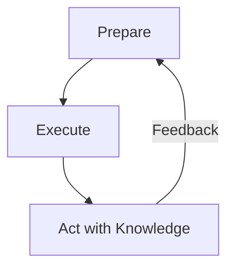
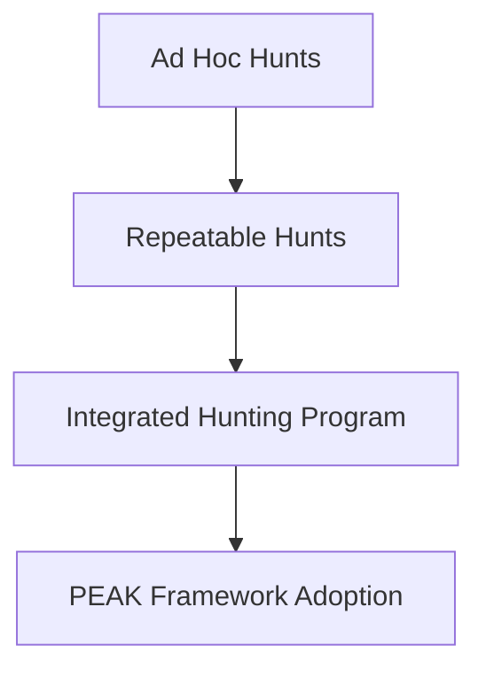

|Revised Date | Author | Comment |
| ----------- | ------ | ------- |
| 13.04.2025  | Roger Johnsen | Article added |

## Introduction

**Threat hunting is not just an activity. It is a mindset. As defenders mature, they move from passive alert review to active pursuit of adversaries. The PEAK Threat Hunting Framework, developed by Splunk’s SURGe team (David Bianco, Dr. Ryan Fetterman, and Sydney Marrone), offers a comprehensive approach that helps hunters structure their methodology while driving measurable improvements.**

---

## Why PEAK?

PEAK stands for: 

- Prepare
- Execute
- Act with Knowledge

It is more than a model, it is a philosophy for continuous advancement in proactive defense. PEAK focuses on building repeatable, scalable, and professionalized hunting operations that evolve with your environment. It addresses common gaps in threat hunting; like poor documentation, inconsistent outcomes, and lack of follow-through. This by defining a lifecycle that emphasizes *preparation, execution, and impact*.

Unlike other frameworks that focus heavily on hypothesis testing alone, PEAK emphasizes *people*, *process*, and *planning* as much as *analysis*. It also introduces *three hunt types*:

- Hypothesis-driven: traditional hunting
- Baseline-based: anomaly detection
- Model-Assisted (M-ATH): machine learning-enhanced hunting

## Core Phases of the PEAK Framework

The PEAK Threat Hunting Framework consists of three major phases, each with clearly defined objectives and outcomes:

- **Prepare**
- **Execute**
- **Act with Knowledge**

Let’s walk through each phase.

### 1. Prepare

**Before the hunt starts, are you truly ready?**

Preparation is about setting the stage for meaningful hunts. This includes aligning on goals, selecting tools, understanding available data, and choosing relevant hypotheses.

**Preparation Activities Include:**

| Task | Description |
| ---- | ----------- |
| Planning | Define scope, objectives, and timeline for the hunt |
| Threat Intelligence Mapping | Align with MITRE ATT&CK techniques or adversaries |
| Hunt Team Alignment | Assign roles, review assumptions, and agree on communications |
| Data Availability Review | Validate that required telemetry is available and high-quality |
| Documentation Setup | Prepare templates and mechanisms to record findings |

**Why it matters**

Unprepared hunts often end up as time-consuming explorations without outcomes. Preparation ensures *efficiency*, *accountability*, and *direction*.

### 2. Execute

**How do you carry out the hunt effectively?**

This phase covers the actual hunting activity: exploring data, validating hypotheses, uncovering anomalies, and investigating leads.

**Execution Activities Include:**

- Query development and testing
- Hunting playbook execution
- Timeline and graph building
- Anomaly detection and triage
- Collaboration between hunters and SMEs (Subject Matter Experts)

**Example Flow**

> **Hypothesis:** Lateral movement is occurring using SMB  
> **Action:** Search for unusual cross-host file transfers using `smbclient` or `net use` commands  
> **Follow-up:** Pivot into host behavior, peer activity, and identity usage

**Why it matters**

This is the *heart* of the hunt. Execution requires technical depth, investigative intuition, and disciplined workflows.

### 3. Act with Knowledge

**What did we learn, and how does it improve our defense posture?**

This final phase translates hunting outcomes into organizational gains. Whether you found an adversary or validated clean telemetry, the results must *impact the ecosystem*.

**Key Impact Areas:**

| Outcome | Examples |
| ------- | -------- |
| Detections | Develop or tune detection logic based on what was found |
| Documentation | Create reusable hunt reports, playbooks, and dashboards |
| Coverage Enhancements | Identify missing logs or visibility blind spots |
| Training & Enablement | Share findings with SOC and IR teams for upskilling |
| Metrics & KPIs | Report on time-to-hunt, hypotheses tested, or systems covered |

**Why it matters**

Threat hunting is not valuable unless it feeds back into the environment. PEAK emphasizes *closing the loop* to avoid “hunt and forget” syndrome.

## PEAK Threat Hunting Lifecycle

The diagramme below depicts the PEAK Threat Hunting Lifecycle. The feedback loop is essential. Each hunt enhances your understanding, tooling, and response capability. This feeding into better preparedness for the next.

## PEAK in Practice: A Practical Example

**Scenario**

> A recent surge in ransomware attacks targeting backup servers prompts your team to act.

**1. Prepare**  
- Define scope: Hunt across all backup infrastructure  
- Identify MITRE techniques: T1485 (Data Destruction), T1003 (Credential Dumping)  
- Validate EDR and file access logs  
- Assign roles across team and threat intel  

**2. Execute**  
- Query for suspicious access to backup volumes  
- Analyze PowerShell execution and NTFS permission changes  
- Investigate use of `vssadmin delete shadows`  
- Identify unauthorized lateral movement into backup systems  

**3. Act with Knowledge**  
- Create detection logic for shadow copy deletion patterns  
- Recommend hardening controls on backup servers  
- Document hunt results and conduct knowledge-sharing session  
- Feed outcomes into IR playbooks

---

## Comparison Table: Strategic Placement of PEAK

| Framework        | Focus                    | Use Case                          |
|------------------|--------------------------|-----------------------------------|
| MITRE ATT&CK     | TTP mapping              | Enriching hypotheses and alerts   |
| TaHiTI           | Strategic hypothesis refinement | Sustained hunt improvement |
| PEAK             | Operational lifecycle    | Organizing and maturing hunt programs |
| ELK Hunting Loop | Tactical hunt execution  | Quick, iterative data exploration |

PEAK is well-suited for teams ready to *institutionalize* hunting as a program.

## Hunt Program Maturity with PEAK

PEAK represents a maturity leap from isolated hunts to an integrated, strategic capability.

## Conclusion

The PEAK Threat Hunting Framework gives organizations a way to *structure, measure, and evolve* their threat hunting initiatives. By balancing preparation, disciplined execution, and actionable outcomes, PEAK turns hunting from a chaotic activity into a repeatable function.

With PEAK, you can:

- Build a culture of hunting within your SOC
- Elevate junior analysts through clear documentation and roles
- Bridge the gap between intel, detection, and incident response
- Improve your environment continuously through iterative learning

Threat hunting isn’t just finding threats. It’s abput building a better, smarter defense over time. PEAK makes that journey structured and sustainable.

---

## References

| Resource | Description |
| ----- | ----------- |
| [Splunk PEAK Framework Guide](https://www.splunk.com/) | Official whitepaper for adopting the PEAK methodology |
| [MITRE ATT&CK](https://attack.mitre.org/) | Tactical technique mapping framework used for hypothesis development |
| [ThreatHunting.org](https://threathunting.org) | Community-driven hunt library and methodology knowledge base |
| [Pyramid of Pain – David Bianco](https://detect-respond.blogspot.com/2013/03/the-pyramid-of-pain.html) | Influential concept showing value of higher-fidelity detection targets |
| [Red Canary's Threat Detection Report](https://redcanary.com/threat-detection-report/) | Annual insights into detection trends that can guide hypothesis creation |