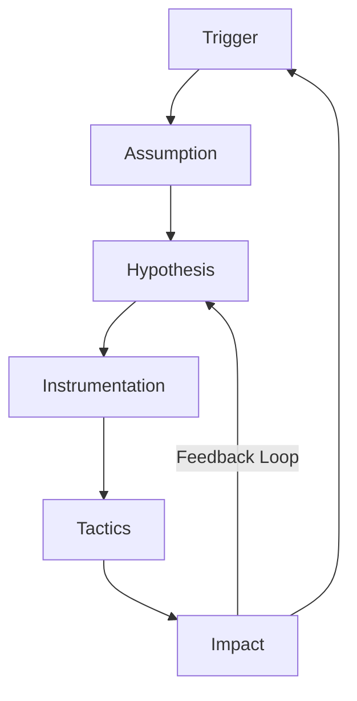
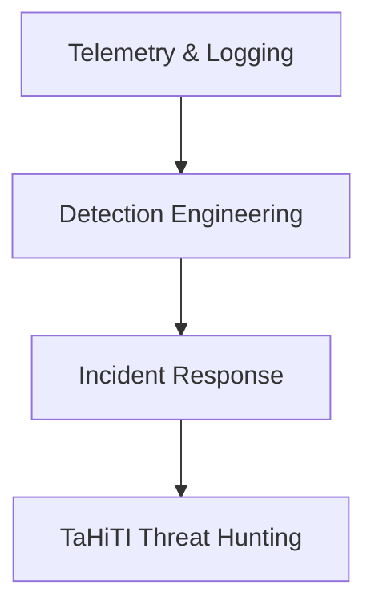

|Revised Date | Author | Comment |
| ----------- | ------ | ------- |
| 13.04.2025  | Roger Johnsen | Article added |

{}
This article is a work in progress and please consider this as a sneak peak. Quality checks hasn't been applied yet. If you find something off, please contact me directly. 
{}

## Introduction

**In modern cybersecurity, proactive threat hunting is essential. As attackers bypass automated defenses, structured threat hunting frameworks have emerged. One such framework is TaHiTI (Targeted Hunting integrating Threat Intelligence), developed by the Dutch financial sector (FI-ISAC). TaHiTI offers a structured, intelligence-driven approach, transforming ad hoc investigations into repeatable hunts. It refines hypotheses, identifies detection gaps, and integrates findings into security measures, emphasizing the use of threat intelligence for targeted and efficient hunts.**

---

## Why TaHiTI?

While MITRE ATT&CK details adversary tactics and the Pyramid of Pain assesses detection difficulty, TaHiTI focuses on sustainable, intelligence-driven hunting. It guides threat hunters through exploration, validation, and continuous learning, enabling teams to evolve with each hunt using actionable threat intelligence.

## Core Components

TaHiTI centers on six key domains and is executed through three phases: Initiate, Hunt, and Finalize.

**Six Key Domains**

* Triggers
* Assumptions
* Hypotheses
* Instrumentation
* Tactics
* Impact

**Three Phases**

1.  **Initiate**: This phase involves planning and preparation, defining scope, objectives, and success criteria. Threat intelligence identifies threats and informs hypotheses. Activities include identifying triggers, formulating assumptions, developing hypotheses, and determining instrumentation.

2.  **Hunt**: The execution phase involves analysts using various tactics to explore data and identify malicious activity, with threat intelligence used to prioritize findings. Activities include executing queries and analysis, pivoting on data points, enriching findings with threat intelligence, and documenting observations.

3.  **Finalize**: This phase focuses on analyzing findings, sharing insights, and improving security posture. Threat intelligence validates findings and informs future hunts. Activities include analyzing hunt results, documenting recommendations, improving detection and response, and sharing insights.

### 1. Triggers

**What initiates a hunt?**

Triggers are events or observations suggesting potential issues.

**Common Trigger Sources**

| Trigger                    | Description                                                                                               |
| :------------------------- | :-------------------------------------------------------------------------------------------------------- |
| Threat Intelligence Reports | APT29 abusing Kerberoasting? Check for vulnerabilities.                                                    |
| Red Team Results           | EDR bypassed? Hunt for signs.                                                                             |
| Anomalous Activity         | Internal host beaconing over TCP/443 to an unknown IP every 2 minutes.                                   |
| Detection Coverage Reviews | Remote PowerShell execution not reviewed in six months?                                                   |
| Business Changes           | Merger introduces unmanaged systems—check for breaches.                                                    |

**Why it matters:** Triggers provide focus and relevance.

### 2. Assumptions

**What do we believe to be true?**

Assumptions are beliefs about the environment, attacker behavior, or tooling. Examples include "no user should access domain controller logs" or "RDP should never be exposed to the public internet." Assumptions narrow scope but should be challenged.

**Pro tip:** Document assumptions to fuel future hunts.

### 3. Hypotheses

**What are we testing?**

Hypotheses convert assumptions into testable statements that are specific, falsifiable, and actionable.

**Examples of Good Hypotheses:**

*   "External attacker gained initial access via exposed RDP."
*   "Adversaries are using WMI to move laterally undetected."
*   "Sensitive files are being exfiltrated via Dropbox."

**Examples of Bad Hypotheses:**

*   "Everything is compromised." (Too broad)
*   "Something weird in the logs." (Too vague)

**Why it matters:** Clear hypotheses set direction and allow objective measurement.

### 4. Instrumentation

**Do we have the required telemetry?**

Instrumentation refers to the visibility into systems, applications, and networks needed to test hypotheses.

**Types of Instrumentation:**

| Instrumentation | Examples                                               |
| :-------------- | :----------------------------------------------------- |
| Endpoint        | EDR tools, Sysmon                                      |
| Network         | PCAPs, Zeek, Suricata, firewall logs                   |
| Identity        | Active Directory, Okta logs                            |
| Cloud           | CloudTrail, Azure Activity Logs                        |
| Application     | Web server logs, WAF, DB access logs                   |

**Checklist:**

*   Do we have the data?
*   Is it centralized?
*   Is retention sufficient?
*   Is data high-quality?

**Why it matters:** Instrumentation prevents hunts from becoming guesswork and identifies telemetry gaps.

### 5. Tactics

**How do we perform the hunt?**

Tactics are methods used to test hypotheses, explore anomalies, and identify indicators.

**Common Hunting Tactics:**

*   Writing and tuning queries (e.g., KQL, Sigma, Lucene)
*   Creating time series charts
*   Pivoting: host → user → file → network flow
*   Enriching with threat intel
*   Using Jupyter notebooks

**Example:**

> Hypothesis: Credential theft via LSASS dumps
>
> Tactic: Query memory access to `lsass.exe` by non-system processes

**Why it matters:** This is the creative part of threat hunting where new detection logic is developed.

### 6. Impact

**What did we find, and how do we apply it?**

A successful hunt improves security posture measurably.

**Types of Impact:**

| Impact               | Example(s)                                       |
| :------------------- | :----------------------------------------------- |
| Detection Engineering | Created new rules based on findings             |
| Response Readiness   | Updated playbooks                                |
| Coverage Review      | Identified missing logs                          |
| Collaboration        | Shared insights with Red Team, IR, or DevOps     |
| Training             | Documented case studies for junior analysts      |

Even null results are valuable, confirming defenses and assumptions.

**Why it matters:** The true value of threat hunting lies in continuous improvement.

## The TaHiTI Threat Hunting Cycle

Each cycle informs the next, with even failed hunts improving hypotheses or revealing gaps.

## TaHiTI in Action: A Realistic Example

**Scenario:**

> A Red Team bypassed EDR using custom C2 over DNS.

**1. Trigger**: Red Team report on DNS tunneling

**2. Assumption**: "We monitor all outbound DNS traffic."

**3. Hypothesis**: "Malicious DNS tunneling went undetected."

**4. Instrumentation**: Check DNS logs, firewall, endpoint DNS queries

**5. Tactics**:
  *   Extract DNS request volumes by host
  *   Look for TXT/NULL/large query sizes
  *   Pivot on timeframes from Red Team exercise

**6. Impact**:
  *   Added detection rules for tunneling patterns
  *   Requested firewall DNS logging enhancement
  *   Shared patterns with IR and Detection Engineering

## Comparison Table: Strategic Placement of TaHiTI

| Framework      | Focus                      | Use Case                           |
| :------------- | :------------------------- | :--------------------------------- |
| MITRE ATT&CK   | Adversary techniques   | Detection mapping, coverage gap  |
| Pyramid of Pain  | IOC resistance level   | Prioritizing detection effort    |
| ELK Hunting Loop | Tactical hunting process | Query-execution-refinement loop  |
| TaHiTI      | Strategic hunting method | Maturing threat hunting programs |

TaHiTI suits mature environments or teams scaling hunting across analysts and campaigns.

## Detection Maturity Stack with TaHiTI

TaHiTI leverages and improves all layers below it.

## Conclusion

TaHiTI brings clarity, repeatability, and strategic direction to threat hunting. By emphasizing threat intelligence and using a structured approach, TaHiTI ensures targeted hunts that improve security. It transforms observations into action and learnings into better defenses.

When used consistently, TaHiTI enables teams to:

*   Define intelligence-driven hypotheses.
*   Identify gaps in logging and coverage.
*   Reduce dwell time.
*   Sharpen detection and response capabilities.

Threat hunting is a continuous loop, and TaHiTI provides a structured, intelligence-led path toward operational excellence.

---

## References

| Resource                                                                                               | Description                                                                                                                               |
| :----------------------------------------------------------------------------------------------------- | :---------------------------------------------------------------------------------------------------------------------------------------- |
| [Official whitepaper](https://www.betaalvereniging.nl/wp-content/uploads/TaHiTI-Threat-Hunting-Methodology-whitepaper.pdf) | Official whitepaper (PDF)                                                                                                             |
| [Methodology paper](https://www.betaalvereniging.nl/wp-content/uploads/DEF-TaHiTI-Threat-Hunting-Methodology.pdf)   | Methodology paper                                                                                                                         |
| [ThreatHunting.org](https://threathunting.org)                                                          | A community-driven knowledge base for threat hunting.                                                                                    |
| [MITRE ATT&CK Framework](https://attack.mitre.org/)                                                    | A comprehensive matrix of adversary tactics and techniques.                                                                              |
| [The DFIR Report](https://thedfirreport.com)                                                            | Real-world incident response writeups.                                                                                                  |
| [Hunting Queries (Elastic)](https://github.com/elastic/detection-rules)                                  | Detection rules and hunting queries for Elastic Security.                                                                                 |
| [Pyramid of Pain – David Bianco](https://detect-respond.blogspot.com/2013/03/the-pyramid-of-pain.html) | Foundational concept explaining the difficulty of evading indicators.                                                                     |