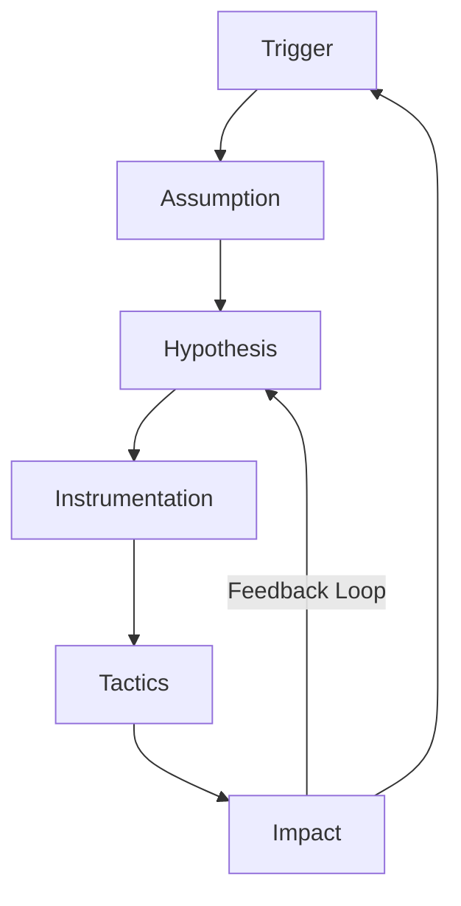
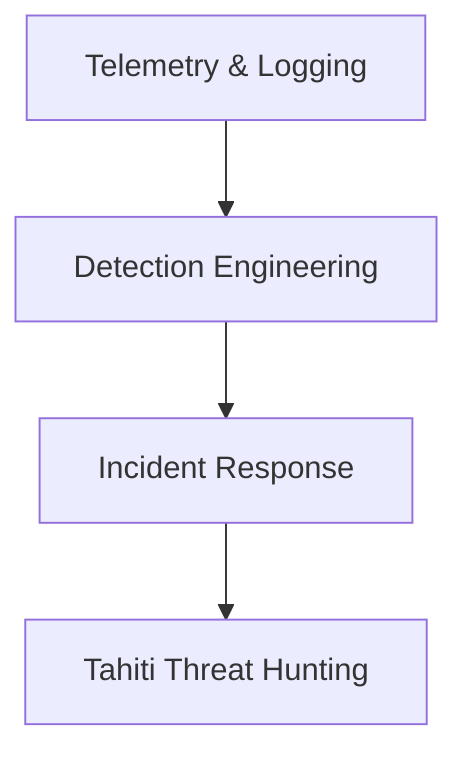

|Revised Date | Author | Comment |
| ----------- | ------ | ------- |
| 13.04.2025  | Roger Johnsen | Article added |

## Introduction

**In a modern cyber defense program, threat hunting isn't just a luxury, it's a necessity. As attackers become stealthier, relying solely on automated detection is no longer enough. Thus there has been developes quite a few threat hunting frameworks to improve hunting. One of these is The Tahiti Threat Hunting Framework. It is developed by Mandiant and presents a structured, strategic approach that turns ad hoc investigations into repeatable, measurable hunts. It provides a method for refining  hypotheses, identifying detection gaps, and feeding outcomes back into your security stack.**

---

## Why Tahiti?

While MITRE ATT&CK tells us *what attackers do*, and the Pyramid of Pain shows *how hard it is to detect them*, Tahiti focuses on *how we hunt them in a sustainable way*. It guides threat hunters through a loop of curiosity, validation, and learning—enabling security teams to grow with each hunt.

## Core Components of the Tahiti Framework

The Tahiti framework is centered around six key domains of a threat hunting operation:

| Letter | What |
| ------ | ---- |
| **T** | Triggers |
| **A** | Assumptions |
| **H** | Hypotheses |
| **I** | Instrumentation |
| **T** | Tactics |
| **I**| Impact |

### 1. Triggers

**What initiates a hunt?**

Triggers are the spark that lights the fire. These are the cues that something might be off, or that an area of risk needs deeper exploration.

**Common Trigger Sources:**

| Trigger | Description |
| ------- | ----------- |
| Threat Intelligence Reports | APT29 is abusing Kerberoasting? Time to check if your environment is vulnerable. |
| Red Team Results | An internal adversary simulation bypassed your EDR. Can you hunt for signs of this? |
| Anomalous Activity | You notice an internal host beaconing over TCP/443 every 2 minutes to an unknown IP. |
| Detection Coverage Reviews | You realize you haven’t looked at remote PowerShell execution in six months. |
| Business Changes | A merger introduces unmanaged systems—have they already been breached? |

**Why it matters**

Without a trigger, hunting becomes aimless. Triggers give hunts *focus and relevance*.

### 2. Assumptions

**What do we believe to be true?**

Assumptions are beliefs you hold about your environment, attacker behavior, or tooling. They can be security posture beliefs ("we patch fast") or threat knowledge ("Emotet spreads via SMB").

**Examples**

- "No user should have access to domain controller logs."
- "RDP should never be exposed to the public internet."
- "We log all DNS queries."

Assumptions are not inherently bad. They help *narrow the scope*, but should be *challenged* to uncover blind spots.

**Pro tip**

Regularly write down your team's assumptions. These can fuel future hunts or be validated against actual telemetry.

### 3. Hypotheses

**What are we testing or trying to prove/disprove?**

Hypotheses convert assumptions into testable statements. They should be specific, falsifiable, and actionable.

**Exmaples of Good Hypothesis**

- "An external attacker has gained initial access via exposed RDP."
- "Adversaries are using WMI to move laterally without triggering alerts."
- "Sensitive files are being exfiltrated via Dropbox."

**Examples of Bad Hypothesis**

- "Everything is compromised." (Too broad.). It leaves you with no starting points. 
- "There might be something weird in the logs." (Too vague.) Yet again, to it leaves you with no starting points.

**Why it matters**

A clear hypothesis sets the direction and end goal of your hunt, allowing you to measure success or failure objectively.

### 4. Instrumentation  

**Do we have the telemetry required to investigate the hypothesis?**

Even the sharpest hypotheses are useless without *data to test them*. Instrumentation refers to the *visibility* you have into systems, applications, and networks.

**Types of Instrumentation:**

| Instrumentation | Examples |
| --------------- | -------- |
| Endpoint | EDR tools like Defender for Endpoint, Sysmon |
| Network | PCAPs, Zeek, Suricata, firewall logs |
| Identity | Active Directory, Okta logs |
| Cloud | CloudTrail, Azure Activity Logs |
| Application | Web server logs, WAF, DB access logs |

**Checklist**

- Do we have the data?
- Is it centralized (SIEM/Data Lake)?
- Is the retention period long enough?
- Is the data high-quality and normalized?

**Why it matters**

If you lack instrumentation, the hunt can turn into a guessing game. This phase often leads to *identifying telemetry gaps* that can be addressed in the impact phase.

### 5. Tactics

**How do we actually perform the hunt?**

This is the execution phase, where hunting becomes art and science. Tactics are *methods used to test the hypothesis*, explore anomalies, and identify indicators.

**Common Hunting Tactics**

- Writing and tuning queries (e.g., KQL, Sigma, Lucene)
- Creating time series or anomaly charts
- Pivoting: From host → user → file → network flow
- Enriching with threat intel or asset context
- Using Jupyter notebooks, data lakes, or SOAR tools for analysis

**Example**

> Hypothesis: Credential theft is occurring via LSASS dumps  
> Tactic: Query for memory access to `lsass.exe` by non-system processes across EDR telemetry

**Why it matters**

This is the creative, exploratory part of threat hunting, where skilled analysts shine and new detection logic is born.

### 6. Impact

**What did we find, and how do we apply it?**

A successful hunt doesn’t just stop with a detection. It should result in *measurable improvements* to your security posture.

**Types of Impact**

| Impact | Example(s) |
| ------ | ---------- |
| Detection Engineering | Created new rules based on your findings | 
| Response Readiness | Updated playbooks to respond faster |
| Coverage Review | Identified missing logs or telemetry | 
| Collaboration | Shared insights with Red Team, IR, or DevOps |
| Training | Documented findings as case studies for junior analysts |

Even a null result (no malicious activity) is useful: it helps confirm defenses and clarify assumptions.

**Why it matters**

The true value of threat hunting lies not just in detection, but in *continuous improvement* of the security ecosystem.

## The Tahiti Threat Hunting Cycle

Each cycle feeds the next. Even failed hunts inform better hypotheses or reveal gaps to fix.

## Tahiti in Action: A Realistic Example

**Scenario**  

> A Red Team exercise bypassed EDR by using custom C2 over DNS.

**1. Trigger**: Red Team report flags use of DNS tunneling  
**2. Assumption**: "We monitor all outbound DNS traffic."  
**3. Hypothesis**: "Malicious DNS tunneling went undetected during the test."  
**4. Instrumentation**: Check DNS logs, firewall, endpoint DNS client queries  
**5. Tactics**:  
   - Extract DNS request volumes by host  
   - Look for TXT/NULL/large query sizes  
   - Pivot on timeframes from Red Team exercise  
   
**6. Impact**:  
   - Added detection rules for tunneling patterns  
   - Requested firewall DNS logging enhancement  
   - Shared patterns with IR and Detection Engineering

## Comparison Table: Strategic Placement of Tahiti 

| Framework        | Focus                    | Use Case                          |
|------------------|--------------------------|-----------------------------------|
| MITRE ATT&CK     | Adversary techniques     | Detection mapping, coverage gap   |
| Pyramid of Pain  | IOC resistance level     | Prioritizing detection effort     |
| ELK Hunting Loop | Tactical hunting process | Query-execution-refinement loop   |
| Tahiti           | Strategic hunting method | Maturing threat hunting programs  |

Tahiti is best used in *mature environments* or teams aiming to scale hunting across multiple analysts and campaigns.

## Detection Maturity Stack with Tahiti

Tahiti operates at the top of the stack. It leverages everything below it and feeds improvements back down.

## Conclusion

The Tahiti Threat Hunting Framework brings *clarity, repeatability, and strategic direction* to the threat hunting discipline. It’s not about chasing shadows; it's about transforming observations into action, and learnings into better defenses. 

When used consistently, Tahiti empowers teams to:

- Define clear hypotheses
- Identify gaps in logging and coverage
- Reduce dwell time
- Sharpen detection and response capabilities

Threat hunting isn't a sprint—it's a continuous feedback loop. With Tahiti, that loop becomes a structured path toward operational excellence.

---

## References

| Resource | Description |
| ----- | --- |
| [Official whitepaper](https://www.betaalvereniging.nl/wp-content/uploads/TaHiTI-Threat-Hunting-Methodology-whitepaper.pdf) | Official whitepaper (PDF) |
| [ThreatHunting.org](https://threathunting.org) | A community-driven knowledge base for threat hunting that includes techniques, tools, hypotheses, and hunt flow examples to support defenders at all levels. |
| [MITRE ATT&CK Framework](https://attack.mitre.org/) | A comprehensive matrix of adversary tactics and techniques based on real-world observations, widely used for mapping detection coverage and developing hypotheses. |
| [The DFIR Report](https://thedfirreport.com) | Real-world, detailed writeups of incident response cases, showing attacker behaviors step-by-step, often used to derive hunting triggers and detection opportunities. |
| [Hunting Queries (Elastic)](https://github.com/elastic/detection-rules) | GitHub repository containing curated and regularly updated detection rules and hunting queries for Elastic Security, built using the Elastic Common Schema (ECS). |
| [Pyramid of Pain – David Bianco](https://detect-respond.blogspot.com/2013/03/the-pyramid-of-pain.html) | A foundational concept in detection engineering explaining the difficulty of evading various indicators, and guiding defenders to focus on high-value detection opportunities. |