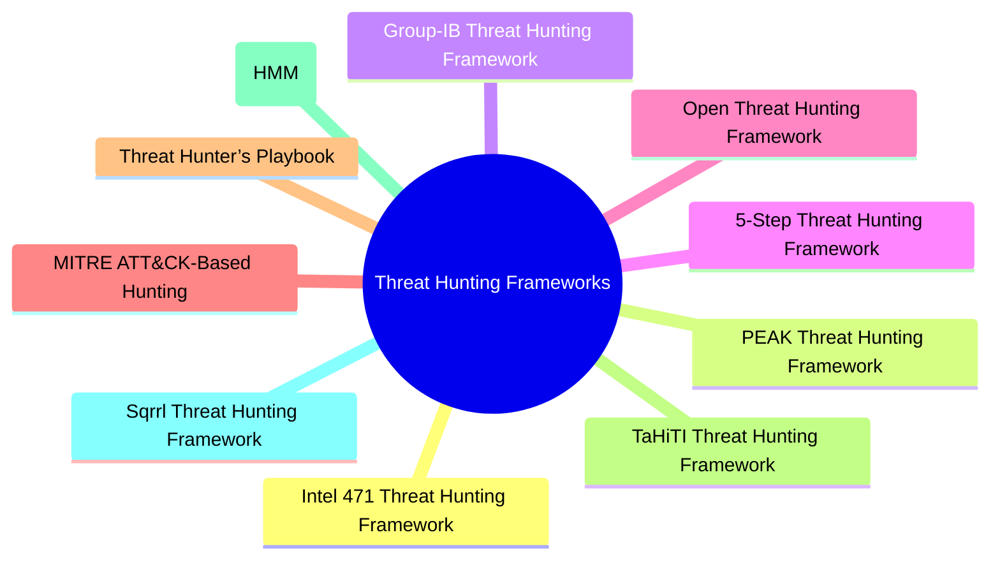

|Revised Date | Author | Comment |
| ----------- | ------ | ------- |
| 20.04.2025  | Roger Johnsen | Article added |

**In my introduction to this book I wrote that if you were to inquire about threat hunting, you would likely encounter a wide range of interpretations, comparable to the multitudes of stars in the night sky. The same woul apply if you inquire on how to do threat hunting. Everyone out there appears to have their own methodology. Given that there are a multitude of methodologies out there, multiple instances has tried to put their frameworks onto paper and promote their ideas. This resulting in a set of frameworks released over the years. Some have been thought of as the folden standard, until a new one came alone. Whilst others has just been memos on how to do XYZ. In this article, I’ve gathered a selection of threat hunting frameworks that have shaped the field. Some are community-born, others come from leading cybersecurity vendors, and a few are still under-the-radar gems. Together, they form a reference landscape for practitioners and decision-makers looking to mature their hunting practices.**

---

To provide an overview of what's out there, the mindmap below depicts a handful of frameworks available. I have chosen those I belive are the most usefule ones to know: 

Furhter, the table below summarizes each framework with a short description and a reference link. These frameworks span a variety of perspectives. Some focus on process, others on tooling, data, intelligence integration, or organizational development. They are not ranked in any particular order, and each offers something unique. Whether you're building a hunting program from scratch or refining your current approach, these frameworks can serve as starting points or sources of inspiration. They do really make a great starting point for aspiring Threat Hunters!

| Framework Name | Description | Link |
|----------------|-------------|------|
| Intel 471 Threat Hunting Framework | Combines cyber threat intelligence and behavioral hunting with pre-validated queries mapped to MITRE ATT&CK.         | [Intel 471 Threat Hunting Framework ](https://intel471.com/resources/whitepapers/threat-hunting-framework) |
| PEAK Threat Hunting Framework    | Vendor-agnostic framework with Prepare, Execute, Act phases supporting hypothesis, baseline, and model-assisted hunts. | [Introducing the PEAK Threat Hunting Framework](https://www.splunk.com/en_us/blog/security/peak-threat-hunting-framework.html)                                                 |
| Group-IB Threat Hunting Framework | Adversary-centric detection of targeted attacks using proprietary technologies.                                     | [Group-IB Framework](https://www.ecura.at/wp-content/uploads/2021/08/Group-IB_Threat-Hunting-Framework_Leaflet_ENG_.pdf) |
| 5-Step Threat Hunting Framework  | Hypothesis-driven process with stages: hypothesis, data collection, trigger, investigation, and resolution.          | [Bitsight Guide](https://www.bitsight.com/learn/threat-hunting-explained)                     |
| Open Threat Hunting Framework    | Covers governance, staffing, data types, and use cases for operational hunting programs.                             | [OTHF GitHub](https://github.com/TactiKoolSec/OTHF/blob/main/Entire%20Framework/OTHF_Full_Framework_v3.pdf)                                  |
| MITRE ATT&CK-Based Hunting       | Guides hunts using adversary TTPs mapped to the ATT&CK matrix; foundational for structured hunting.                  | [MITRE ATT&CK](https://attack.mitre.org/)                                                    |
| Threat Hunter’s Playbook         | Community-driven playbook with ATT&CK-mapped practical hunting techniques.                                           | [GitHub](https://github.com/OTRF/ThreatHunter-Playbook)                                       |
| TaHiTI Threat Hunting Framework  | Integrates threat intelligence into hunting via preparation, hunting, and iteration phases.                          | [TaHiTI Whitepaper](https://www.betaalvereniging.nl/wp-content/uploads/TaHiTI-Threat-Hunting-Methodology-whitepaper.pdf) |
| Hunting Maturity Model (HMM)     | Defines five levels of organizational hunting maturity (HMM0 to HMM4) to guide capability development. | [A Simple Hunting Maturity Model](https://detect-respond.blogspot.com/2015/10/a-simple-hunting-maturity-model.html) |
| Sqrrl Threat Hunting Framework   | Iterative, hypothesis-driven model focusing on investigation and response; includes Hunting Maturity Model.          | [Sqrrl Whitepaper](https://www.threathunting.net/files/framework-for-threat-hunting-whitepaper.pdf) |

## On the Origin of Species

> “It is not the strongest of the species that survives, not the most intelligent that survives. It is the one that is the most adaptable to change.”  
> — Charles Darwin

This quote from Charles Darwin is particularly fitting when we consider the evolution of threat hunting frameworks. Over time, these frameworks have been shaped and adapted by researchers and organizations to respond to the ever-changing threat landscape. Just as species evolve to thrive in their environments, these frameworks have emerged and evolved to meet the challenges posed by increasingly sophisticated adversaries and diverse cybersecurity needs.

The frameworks we see today stem from various sources, each one reflecting the unique needs of the organizations that developed them. Whether driven by vendor capabilities, national security concerns, or community collaboration, these frameworks have adapted to address new threats, leveraging lessons learned from experience and innovation.

Below is a table summarizing the origins of various threat hunting frameworks, showing how each one aligns with a specific domain and its unique challenges:

| Origin | Description | Example |
| ------ | ----------- | ------- |
| SIEM/SOAR Companies                          | Frameworks designed to optimize threat detection, response, and orchestration, often aligned with vendor products.          | PEAK Threat Hunting Framework by Splunk          |
| Financial and Critical Infrastructure        | Developed by organizations in critical sectors to address high stakes in security and compliance.                           | Open Threat Hunting Framework (OTHF)            |
| Government and Military Agencies             | Focused on national security, often addressing advanced threats and intelligence.                                           | MITRE ATT&CK                                     |
| Cybersecurity Vendors/Independent Threat Hunters | Created based on hands-on experience, often focusing on specific attack types or methodologies.                              | Intel 471’s Threat Hunting Framework, TaHiTI     |
| Other Security Product Companies             | Frameworks developed by security product companies that don't fall under SIEM/SOAR, or have since been acquired/repositioned. | Sqrrl Threat Hunting Framework                   |
| Community-Driven Open Source                 | Emerges from community contributions, addressing common challenges in threat hunting.                                          | Threat Hunter’s Playbook                         |
| Cybersecurity Consulting Firms               | Tailored for large enterprises to address complex environments and organizational needs.                                     | Group-IB's Threat Hunting Framework              |               |

Just like Darwin’s theory of evolution, these frameworks continue to adapt to the changing needs of the cybersecurity ecosystem. Each framework represents a different path in the ongoing battle against cyber threats, driven by the need for constant adaptation, improvement, and survival.

## My Take on These Frameworks

In the following subchapters, I’ll focus on the frameworks I find most valuable. Not just in theory, but in day-to-day operations. While each entry in the list has merit, some resonate more deeply with how I approach threat hunting in practice. Expect a mix of analysis, personal reflections, and practical context.

Let’s dive in.

