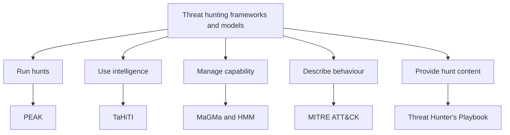

**Author:** *Roger C.B. Johnsen*

## Introduction

**Threat hunting frameworks help turn hunting from individual effort into repeatable practice. Threat hunting is often described in different ways depending on who you ask. Some people focus on hypotheses. Some focus on threat intelligence. Some focus on anomalies, data science, detection engineering, maturity or operational capability. The same is true for threat hunting frameworks.**

The word framework is used broadly in this field. A framework may describe a hunt lifecycle, a maturity model, a playbook library, an intelligence methodology, a use case management model or a vendor-specific operating approach. These are not the same thing, but they are often discussed as if they were.

That can make the landscape difficult to navigate. This section tries to separate those ideas. The goal is not to catalogue every threat hunting framework ever created. The goal is to describe the frameworks, models and structured approaches that are useful to know, explain what problem they try to solve, and show how they can support a mature hunting capability.

## Why Frameworks Matter

A good threat hunter can investigate without a formal framework. That does not mean frameworks are useless. Frameworks become valuable when an organisation needs hunting to be repeatable, teachable, reviewable and connected to security improvement. They help prevent every hunt from becoming a one-off activity that depends entirely on the memory, style or experience of one analyst.

A useful framework can help define:

* where hunt ideas come from
* how hunts are selected and prioritised
* how hypotheses are formed
* how scope is defined
* how execution is documented
* how findings are handed over
* how detections are created or improved
* how use cases are managed over time
* how knowledge survives after the hunt is finished

This does not mean the framework should control the hunter. A framework should support investigation, not replace judgement. The hunter still needs curiosity, technical skill, scepticism, domain knowledge and the ability to follow evidence when the hunt changes direction.

> A framework should make good hunting easier to repeat, not turn hunting into form-filling.
>
> -- Roger Johnsen

## Frameworks Are Not All the Same

One reason threat hunting frameworks can be confusing is that they operate at different levels. Some frameworks describe how to run a hunt. Others describe how to build maturity. Some help turn intelligence into hunts. Some help manage use cases after the hunt has produced output. Some are not frameworks in a strict sense, but are still important because they shape how hunters structure investigations.

A single organisation will usually need more than one type of framework or model. One framework may help structure the hunt itself, while another helps describe adversary behaviour, manage maturity, operationalise threat intelligence or preserve outputs after the hunt is finished.

A practical way to view the landscape is to ask what the framework helps with.


```mermaid
flowchart TD
    A[Threat hunting frameworks and models]
    A --> B[Run hunts]
    A --> C[Use intelligence]
    A --> D[Manage capability]
    A --> E[Describe behaviour]
    A --> F[Provide hunt content]

    B --> B1[PEAK]
    C --> C1[TaHiTI]
    D --> D1[MaGMa and HMM]
    E --> E1[MITRE ATT&CK]
    F --> F1[Threat Hunter's Playbook]
```

This is not a perfect taxonomy, but it is useful. It reminds us that different frameworks answer different questions:

* How do we run the hunt?
* How do we turn intelligence into hunting activity?
* How mature is our hunting capability?
* How do we describe adversary behaviour?
* How do we manage the outputs after the hunt?
* Where can we find practical hunt ideas, queries or patterns?

Those questions are related, but they are not the same.

## A Practical Taxonomy

The table below groups common threat hunting frameworks and related models by the type of problem they help solve.

| Type                               | What it helps with                                                                           | Examples                      |
| ---------------------------------- | -------------------------------------------------------------------------------------------- | ----------------------------- |
| Hunt lifecycle frameworks          | How to prepare, execute and act on hunts.                                                    | PEAK                          |
| Intelligence-driven methodologies  | How to turn threat intelligence into hunting activity.                                       | TaHiTI                        |
| Use case and capability management | How to manage outputs, detections, metrics and improvement over time.                        | MaGMa                         |
| Maturity models                    | How to assess and develop hunting capability.                                                | Hunting Maturity Model        |
| Behavioural reference models       | How to describe adversary behaviour and structure hunting around techniques.                 | MITRE ATT&CK                  |
| Playbooks and practical libraries  | How to provide hunt content such as hypotheses, queries, investigation patterns or examples. | Threat Hunter’s Playbook      |
| Programme and operating models     | How to structure hunting teams, governance, data and operations.                             | Open Threat Hunting Framework |
| Vendor or product-aligned models   | How a vendor structures hunting around its platform, intelligence or services.               | Intel 471, Group-IB, Sqrrl    |

This distinction matters because a team may say that it needs a threat hunting framework, when it actually needs something more specific.

For example:

* A team with ad hoc investigations may need a hunt lifecycle framework.
* A team with good intelligence but poor follow-through may need an intelligence-driven methodology.
* A team with many detections and no ownership may need use case management.
* A team with no clear development path may need a maturity model.
* A team struggling to describe adversary behaviour may need ATT&CK.
* A team looking for concrete hunt ideas may need playbooks.

The word framework is therefore less important than the problem being solved.

## The First Frameworks Covered Here

The first subchapters in this section focus on three frameworks that work well together:

| Framework | Primary role                                                                                       |
| --------- | -------------------------------------------------------------------------------------------------- |
| PEAK      | Structures the hunt lifecycle from preparation to execution and action.                            |
| TaHiTI    | Structures intelligence-driven hunting from threat intelligence to investigation and final output. |
| MaGMa     | Manages use cases, lifecycle, metrics and continuous improvement after hunting and detection work. |

A simple way to separate them is:

```text
PEAK   → how the hunt is run
TaHiTI → how intelligence drives the hunt
MaGMa  → how outputs become managed capability
```

This is important because many teams mix these concerns together. A hunt can be well executed but poorly documented. Threat intelligence can be interesting but never become a local hunt. A useful detection can be created but never owned, reviewed, measured or maintained.

PEAK, TaHiTI and MaGMa help address different parts of that problem.

## How These Frameworks Work Together

The frameworks in this section are not competing answers to the same question. They can support different parts of the same hunting programme.

A threat intelligence report may create a TaHiTI trigger. PEAK can structure the hunt from preparation to execution and action. The hunt may produce detections, triage guidance, visibility gaps or follow-up work. MaGMa can then help manage those outputs as use cases or improvement items over time.

A compact way to view this is:

```text
Triggers → Hunt → Output → Managed capability
```

Triggers may come from threat intelligence, hypotheses, anomalies, incidents, risk assessments, visibility gaps, red team findings or previous hunts. PEAK, TaHiTI and MaGMa help move those triggers through investigation and into durable security improvement.

In practice, that can look like this:

```text
Threat intelligence, risk, gaps or previous hunts
        ↓
TaHiTI: turn input into hunting activity
        ↓
PEAK: prepare, execute and act with knowledge
        ↓
Hunt findings and outputs
        ↓
MaGMa: manage, measure and improve use cases
        ↓
Improved detection, triage, visibility and future hunts
```

For example, an APT report may describe abuse of valid accounts for lateral movement. TaHiTI can help turn that report into a hunt trigger and local hunting question. PEAK can structure the hunt from preparation to execution and action. If the hunt produces useful detection logic, triage guidance or a visibility gap, MaGMa can help ensure that the output is owned, reviewed and improved over time.

This is also where detection engineering connects to hunting. A hunt may produce a detection idea, but detection engineering is needed to turn that idea into reliable, tested and maintainable detection logic.

* The point is not that every hunt must formally use every framework.
* The point is that each framework helps with a different failure mode.

| Failure mode                                                    | Helpful framework |
| --------------------------------------------------------------- | ----------------- |
| Hunts are ad hoc and inconsistent.                              | PEAK              |
| Threat intelligence is consumed but not operationalised.        | TaHiTI            |
| Intelligence creates interest but not testable local questions. | TaHiTI            |
| Hunts produce knowledge but do not improve future work.         | PEAK and MaGMa    |
| Hunts end with findings, but no reusable output.                | MaGMa             |
| Hunt outputs are documented poorly or forgotten.                | MaGMa             |
| Detections are created but not owned or maintained.             | MaGMa             |

Used together, they provide a practical operating model for threat hunting.

## Other Frameworks and Models

PEAK, TaHiTI and MaGMa are only the first frameworks covered in this section. Other models and resources are also relevant to threat hunting, either because they shaped the field historically or because they solve a practical problem for modern teams.

Examples include:

| Framework or model                 | Why it matters                                                                   |
| ---------------------------------- | -------------------------------------------------------------------------------- |
| Hunting Maturity Model             | Helps describe levels of hunting maturity and capability development.            |
| MITRE ATT&CK-based hunting         | Provides a behavioural structure for planning hunts around adversary techniques. |
| Threat Hunter’s Playbook           | Provides practical, ATT&CK-mapped hunt ideas and query examples.                 |
| Open Threat Hunting Framework      | Provides a broader programme view of people, process, data and governance.       |
| Sqrrl Threat Hunting Framework     | Historically important for popularising iterative, hypothesis-driven hunting.    |
| Intel 471 Threat Hunting Framework | Shows how cyber threat intelligence can be connected to behavioural hunting.     |
| Group-IB Threat Hunting Framework  | Represents a vendor and adversary-centric approach to targeted attack hunting.   |

Some of these are full frameworks. Some are models. Some are libraries or references. Some are vendor-aligned. Some are community-driven.

They are included because they help explain how the field has evolved and how different practitioners have tried to structure the same problem: finding adversary behaviour that normal monitoring may miss.

## How to Read This Section

Read the subchapters as complementary, not competing:

* Start with PEAK if you want to understand how to structure a hunt from start to finish.
* Read TaHiTI if you want to understand how threat intelligence becomes a hunt.
* Read MaGMa if you want to understand how hunting and detection outputs should be managed after the initial work is done.

Later subchapters may cover maturity models, playbook libraries, ATT&CK-based approaches, vendor frameworks and other structured models that have influenced threat hunting practice.

A useful way to approach the section is to ask:

```text
What problem does this framework solve?
```

That question is more useful than asking which framework is best. A framework that is excellent for structuring a hunt may not help much with maturity. A maturity model may not tell the hunter how to execute an investigation. A playbook library may provide useful ideas but not solve ownership, metrics or follow-through.

The value depends on the problem.

## Working Position for This Book

For this book, threat hunting frameworks are best treated as practical support structures. They should help the hunter think, scope, execute, document and improve. They should not replace analysis.

A framework does not make a weak hunt strong by itself. A team can follow a process and still ask poor questions, use weak telemetry, ignore context or fail to act on findings.

The value appears when the framework helps the team do better work.

A useful threat hunting framework should help the organisation move from:

```text
An analyst investigated something interesting.
```

to:

```text
The team learned something, improved something and made the next hunt better.
```

That is the standard used in this section.

## Resources

* [Introducing the PEAK Threat Hunting Framework](https://www.splunk.com/en_us/blog/security/peak-threat-hunting-framework.html)
* [The PEAK Threat Hunting Framework](https://www.splunk.com/en_us/pdfs/gated/ebooks/splunk-peak-threat-hunting-framework.pdf)
* [DEF-TaHiTI Threat Hunting Methodology](https://www.betaalvereniging.nl/wp-content/uploads/DEF-TaHiTI-Threat-Hunting-Methodology.pdf)
* [MaGMa for threat hunting](https://www.betaalvereniging.nl/wp-content/uploads/FI-ISAC-use-case-framework-verkorte-versie.pdf)
* [A Simple Hunting Maturity Model](https://detect-respond.blogspot.com/2015/10/a-simple-hunting-maturity-model.html)
* [Threat Hunter’s Playbook](https://github.com/OTRF/ThreatHunter-Playbook)
* [Open Threat Hunting Framework](https://github.com/TactiKoolSec/OTHF)
* [MITRE ATT&CK](https://attack.mitre.org/)

## Revision

| Revised Date | Comment                                                                                                                                                     |
| ------------ | ----------------------------------------------------------------------------------------------------------------------------------------------------------- |
| 2026-07-10   | Major rewrite. Reframed the article as a parent page for the threat hunting framework landscape, including taxonomy, practical use and current subchapters. |
| 2025-04-20   | Article added                                                                                                                                               |
