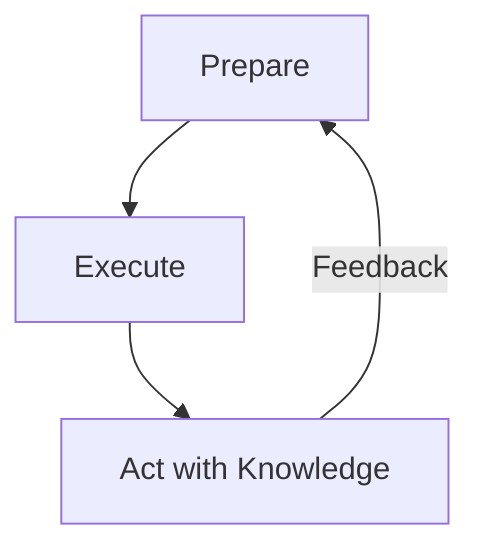
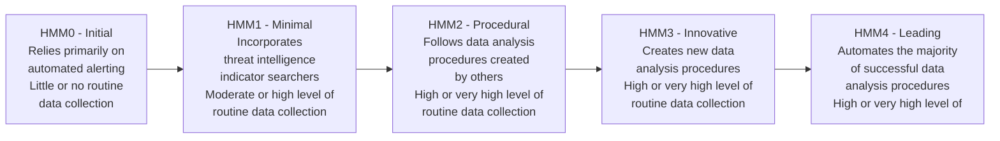

|Revised Date | Author | Comment |
| ----------- | ------ | ------- |
| 20.04.2025  | Roger Johnsen | Article rewritten |

## Introduction

**Threat hunting is not just an activity; it’s a mindset. As defenders mature, they evolve from passively reviewing alerts to actively pursuing adversaries. The PEAK Threat Hunting Framework, developed by Splunk’s SURGe team (David Bianco, Dr. Ryan Fetterman, and Sydney Marrone), offers a comprehensive approach that helps hunters structure their methodology while driving measurable improvements.** 

---

## Why PEAK?

PEAK stands for *Prepare, Execute, and Act with Knowledge*. More than a model, PEAK is a philosophy that emphasizes continuous improvement in proactive defense. It focuses on building repeatable, scalable, and professionalized hunting operations that evolve alongside your environment, ensuring that your threat hunting activities can adapt to emerging threats.

PEAK helps address common challenges in threat hunting, such as poor documentation, inconsistent outcomes, and lack of follow-through. By defining a structured lifecycle focused on *preparation, execution, and impact*, PEAK ensures that hunting activities contribute effectively to the broader security posture.

Unlike other frameworks that emphasize hypothesis testing in isolation, PEAK stresses the importance of *people, processes, and planning* alongside analysis. The framework also introduces *three hunt types*:

| Type | Description |
| ---- | ----------- | 
| Hypothesis-driven hunting | Traditional hypothesis-based hunting focused on investigating specific threats.
| Baseline-based hunting | Anomaly detection, using historical baselines to identify deviations in normal behavior.
| Model-assisted hunting (M-ATH) | Leveraging machine learning models to enhance threat detection and hunting capabilities.

## Core Phases of the PEAK Framework

The PEAK Threat Hunting Framework consists of three major phases, each with clearly defined objectives and outcomes:

- Prepare
- Execute
- Act (with Knowledge)

Let’s explore each phase!

### Phase 1 - Prepare

**Before the hunt starts, are you truly ready?**

Preparation is crucial for ensuring that the hunt is purposeful and effective. It involves aligning on goals, selecting the right tools, understanding available data, and framing relevant hypotheses. Proper preparation minimizes wasted effort and maximizes the potential for uncovering real threats.

**Preparation Activities Include:**

| Task | Description |
| ---- | ----------- |
| Planning | Define the scope, objectives, and timeline for the hunt. |
| Threat Intelligence Mapping | Align with frameworks such as MITRE ATT&CK and identify relevant adversary behaviors. |
| Hunt Team Alignment | Ensure that all team members have defined roles, understand the assumptions, and agree on communication strategies. |
| Data Availability Review | Verify that the necessary telemetry and data sources are available and of high quality. |
| Documentation Setup | Prepare templates for reporting and documenting findings throughout the hunt. |

**Why it matters**  
Unprepared hunts often devolve into inefficient, aimless explorations. Adequate preparation ensures that the hunt is aligned with organizational priorities, efficient in its execution, and accountable for its outcomes.

### Phase 2 - Execute

**How do you carry out the hunt effectively?**

Execution involves the core hunting activities: exploring data, validating hypotheses, uncovering anomalies, and investigating leads. This phase is where the threat hunter’s skills, tools, and experience come into play.

**Execution Activities Include:**

- Query development and testing
- Execution of hunting playbooks
- Timeline and graph creation for investigation
- Anomaly detection and triage
- Collaboration between hunters and Subject Matter Experts (SMEs)

**Example Flow:**

> **Hypothesis**: Lateral movement is occurring using SMB.  
> **Action**: Search for unusual cross-host file transfers using `smbclient` or `net use` commands.  
> **Follow-up**: Pivot into host behavior, peer activity, and identity usage to trace lateral movement.

**Why it matters**  
Execution is the heart of threat hunting. It requires technical expertise, investigative intuition, and disciplined processes to follow leads and connect data points. A structured execution phase is key to uncovering actionable intelligence.

### Phase 3 - Act (with Knowledge)

**What did we learn, and how does it improve our defense posture?**

The final phase of the PEAK framework focuses on translating the outcomes of the hunt into meaningful actions that strengthen the organization’s defenses. The results of the hunt should be shared, integrated into existing processes, and used to improve detection, response, and prevention capabilities.

**Key Impact Areas Include:**

| Outcome | Examples |
| ------- | -------- |
| Detections | Develop or refine detection logic based on findings. |
| Documentation | Create reusable reports, playbooks, and dashboards. |
| Coverage Enhancements | Identify visibility gaps, missing logs, or overlooked assets. |
| Training & Enablement | Share findings with SOC and IR teams to improve their capabilities. |
| Metrics & KPIs | Track and report metrics such as time-to-hunt, hypotheses tested, and systems covered. |

**Why it matters**  
PEAK emphasizes *closing the loop*. Threat hunting should never be a “hunt and forget” exercise. Instead, findings must be fed back into the security ecosystem to refine defenses, enhance detection capabilities, and support continuous improvement.

## PEAK Threat Hunting Lifecycle

The diagram below illustrates the PEAK Threat Hunting Lifecycle. The feedback loop is crucial—each hunt informs the next, driving continuous improvement in readiness, execution, and defense capabilities.

---

## PEAK in Practice: A Practical Example

**Scenario**  
A surge in ransomware attacks targeting backup servers prompts your team to act.

**1. Prepare**  
- Define scope: Hunt across all backup infrastructure.  
- Identify MITRE techniques: T1485 (Data Destruction), T1003 (Credential Dumping).  
- Validate EDR and file access logs.  
- Assign roles across the team and align with threat intelligence.

**2. Execute**  
- Query for suspicious access to backup volumes.  
- Analyze PowerShell execution and NTFS permission changes.  
- Investigate use of `vssadmin delete shadows`.  
- Identify unauthorized lateral movement into backup systems.

**3. Act with Knowledge**  
- Develop detection logic for shadow copy deletion patterns.  
- Recommend hardening controls on backup servers.  
- Document findings and share them with the team.  
- Feed outcomes into incident response playbooks.

## Hunt Program Maturity with PEAK

PEAK represents a maturity leap, transitioning from isolated hunts to an integrated, strategic program. As teams adopt and mature their hunting capabilities, they move through stages from ad hoc hunts to fully integrated PEAK-based frameworks.

## Conclusion

The PEAK Threat Hunting Framework provides organizations with a structured, strategic approach to developing, measuring, and evolving threat hunting programs. By balancing preparation, disciplined execution, and actionable outcomes, PEAK transforms hunting from a chaotic activity into a repeatable, professional function.

With PEAK, you can:

- Foster a culture of hunting within your SOC.
- Elevate junior analysts through structured processes and clear documentation.
- Bridge gaps between intelligence, detection, and incident response.
- Continuously improve your security posture through iterative learning and adaptation.

Threat hunting is more than just finding threats—it’s about building a smarter, more resilient defense over time. PEAK makes that journey structured, sustainable, and effective.

---

## References

| Resource | Description |
| ----- | ----------- |
| [Introducing the PEAK Threat Hunting Framework](https://www.splunk.com/en_us/blog/security/peak-threat-hunting-framework.html) | Introduction to the PEAK Threat Hunting Framework |
| [The PEAK Threat Hunting Framework](https://www.splunk.com/en_us/pdfs/gated/ebooks/splunk-peak-threat-hunting-framework.pdf) | The document about PEAK framework to read! |
| [MITRE ATT&CK](https://attack.mitre.org/) | Framework for mapping tactics, techniques, and procedures used by adversaries. |
| [ThreatHunting.org](https://threathunting.org) | Community-driven hunt library and knowledge base. |
| [Pyramid of Pain – David Bianco](https://detect-respond.blogspot.com/2013/03/the-pyramid-of-pain.html) | A framework for understanding the value of detection targets. |
| [Red Canary's Threat Detection Report](https://redcanary.com/threat-detection-report/) | Annual report providing insights into detection trends and best practices. |