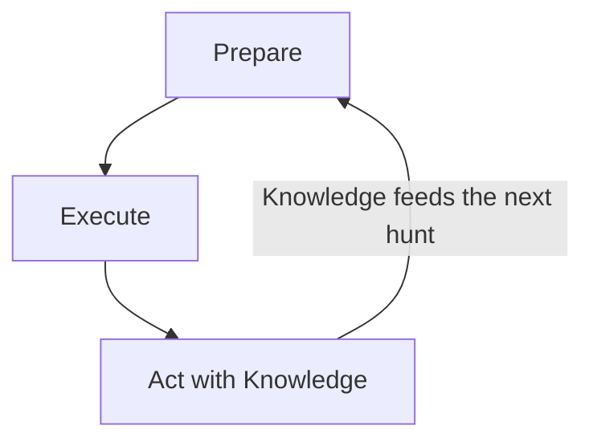

**Author:** *Roger C.B. Johnsen*

## Introduction

**PEAK is a threat hunting framework built around three activities: Prepare, Execute and Act with Knowledge.**

The framework was developed by Splunk’s SURGe team and is intended to make threat hunting more repeatable, useful and connected to measurable security improvement. PEAK is not only about running hunts. It is about making sure the organisation prepares properly, executes with discipline and turns what it learns into something useful afterwards.

A threat hunt can easily become a one-off investigation. A team spends time exploring telemetry, writes a report, shares a few findings and then moves on. Sometimes that is enough in the moment, but it does not necessarily improve the organisation over time. PEAK pushes against that problem.

It treats hunting as a lifecycle where knowledge is used before the hunt, created during the hunt and acted on after the hunt. That knowledge may come from threat intelligence, business context, previous hunts, analyst experience, data exploration, detection engineering or the findings from the current hunt.

For threat hunters, this is a useful way to think because it keeps the whole hunt in view. The hunt is not only the query, the hypothesis or the interesting finding. It also includes the preparation that makes the work possible, the execution that tests the idea, and the follow-through that decides whether the hunt becomes useful security improvement or just another note in a report.

That makes PEAK especially useful for teams that want to move from individual hunts to a more professional hunting capability.

> A hunt that produces knowledge but does not feed that knowledge back into the defence is only half finished.
>
> -- Roger Johnsen

## What PEAK Is

PEAK stands for **Prepare, Execute and Act with Knowledge**. The framework defines a common structure for threat hunts while still allowing hunters to adapt the work to the situation. That flexibility is important because hunts are not all the same. Some begin with a clear hypothesis. Some begin with a baseline or anomaly question. Some are assisted by models or machine learning. Some produce findings. Others produce rejected hypotheses, visibility gaps, detection ideas or lessons about normal behaviour.

PEAK gives those different hunts a shared shape.

| PEAK element | Meaning                                                                                                                   |
| ------------ | ------------------------------------------------------------------------------------------------------------------------- |
| Prepare      | Select the topic, research the problem, scope the hunt and decide how the hunt should be approached.                      |
| Execute      | Gather and analyse data, test the hypothesis or question, pivot, refine and escalate when necessary.                      |
| Act          | Preserve the hunt, document findings, communicate outcomes, create detections and feed knowledge back into the programme. |
| Knowledge    | The context, intelligence, experience, data understanding and findings that inform every part of the lifecycle.           |

This is why the “Knowledge” part of PEAK is important. Knowledge is not only the output at the end. It is part of the whole process. A hunter prepares using knowledge. A hunter executes by creating and testing knowledge. A hunter acts by preserving and sharing knowledge.

That makes PEAK more than a process diagram. It is a way to prevent hunts from becoming disconnected events.

## The Three PEAK Hunt Types

PEAK describes three types of threat hunts:

| Hunt type                     | Description                                                                                                           |
| ----------------------------- | --------------------------------------------------------------------------------------------------------------------- |
| Hypothesis-driven hunting     | A hunt based on a testable statement about possible adversary behaviour in the environment.                           |
| Baseline hunting              | A hunt that establishes or uses a baseline of normal behaviour and looks for meaningful deviations.                   |
| Model-assisted threat hunting | A hunt where models, analytics or machine learning help identify patterns, anomalies or candidates for investigation. |

These hunt types are useful because they give hunters more than one starting point.

Not every hunt starts with a fully formed hypothesis. Sometimes the team has threat intelligence that suggests a specific behaviour to test. Sometimes the team needs to understand what normal looks like before it can define what suspicious means. Sometimes a model can help surface unusual activity that humans can then investigate.

The important point is that PEAK does not remove the hunter from the work.

Even when a hunt is model-assisted, the human hunter still needs to understand the environment, validate findings, test assumptions and decide what the result means.

That distinction matters. Machine learning can help identify candidates. It does not replace investigation.

## Hypothesis-Driven Hunting

Hypothesis-driven hunting is the classic threat hunting approach. The hunter starts with a testable statement about possible adversary behaviour and then uses data to support, weaken or reject it. A simple hypothesis might be:

```text
Attackers may be using remote services for lateral movement between workstations and servers outside normal administrative patterns.
```

That hypothesis gives direction. It suggests behaviour to look for, data sources to review and validation questions to answer.

In PEAK terms, the hunter prepares by selecting and researching the topic, shaping the hypothesis and defining scope. The hunter executes by gathering data, analysing the behaviour and refining the investigation. The hunter acts by documenting the outcome, creating detections or feeding lessons back into future hunts.

Hypothesis-driven hunting is powerful because it gives the hunt structure.

But a weak hypothesis can still produce weak hunting. If the hypothesis is too vague, the hunt may turn into browsing logs. If it is too narrow, the hunt may miss related behaviour. If it cannot be tested with available telemetry, it may fail before execution starts.

PEAK helps by forcing the hunter to think about preparation before diving into the data.

## Baseline Hunting

Baseline hunting starts from a different question:

```text
What is normal here, and what meaningfully deviates from it?
```

This is useful when the team does not know enough about an environment, behaviour or data source to write a strong hypothesis immediately.

For example, a hunter may want to understand:

* which parent processes normally launch PowerShell
* which users normally access backup systems
* which hosts normally communicate with external cloud storage
* which service accounts normally authenticate across systems
* which administrative tools are normally used in a given server group

A baseline hunt can reveal suspicious outliers, but it can also reveal something equally valuable: normal behaviour.

That matters because detection engineering and triage both depend on knowing what normal looks like. Without baseline understanding, rules become noisy, analysts waste time and rare-but-legitimate behaviour may be mistaken for compromise.

Baseline hunting is not “just anomaly detection”. It is structured learning about the environment. The result may be a finding, but it may also be a better baseline, a detection candidate, a suppression rule, a triage note or a visibility gap.

## Model-Assisted Threat Hunting

Model-assisted threat hunting, often shortened to **M-ATH**, uses models or machine learning to support the hunting process.

This may include:

* anomaly scoring
* clustering
* classification
* behavioural modelling
* statistical outlier detection
* model-assisted prioritisation
* known-good or known-bad pattern comparison

The value of model-assisted hunting is that it can help the hunter find patterns that may be difficult to identify manually.

But the model does not own the conclusion. A model can surface unusual behaviour. It can suggest candidates. It can reduce the search space. It can help prioritise. But the hunter still has to orient around context, validate the result and decide whether the activity matters.

The failure mode is analyst overload. A model that only produces large volumes of “rare” or “unusual” events without useful context may create more work than value. Model-assisted hunting works best when the model helps prioritise meaningful questions, not when it simply hands the hunter another noisy queue.

That is especially important in environments where unusual does not always mean malicious.

A rare login, strange process chain or unusual data transfer may be malicious. It may also be a business exception, administrative maintenance, deployment activity or telemetry artefact.

Model-assisted hunting becomes useful when it combines machine assistance with human validation.

> Model-assisted hunting should help the hunter ask better questions. It should not pretend to answer them alone.
>
> -- Roger Johnsen

## Prepare

The **Prepare** phase is where the hunt is made ready before the team starts digging through data. This phase matters because many weak hunts fail before execution begins. The team starts with an interesting idea, but the scope is unclear, the data source is missing, the hypothesis cannot be tested or nobody agrees what output the hunt should produce.

Preparation reduces that waste. Useful preparation activities include:

| Activity                      | Purpose                                                                             |
| ----------------------------- | ----------------------------------------------------------------------------------- |
| Select topic                  | Decide what behaviour, threat, gap or environment the hunt should focus on.         |
| Research topic                | Understand the threat, technique, environment, prior hunts and existing detections. |
| Generate or refine hypothesis | Turn the idea into something testable, where relevant.                              |
| Scope the hunt                | Define systems, users, time range, data sources and boundaries.                     |
| Review telemetry              | Confirm that the required data exists and is good enough to support the hunt.       |
| Plan communication            | Decide who should be involved, informed or ready to receive findings.               |
| Prepare documentation         | Set up the notes, templates or tracking needed to preserve the hunt.                |

Preparation is not bureaucracy. It is what prevents the hunt from becoming aimless. A hunter does not need a massive project plan for every hunt, but they do need enough structure to know what they are testing, where they are looking and what they will do with the result.

A useful preparation question is:

```text
Are we able to hunt this properly with the data, time and knowledge we have?
```

If the answer is no, the team may still have learned something important: the organisation has a visibility or readiness gap.

## Execute

The **Execute** phase is where the hunter performs the investigation. This is where data is gathered, queries are written, hypotheses are tested, baselines are explored, models are reviewed and leads are followed.

Execution may include:

* gathering data
* pre-processing data
* writing and testing queries
* reviewing timelines
* building relationship graphs
* analysing anomalies
* pivoting between hosts, users, identities and infrastructure
* validating findings
* refining the hypothesis
* escalating critical findings

This is often the part people think of as “the hunt”. That is understandable, but PEAK makes an important point: execution is only one part of a successful hunt. A hunt can be technically impressive and still fail if it was poorly prepared or if the results are not acted on afterwards.

During execution, the hunter should continuously ask:

* What did we find?
* Does it support the hypothesis?
* Does it weaken the hypothesis?
* What else could explain this?
* What should we pivot to next?
* Is this becoming an incident?
* What should be preserved for later?

Execution should be disciplined, but not rigid. A good hunter follows the evidence. If the data reveals that the original idea was wrong, that is not failure. It may be a useful rejection, a better hypothesis, a baseline improvement or a visibility gap.

## Act with Knowledge

The **Act** phase is where PEAK becomes especially valuable. This phase is about making sure the knowledge created during the hunt is preserved, communicated and turned into security improvement.

Possible actions include:

| Action                     | Purpose                                                                                         |
| -------------------------- | ----------------------------------------------------------------------------------------------- |
| Document findings          | Preserve what was tested, what was found and what it means.                                     |
| Communicate results        | Share findings with SOC, incident response, detection engineering, management or system owners. |
| Create detections          | Turn useful behaviour into detection logic or analytics.                                        |
| Improve triage             | Add analyst guidance, context, enrichment or suppression logic.                                 |
| Preserve the hunt          | Keep queries, notes, assumptions and decisions for future reuse.                                |
| Re-add topic to backlog    | Continue later if the hunt opened new questions.                                                |
| Escalate critical findings | Move confirmed or serious findings into incident response.                                      |

This phase is where many organisations lose value. A hunt may find something useful, but if the result stays in a report and never improves detection, response, telemetry or understanding, the long-term value is limited.

This is also where hunting becomes programme value. A finding may matter during the hunt, but the knowledge only becomes durable when it changes how the organisation detects, responds, documents, prioritises or prepares the next hunt.

PEAK helps close that loop. It asks the team to treat hunt output as knowledge that should be acted on.

> The Act phase is where a hunt either becomes organisational learning or fades into another report.
>
> -- Roger Johnsen

## The PEAK Lifecycle

The PEAK lifecycle can be represented simply:


```mermaid
graph TD
    A[Prepare] --> B[Execute]
    B --> C[Act with Knowledge]
    C -->|Knowledge feeds the next hunt| A
```

The feedback loop is the point. Each hunt should improve the next one. That improvement may come from better telemetry, better hypotheses, better baselines, better models, better detections or better understanding of the environment. If the team repeats hunts without improving anything, the programme is not really maturing.

PEAK encourages hunters to preserve knowledge and feed it back into future work.

## PEAK in Practice: Ransomware and Backup Servers

Consider a simplified scenario. Threat intelligence and recent incident reports suggest that ransomware operators are increasingly targeting backup infrastructure before deploying ransomware. The team decides to hunt for suspicious activity around backup servers.

### Prepare

The team starts by defining the scope. They decide to hunt across backup servers, backup administration accounts, remote administration activity, PowerShell usage, file access logs, authentication logs and endpoint telemetry. They also identify relevant behaviours:

* access to backup volumes from unusual hosts
* administrative logins outside normal patterns
* shadow copy deletion commands
* suspicious use of backup administration accounts
* lateral movement into backup infrastructure
* attempts to disable backup services or tamper with recovery paths

The team reviews available telemetry before execution. If backup logs, EDR telemetry or authentication logs are incomplete, that becomes part of the hunt record.

### Execute

During execution, the hunter queries for suspicious access to backup systems. The team reviews:

* PowerShell execution
* `vssadmin delete shadows`
* unusual NTFS permission changes
* remote service creation
* suspicious authentication paths
* access from non-administrative workstations
* backup service tampering
* recent changes to privileged groups

The hunt does not only ask whether ransomware has already been deployed. It asks whether the adversary may be preparing to make recovery harder. If the organisation only detects the final encryption stage, it is detecting late.

### Act with Knowledge

At the end of the hunt, the team should do more than write a summary. Possible outputs include:

* detection logic for shadow copy deletion patterns
* detection logic for suspicious access to backup systems
* improved triage guidance for backup-related alerts
* hardening recommendations for backup administration accounts
* a visibility gap if backup telemetry is incomplete
* updates to incident response playbooks
* a follow-up hunt for related lateral movement behaviour

This is where PEAK becomes practical. The hunt improves the organisation’s ability to detect, respond and recover.

## PEAK and Detection Engineering

PEAK fits naturally with detection engineering because the Act phase explicitly pushes hunt knowledge into security improvement. A hunt may reveal a behaviour that should become a detection. But turning a finding into a useful detection requires more than copying a query into the SIEM.

The team should ask:

| Question                               | Why it matters                                             |
| -------------------------------------- | ---------------------------------------------------------- |
| What behaviour did the hunt identify?  | Prevents detection from being based only on one indicator. |
| Which data source supports the logic?  | Confirms whether the detection can run reliably.           |
| How common is the behaviour?           | Helps estimate noise and tuning requirements.              |
| Which systems are in scope?            | Prevents partial visibility from looking complete.         |
| What should analysts do when it fires? | Connects detection to response.                            |
| How should it be tested?               | Prevents unvalidated detection content.                    |
| How should it be maintained?           | Keeps the detection useful as the environment changes.     |

This is where PEAK connects strongly to the Pyramid of Pain and MITRE ATT&CK. ATT&CK helps describe the behaviour. The Pyramid of Pain helps ask whether the detection is fragile or durable. PEAK helps make sure the hunt output is documented, communicated, automated where appropriate and fed back into the security programme.

## PEAK and Metrics

PEAK also includes metrics as part of hunting programme improvement. Metrics are useful because hunting can otherwise become difficult to explain. A team may do valuable work, but if the output is not measured, it may be hard to show what changed. Useful hunting metrics may include:

* hunts completed
* hypotheses tested
* detections created or improved
* visibility gaps identified
* findings escalated
* false positives reduced
* triage guidance created
* time spent per hunt
* data sources used
* coverage improved

But metrics need careful interpretation. A high number of hunts does not automatically mean a strong hunting programme. A hunt that creates no incident may still be valuable if it finds a visibility gap or improves detection. A hunt that produces many findings may indicate adversary activity, but it may also indicate noisy logic or weak scoping.

The useful question is not only:

```text
How many hunts did we run?
```

The better question is:

```text
What did the hunts improve?
```

Good metrics should influence decisions. They can help prioritise the hunt backlog, justify onboarding missing telemetry, identify hunts that should be repeated, show which detections need tuning and reveal where the programme is spending effort without producing useful improvement.

PEAK is valuable because it treats hunt metrics as part of continuous improvement, not as decorative reporting.

## PEAK and Hunting Maturity

PEAK can also support hunting maturity. A less mature hunting programme may depend on individual analysts, informal knowledge and ad hoc searches. That can still produce good work, especially if the analysts are skilled, but it is difficult to scale and repeat. A more mature programme should have:

* repeatable hunting processes
* documented hunt types
* clear outputs and deliverables
* reusable queries and notes
* links to detection engineering
* metrics that show improvement
* a backlog of future hunt topics
* a way to preserve and reuse knowledge

PEAK helps because it gives the team a shared process without removing analyst judgement. That balance is important. A framework should not turn hunting into form-filling. It should make good hunting easier to repeat and easier to improve.

## Where PEAK Fits With Other Frameworks

PEAK fits naturally with the other frameworks in this section, but it answers a different question.

| Framework                  | Main value                                                                                                                                          |
| -------------------------- | --------------------------------------------------------------------------------------------------------------------------------------------------- |
| Lockheed Martin Kill Chain | Describes intrusion progression and disruption opportunities.                                                                                       |
| Unified Kill Chain         | Describes broader adversary progression and operational phases.                                                                                     |
| MITRE ATT&CK               | Provides behavioural vocabulary for adversary techniques.                                                                                           |
| Diamond Model              | Structures relationships between adversary, infrastructure, capability and victim.                                                                  |
| OODA Loop                  | Structures decision-making under uncertainty.                                                                                                       |
| Pyramid of Pain            | Helps prioritise indicators and detections by adversary disruption.                                                                                 |
| PEAK                       | Structures the threat hunting lifecycle from preparation to execution and action.                                                                   |
| TaHiTI                     | Structures intelligence-driven threat hunting by turning threat intelligence into hunt triggers, hypotheses, investigation scope and final outputs. |
| MaGMa                      | Manages use cases, lifecycle, metrics and continuous improvement.                                                                                   |

The distinction between PEAK, TaHiTI and MaGMa is important.

PEAK structures the hunt lifecycle: how the team prepares, executes and acts on what it learns. TaHiTI structures intelligence-driven hunting: how threat intelligence becomes a trigger, hypothesis, investigation scope, hunt execution and final output. MaGMa structures the use case lifecycle: how resulting monitoring use cases are owned, measured, maintained and improved over time.

In simple terms:

```text
PEAK   → how the hunt is run
TaHiTI → how intelligence drives the hunt
MaGMa  → how outputs become managed capability
```

Together, they describe three different parts of a mature hunting programme. PEAK gives the hunt a lifecycle. TaHiTI gives threat intelligence a route into hunting. MaGMa gives the results somewhere to live after the hunt is finished.

The analytical frameworks help the hunter understand the adversary, behaviour, relationships, decision process or detection value. PEAK, TaHiTI and MaGMa are more programme-oriented: they help structure how hunts are run, how intelligence drives them and how outputs are managed afterwards. That makes it especially useful when the organisation wants threat hunting to become repeatable, teachable and connected to measurable improvement.

## What Usually Goes Wrong

Several problems appear when teams try to hunt without a structured lifecycle.

| Problem                              | Why it hurts                                                                                                                 |
| ------------------------------------ | ---------------------------------------------------------------------------------------------------------------------------- |
| Hunting without preparation          | The team starts querying before it understands the topic, scope or data.                                                     |
| Weak scoping                         | The hunt becomes too broad, too vague or impossible to finish.                                                               |
| Treating execution as the whole hunt | The organisation ignores planning, documentation and follow-through.                                                         |
| Executing without acting             | The team runs many hunts, but findings do not become detections, documentation, response improvements or future hunt topics. |
| No knowledge preservation            | Queries, assumptions and findings disappear after the hunt.                                                                  |
| No detection handover                | Useful behaviour never becomes durable detection or triage guidance.                                                         |
| No communication plan                | Findings do not reach SOC, IR, detection engineering or system owners.                                                       |
| Metrics without meaning              | The team counts hunts without understanding what they improved.                                                              |
| Over-reliance on models              | Model-assisted hunting produces candidates, but nobody validates them properly.                                              |

PEAK should not become paperwork. It should help hunters prepare better, execute more deliberately and act on what they learn.

## Working Position for This Book

For this book, PEAK is best treated as a threat hunting lifecycle framework. It helps answer a practical question:

```text
How do we run hunts in a way that is prepared, disciplined and useful afterwards?
```

The value of PEAK is that it does not treat the hunt as only the investigation phase. It includes the preparation before the hunt and the action after the hunt. That makes it a useful bridge between individual hunter craft and a more mature hunting programme.

A good hunt should answer a question, but it should also leave something behind: knowledge, detections, documentation, improvements or better questions for the next hunt.

> PEAK is useful because it makes threat hunting easier to repeat, easier to improve and harder to forget.
>
> -- Roger Johnsen

## Resources

* [Introducing the PEAK Threat Hunting Framework](https://www.splunk.com/en_us/blog/security/peak-threat-hunting-framework.html)
* [The PEAK Threat Hunting Framework](https://www.splunk.com/en_us/pdfs/gated/ebooks/splunk-peak-threat-hunting-framework.pdf)
* [MITRE ATT&CK](https://attack.mitre.org/)
* [Pyramid of Pain by David Bianco](https://detect-respond.blogspot.com/2013/03/the-pyramid-of-pain.html)
* [ThreatHunting.org](https://threathunting.org)
* [Red Canary Threat Detection Report](https://redcanary.com/threat-detection-report/)
* [DEF-TaHiTI Threat Hunting Methodology](https://www.betaalvereniging.nl/wp-content/uploads/DEF-TaHiTI-Threat-Hunting-Methodology.pdf)
* [MaGMa: a framework and tool for use case management](https://www.betaalvereniging.nl/wp-content/uploads/FI-ISAC-use-case-framework-verkorte-versie.pdf)

## Revision

| Revised Date | Comment                                                                                                                                                                                     |
| ------------ | ------------------------------------------------------------------------------------------------------------------------------------------------------------------------------------------- |
| 2026-07-10   | Major rewrite. Reframed the article as a practical guide to using PEAK as a threat hunting lifecycle framework for preparation, execution, knowledge preservation and security improvement. |
| 2025-04-20   | Article rewritten                                                                                                                                                                           |
| 2024-09-22   | Added page                                                                                                                                                                                  |
