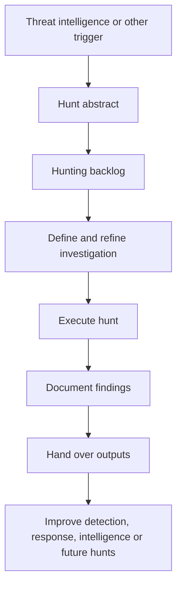

**Author:** *Roger C.B. Johnsen*

## Introduction

**TaHiTI is a threat hunting methodology for turning threat intelligence into focused hunting investigations.**

TaHiTI stands for **Targeted Hunting integrating Threat Intelligence**. The methodology was created as a joint effort by several Dutch financial institutions through the Dutch financial institutes information sharing community, FI-ISAC. The goal was to create a shared understanding of threat hunting and a common approach to conducting threat hunting activities.

TaHiTI is **targeted** because the hunt should have a clear purpose. It is not meant to be random browsing through logs. It integrates **threat intelligence** because intelligence is used to trigger hunts, shape hypotheses, enrich findings and contextualise the investigation.

That makes TaHiTI useful for teams that want to connect threat intelligence and threat hunting in a practical way.

Threat intelligence often loses value when it stops at distribution. A report is shared, indicators are forwarded, techniques are mentioned, and then little changes in the local environment. TaHiTI pushes against that problem by asking how intelligence should become a hunt.

A useful TaHiTI-style question is:

```text
What does this intelligence suggest we should look for in our own environment?
```

That question matters. It moves the team from reading about adversary behaviour to testing whether related behaviour exists locally.

> Threat intelligence becomes more useful when it creates better questions for the hunter.
>
> -- Roger Johnsen

## What TaHiTI Is

TaHiTI is a structured threat hunting methodology with a strong emphasis on intelligence-driven hunting. The methodology combines threat intelligence and threat hunting to create a focused and risk-driven approach. Threat intelligence is used as a source for hunting investigations and is also used during the investigation to contextualise and enrich the hunt.

That means TaHiTI is not only about consuming threat intelligence before the hunt starts. It is about using intelligence throughout the process. Threat intelligence can help the team:

* identify relevant adversary behaviours
* understand actor capabilities and motivation
* prioritise likely threats
* translate reporting into hypotheses
* select ATT&CK techniques or other behavioural references
* define what data sources may be needed
* enrich suspicious findings
* decide whether a finding is relevant
* generate new intelligence from local observations

This is the difference between passive threat intelligence and operational threat intelligence. Passive intelligence is something the team reads. Operational intelligence changes what the team investigates, detects, prioritises or improves.

## Why TaHiTI Matters

Many organisations have both threat intelligence and threat hunting, but the two functions may not connect well.

Threat intelligence may produce reports, briefings, indicators and actor profiles. Threat hunters may run hypotheses, explore telemetry and investigate behaviours. If those activities are not connected, both sides lose value.

The intelligence team may not know whether the reported behaviour exists in the organisation. The hunting team may not know which adversary behaviours matter most. TaHiTI helps close that gap.

It gives the organisation a way to move from:

```text
Threat intelligence says this actor uses this behaviour.
```

to:

```text
Can we observe this behaviour, or related behaviour, in our own environment?
```

That shift is important because the local environment is what matters. A threat report may describe a technique. But the hunter still has to ask whether the organisation has the telemetry, exposure, business context and detection coverage needed to test it. TaHiTI helps make that translation more deliberate.

It also helps the team avoid chasing every intelligence report. The question is not only whether the intelligence is interesting, but whether it is relevant, testable and useful in the local environment.

## The TaHiTI Process

TaHiTI is built around three main phases:

| Phase    | Purpose                                                                             |
| -------- | ----------------------------------------------------------------------------------- |
| Initiate | Process the trigger, create a hunting abstract and place it on the hunting backlog. |
| Hunt     | Define, refine and execute the hunting investigation.                               |
| Finalize | Document findings, hand over results and feed outputs into other processes.         |

This structure is useful because it recognises that a hunt does not start with the first query and does not end when the analyst stops investigating.

A hunt starts when a trigger becomes a hunting idea. It becomes useful when that idea is refined into an investigation. It becomes valuable when the result is documented, handed over and used to improve security. That makes TaHiTI a practical methodology rather than only a conceptual model.



## Initiate

The **Initiate** phase is where the hunting process begins. In TaHiTI, the process starts with a trigger. Threat intelligence is a major trigger, but it is not the only possible one. A hunt can also be triggered by previous hunting activity, security monitoring gaps, incident response, red teaming, domain expertise or crown jewel analysis. This is useful because it avoids a narrow view of hunting. Threat intelligence may start the hunt, but the organisation’s own environment can also generate hunting needs.

For example:

| Trigger                    | Hunting direction                                                  |
| -------------------------- | ------------------------------------------------------------------ |
| Threat intelligence report | Test whether a reported adversary behaviour exists locally.        |
| Previous hunt              | Continue investigating a related behaviour or unresolved question. |
| Detection gap              | Hunt for behaviour that existing monitoring may not detect.        |
| Incident response          | Search historically for similar activity after an incident.        |
| Red team finding           | Hunt for techniques that were successful during the exercise.      |
| Crown jewel analysis       | Hunt around assets that would matter most if compromised.          |

The output of this phase is not yet the full hunt. It is a hunting abstract: a structured description of what may be worth hunting and why. That abstract should then be placed on a hunting backlog. This matters because not every idea deserves immediate execution. Some hunts are more relevant, more urgent, more feasible or more valuable than others.

A hunting backlog should therefore be prioritised by factors such as risk, exposure, business relevance, telemetry availability, expected value and whether the organisation can actually act on the result.

A good backlog prevents hunting from becoming purely reactive.

## Hunt

The **Hunt** phase is where the abstract becomes an investigation. In TaHiTI, this phase includes defining and refining the hunt before execution. That matters because the initial idea is often too broad. A threat intelligence report may say that a group uses compromised service accounts for lateral movement. That is useful, but it is not yet a hunt.

The hunter still needs to define:

* the hypothesis
* the scope
* relevant ATT&CK techniques or behaviours
* possible actors or campaigns
* required data sources
* analysis techniques
* expected evidence
* time range
* limitations
* success or failure criteria

This is where intelligence becomes operational.

A weak hunt might say:

```text
Look for lateral movement.
```

A better TaHiTI-style hunt might say:

```text
Based on recent intelligence about ransomware operators abusing service accounts for lateral movement, we will hunt for service accounts authenticating to unusual hosts, accessing administrative shares or creating remote services outside normal maintenance patterns.
```

The second version is more useful because it connects intelligence, hypothesis, scope, data and expected behaviour.

Sometimes the most important result is that the hunt cannot be executed properly because the required telemetry does not exist, is incomplete or is not retained long enough. That is still a valid finding. It means the intelligence revealed a visibility gap.

During execution, the hunter tests the hypothesis, reviews data, follows leads and refines the investigation as new evidence appears. The refinement part is important.

A hunt should be structured, but not rigid. If the evidence shows that the original hypothesis is wrong, the team should adapt. A rejected hypothesis can still be a useful result if it improves understanding or reveals a visibility gap.

## Finalize

The **Finalize** phase is where the hunt becomes organisational value. This phase includes documenting findings, drawing conclusions, writing recommendations and handing results over to relevant stakeholders.

Possible outputs include:

* confirmed findings
* rejected hypotheses
* inconclusive results
* detection recommendations
* logging recommendations
* prevention recommendations
* monitoring use case improvements
* process improvements
* new intelligence
* lessons learned
* new hunt ideas

The feedback should also go back to threat intelligence. A hunt may confirm that reported behaviour is relevant locally, show that the organisation is not exposed, reveal a variation of the behaviour, or produce internal observations that can improve future intelligence assessments.

This phase matters because many hunts lose value at the end.

The team may do good investigative work, but if the result is not documented, shared or operationalised, the impact is limited. TaHiTI explicitly treats this as part of the methodology. The result of a hunt can feed security monitoring, incident response, threat intelligence, vulnerability management, architecture, risk or future hunting work.

That is where TaHiTI overlaps with PEAK and MaGMa. PEAK says the team must **Act with Knowledge**. TaHiTI gives a more intelligence-driven structure for what that knowledge may be and where it should go.

MaGMa helps manage the resulting use cases and improvement work over time.

## Threat Intelligence in TaHiTI

Threat intelligence is the defining feature of TaHiTI. But this does not mean simply searching for IOCs from a report. In fact, TaHiTI is most useful when the intelligence is closer to the upper layers of the Pyramid of Pain: adversary behaviours, techniques, procedures, capabilities and intent.

Low-level indicators such as hashes, IP addresses and domains can still support a hunt. They may help with scoping, enrichment or validation. But they should not be the only reason the hunt exists. A stronger hunt starts from behavioural intelligence.

For example:

| Threat intelligence input                               | Hunting translation                                                                                 |
| ------------------------------------------------------- | --------------------------------------------------------------------------------------------------- |
| Actor uses service accounts for lateral movement        | Hunt for unusual service account authentication paths and remote administration behaviour.          |
| Actor stages data before exfiltration                   | Hunt for unusual archive creation, staging directories and access to sensitive file shares.         |
| Actor disables security tools before payload deployment | Hunt for tampering with EDR, logging, backup or recovery controls.                                  |
| Actor uses cloud tokens after phishing                  | Hunt for unusual OAuth consent, session anomalies and impossible travel around targeted users.      |
| Actor abuses remote services                            | Hunt for remote service creation, unusual RDP, SMB or WinRM patterns and abnormal admin tool usage. |

This is where TaHiTI becomes powerful. It helps the team convert external intelligence into local hunting questions.

## TaHiTI and the Pyramid of Pain

TaHiTI and the Pyramid of Pain work well together. The Pyramid of Pain helps explain why behaviour-focused intelligence is more useful for hunting than simple indicator lists. A hash can be searched. An IP can be blocked. A domain can be filtered. Those actions may be useful, but they do not necessarily create a hunt. A hunt usually becomes more valuable when the team asks what the indicators reveal about adversary behaviour.

For example:

```text
The report contains a phishing domain.
```

That may trigger scoping and blocking. But TaHiTI pushes the team toward a better hunting question:

```text
Does the campaign behaviour described in the report appear in our environment, and do we see signs that users interacted with the lure, authenticated to attacker-controlled infrastructure or showed follow-on identity activity?
```

This is the movement from indicator consumption to intelligence-driven hunting.

## TaHiTI and ATT&CK

MITRE ATT&CK can support TaHiTI by giving the team a common vocabulary for adversary behaviour. A threat intelligence report may describe behaviour in narrative form. The hunter may map that behaviour to relevant ATT&CK techniques in order to shape the hypothesis, identify data sources and communicate the results.

For example:

| Intelligence statement                           | Possible ATT&CK mapping | Hunting direction                                       |
| ------------------------------------------------ | ----------------------- | ------------------------------------------------------- |
| Actor sends phishing emails with malicious links | Phishing                | Review email, URL click, proxy and browser activity.    |
| Actor uses valid accounts after credential theft | Valid Accounts          | Review identity, session, MFA and device context.       |
| Actor moves laterally using remote services      | Remote Services         | Review authentication paths and remote service usage.   |
| Actor deletes shadow copies                      | Inhibit System Recovery | Review command execution and backup tampering.          |
| Actor stages files before exfiltration           | Archive Collected Data  | Review archive creation and access to sensitive shares. |

The ATT&CK mapping should not become decorative. It should help the hunter decide what behaviour to look for and which data sources may support the hunt.

## TaHiTI and PEAK

TaHiTI and PEAK are complementary. PEAK gives the hunt a lifecycle:

```text
Prepare → Execute → Act with Knowledge
```

TaHiTI gives intelligence-driven hunts a more specific methodology:

```text
Trigger → Abstract → Backlog → Define/refine → Execute → Finalize
```

A practical way to separate them is:

| Framework | Main question                                                                        |
| --------- | ------------------------------------------------------------------------------------ |
| PEAK      | How do we run hunts in a way that is prepared, disciplined and useful afterwards?    |
| TaHiTI    | How do we turn threat intelligence into focused, risk-driven hunting investigations? |

That means TaHiTI can fit inside PEAK.

* During **Prepare**, TaHiTI can help convert threat intelligence into a hunting abstract, backlog item, hypothesis, scope and data requirements.
* During **Execute**, TaHiTI can help refine the investigation and keep intelligence connected to the analysis.
* During **Act with Knowledge**, TaHiTI can help ensure that findings are documented, handed over and fed back into monitoring, threat intelligence, response or future hunts.

In simple terms:

```text
PEAK gives the hunt its lifecycle.
TaHiTI gives intelligence-driven hunts their shape.
```

## TaHiTI and MaGMa

TaHiTI is also closely related to MaGMa. The TaHiTI methodology was released with support from “MaGMa for threat hunting”, which helps document hunting results, structure outcomes and provide direction for growth of the hunting process.

The relationship is useful, but the two should not be confused.

| Framework | Useful for                                                                   |
| --------- | ---------------------------------------------------------------------------- |
| TaHiTI    | Conducting intelligence-driven threat hunting investigations.                |
| MaGMa     | Documenting, managing and improving use cases and hunting outputs over time. |

TaHiTI helps the team perform the hunt. MaGMa helps preserve and manage the outputs.

This distinction is important because a team can run a good intelligence-driven hunt and still lose value if the findings are not documented, measured or operationalised.

## Practical Example: Service Account Lateral Movement

Consider a threat intelligence report describing ransomware operators using compromised service accounts for lateral movement. A weak response would be to search only for a few IOCs from the report. That may be useful for scoping, but it is not enough for a hunt.

A TaHiTI-style hunt starts by translating the intelligence into a local hypothesis:

```text
Ransomware operators may be abusing service accounts for lateral movement in our environment, especially through unusual authentication paths, administrative share access or remote service creation.
```

### Initiate

The trigger is the threat intelligence report. The team creates a hunting abstract that captures:

* the intelligence source
* the relevant adversary behaviour
* possible ATT&CK techniques
* affected asset groups
* possible data sources
* estimated priority
* expected effort
* initial hypothesis

The abstract is placed on the hunting backlog and prioritised against other hunt candidates.

### Hunt

The team defines and refines the investigation. Possible scope:

* service accounts
* backup servers
* file servers
* domain controllers
* administrative workstations
* authentication logs
* endpoint telemetry
* remote service creation events
* network flow data

Possible hunting questions:

* Which service accounts authenticate to unusual hosts?
* Which service accounts show new lateral movement paths?
* Are service accounts accessing administrative shares outside normal patterns?
* Are remote services created using service accounts?
* Are service account logons followed by suspicious process execution?
* Do the patterns overlap with systems important to recovery or business continuity?

The team then executes the hunt, validates findings and refines the hypothesis as needed.

### Finalize

The output should not only be a report. Possible follow-up actions include:

* detection logic for unusual service account authentication
* detection logic for remote service creation
* review of service account privileges
* hardening of backup and recovery infrastructure
* additional logging recommendations
* updates to monitoring use cases
* new threat intelligence based on local observations
* a follow-up hunt around related lateral movement behaviour

This is where the intelligence-driven hunt becomes useful security improvement.

## What Usually Goes Wrong

A common failure pattern is simple: the team receives an intelligence report, extracts a few IOCs, searches for them, finds nothing and closes the activity. That may be useful scoping, but it is not the same as intelligence-driven hunting. The more important question is what adversary behaviour the report describes and whether that behaviour can be tested locally.

Several problems are common when teams try to use threat intelligence for hunting.

| Problem                              | Why it hurts                                                                                                    |
| ------------------------------------ | --------------------------------------------------------------------------------------------------------------- |
| Treating IOC search as hunting       | The team searches for known indicators but does not investigate behaviour.                                      |
| Weak threat intelligence translation | The report is interesting, but nobody turns it into local hypotheses or data requirements.                      |
| Hunting without prioritisation       | The team chases every report instead of selecting hunts based on relevance, risk and feasibility.               |
| Ignoring local context               | External intelligence is applied without considering the organisation’s systems, users, exposure or telemetry.  |
| Over-mapping to ATT&CK               | Techniques are added to the hunt record, but they do not guide actual data analysis.                            |
| No backlog discipline                | Hunt ideas are created but not prioritised, reviewed or maintained.                                             |
| Poor finalisation                    | Findings are documented poorly or never handed over to monitoring, response, intelligence or engineering teams. |
| Treating MaGMa as the methodology    | The tool helps document and manage outputs, but it is not the reasoning process of the hunt.                    |

TaHiTI should not become a paperwork exercise. It should make threat intelligence more operational.

## Where TaHiTI Fits With Other Frameworks

TaHiTI fits naturally with the other frameworks in this section.

| Framework                  | Main value                                                                                            |
| -------------------------- | ----------------------------------------------------------------------------------------------------- |
| Lockheed Martin Kill Chain | Describes intrusion progression and disruption opportunities.                                         |
| Unified Kill Chain         | Describes broader adversary progression and operational phases.                                       |
| MITRE ATT&CK               | Provides behavioural vocabulary for adversary techniques.                                             |
| Diamond Model              | Structures relationships between adversary, infrastructure, capability and victim.                    |
| OODA Loop                  | Structures decision-making under uncertainty.                                                         |
| Pyramid of Pain            | Helps prioritise indicators and detections by adversary disruption.                                   |
| PEAK                       | Structures the threat hunting lifecycle from preparation to execution and action.                     |
| TaHiTI                     | Structures intelligence-driven threat hunting from trigger to hypothesis, execution and finalisation. |
| MaGMa                      | Manages use cases, lifecycle, metrics and continuous improvement.                                     |

The relationship can be simplified like this:

```text
OODA  → how the analyst thinks and adapts
PEAK  → how the hunt lifecycle is structured
TaHiTI → how threat intelligence drives the hunt
MaGMa → how outputs become managed capability
```

That makes TaHiTI especially useful when the organisation wants threat intelligence to become more than reporting. It gives intelligence a route into hunting.

## Working Position for This Book

For this book, TaHiTI is best treated as an intelligence-driven threat hunting methodology.

It helps answer a practical question:

```text
How do we turn threat intelligence into a focused hunt that can be executed, documented and acted on?
```

The value of TaHiTI is that it connects external or internal intelligence to local investigation.

It does not say that every report deserves a hunt. It does not replace hunter judgement. It does not remove the need for telemetry, environment knowledge or validation.

What it does is provide a structure for turning intelligence into a testable investigation.

That makes it useful for teams that want threat hunting to be targeted, risk-driven and connected to intelligence rather than based on whatever seems interesting that week.

> TaHiTI is useful when threat intelligence becomes a hunting question instead of just another report.
>
> -- Roger Johnsen

## Resources

* [DEF-TaHiTI Threat Hunting Methodology](https://www.betaalvereniging.nl/wp-content/uploads/DEF-TaHiTI-Threat-Hunting-Methodology.pdf)
* [FI-ISAC](https://www.betaalvereniging.nl/en/payments-in-the-netherlands/security/fi-isac/)
* [MaGMa for threat hunting](https://www.betaalvereniging.nl/wp-content/uploads/FI-ISAC-use-case-framework-verkorte-versie.pdf)
* [MITRE ATT&CK](https://attack.mitre.org/)
* [Pyramid of Pain by David Bianco](https://detect-respond.blogspot.com/2013/03/the-pyramid-of-pain.html)

## Revision

| Revised Date | Comment                                                                                                                        |
| ------------ | ------------------------------------------------------------------------------------------------------------------------------ |
| 2026-07-10   | Major rewrite. Reframed the article as a practical guide to using TaHiTI as an intelligence-driven threat hunting methodology. |
| 2025-04-20   | Article rewritten                                                                                                              |
| 2025-04-13   | Added page                                                                                                                     |
