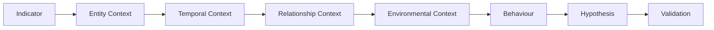
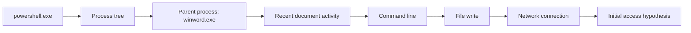
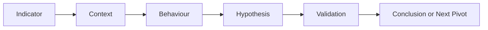

__Author:__ _Roger C.B. Johnsen:_

## Introduction

**Threat hunts rarely start with complete evidence. Often, it is just a fragment: an IOC from a report, a suspicious process, an unusual login, a file found on disk, a SOC escalation, a red team observation, or a weak anomaly in the data. But a starting point is not a finding. It is the first question. The value of threat hunting lies in building enough context around that fragment to understand what it represents, whether it matters, and which hypothesis it supports or weakens.**

**An indicator tells you where to start. Context tells you whether it matters.**

{}
**Why This Matters**

Indicators, alerts, reports, and anomalies often arrive with an implied explanation. A threat hunter should not accept that explanation too quickly. The task is to build context, test the hypothesis, and understand what the activity actually represents.
{}

---

## The Starting Point Is Not the Finding

A threat hunt rarely starts with complete evidence. It may start with an IOC, a suspicious process, an unusual authentication pattern, a threat intelligence report, a SOC escalation, a red team observation, or a weak anomaly in the data.

_That starting point is not the finding. It is the first question._

This distinction matters because hunters can become trapped by the wording or shape of the initial observation. If the starting point suggests a specific technique, tool, or behaviour, it is tempting to investigate only that possibility. If the hunter does not find that exact thing, the observation may be dismissed too quickly. That is a weak investigation. The better question is:

```text
What does this observation actually represent?
```

Not:

```text
Can I confirm the first explanation I was given?
```

A threat intelligence report may mention a named tool. A SOC escalation may mention a specific technique. A red team note may describe one suspected behaviour. An IOC may point to known infrastructure. None of these are conclusions by themselves. They are starting points.

The hunter must still examine the underlying activity, identify what actually happened, and decide whether the original explanation is supported, weakened, or replaced by a better one.

---

## Context and Behaviour

Suspicion usually appears when behaviour and context do not fit together. A process name may look normal until it appears in the wrong parent-child relationship. A user action may look normal until it comes from a newly hired user with no reason to perform that activity. A file access pattern may look normal until the volume, timing, and role of the user make it strange. A network connection may look normal until it appears immediately after suspicious execution.

The mental model is simple:

```text
Behaviour + Context Mismatch = Suspicion
```

_The behaviour tells you what happened. The context tells you whether it makes sense._ This does not mean that every unusual event is malicious. It means that the hunter should look for the point where behaviour, baseline, role, timing, and environment stop fitting together. 

> Behaviour without context is just activity. Behaviour that does not fit its context becomes suspicion.
>
> -- Roger Johnsen

---

## Where Context Comes From

Context is not one thing. It is built from several layers and usually requires more than one data source.

| Context layer         | Question                                         | Example                                                               |
| --------------------- | ------------------------------------------------ | --------------------------------------------------------------------- |
| Entity context        | Who or what is involved?                         | User, device, account, process, IP address, hostname, file            |
| Temporal context      | When did it happen, and what happened around it? | Activity before, during, and after the observation                    |
| Relationship context  | What touched what?                               | User to device, process to process, host to host, account to resource |
| Environmental context | Does it make sense here?                         | Role, department, system purpose, business process, normal behaviour  |

The layers work together. A suspicious IP address may not mean much by itself. But if the IP is contacted by a rare process, from a user workstation, shortly after document execution, and followed by file creation in a user-writable directory, the context changes. The indicator has become part of a story.

The hunter may need endpoint telemetry, identity logs, authentication records, file access logs, DNS, proxy data, network flow, email metadata, asset inventory, vulnerability data, change records, HR role information, or business system knowledge.

The exact sources depend on the observation, but the question is always the same:

```text
Which data can explain whether this activity makes sense?
```

Useful context often comes from several places.

| Context need              | Possible sources                                                                       |
| ------------------------- | -------------------------------------------------------------------------------------- |
| Process behaviour         | Endpoint telemetry, process trees, command lines, parent-child relationships           |
| User and identity context | Identity logs, sign-in logs, directory information, group membership, role information |
| Authentication context    | Kerberos, NTLM, VPN, cloud sign-ins, privileged access logs                            |
| Network context           | DNS, proxy, firewall, NetFlow, EDR network events                                      |
| File context              | File access logs, EDR file events, file metadata, download history                     |
| Email context             | Mail headers, attachment metadata, URLs, sender information                            |
| Asset context             | CMDB, asset inventory, device role, ownership, criticality                             |
| Business context          | Department, job role, onboarding status, maintenance windows, known projects           |

The goal is not to collect every possible data point. The goal is to collect enough context to test the hypothesis properly.

---

## From Indicator to Context

The basic workflow looks like this:



The exact order may vary. Sometimes the hunter starts with an entity. Sometimes the starting point is a time window. Sometimes the hunt begins with a known behaviour and the goal is to find where it appears. The value of the model is not that every hunt must follow it perfectly. The value is that it forces the hunter to move from isolated facts toward an explanation that can be tested.

---

## Common Analytical Pitfalls

Context building is not only about adding more data. It is also about avoiding weak analysis. Several pitfalls appear again and again in investigations:

| Pitfall             | What happens                                                          | Better approach                                                                         |
| ------------------- | --------------------------------------------------------------------- | --------------------------------------------------------------------------------------- |
| Confirmation bias   | The hunter tries to prove the first explanation instead of testing it | Ask what evidence would weaken or replace the hypothesis                                |
| Single-source bias  | One telemetry source is treated as the full story                     | Correlate across endpoint, identity, network, file, and business context where possible |
| Tool bias           | The tool's interpretation is treated as truth                         | Separate what the tool says from what the underlying events show                        |
| Narrow time window  | The hunter only looks at the immediate moment of the observation      | Build a timeline before, during, and after the event                                    |
| Role blindness      | Activity is judged without considering who performed it               | Compare behaviour against user role, device purpose, and business function              |
| Absence of evidence | Missing telemetry is interpreted as proof that nothing happened       | Treat missing visibility as a limitation, not a conclusion                              |

A hunt should not only ask whether something can be confirmed. It should also ask whether the available evidence is good enough to support the conclusion.

---

## Entity Context

Entity context answers the first basic question:

```text
What am I actually looking at?
```

The entity may be a user, device, account, process, IP address, file, hostname, domain, mailbox, cloud identity, or internal resource. A weak investigation treats the entity as obvious. A stronger investigation asks what the entity represents in the environment:

| Entity     | Useful context questions                                                                  |
| ---------- | ----------------------------------------------------------------------------------------- |
| User       | What is the user's role, department, location, and normal access pattern?                 |
| Device     | Is this a workstation, server, jump host, kiosk, developer machine, or privileged system? |
| Account    | Is this a human user, service account, admin account, shared account, or stale account?   |
| Process    | What launched it, where did it run from, who ran it, and what did it do next?             |
| IP address | Is it internal, external, VPN, cloud, proxy, NAT, scanner, or shared infrastructure?      |
| File       | Where did it come from, where was it written, who opened it, and what executed it?        |

The same observation can mean different things depending on the entity. `powershell.exe` on a domain controller is not the same as `powershell.exe` on a developer workstation. A project manager traversing file shares is not the same as a file server administrator doing the same thing during planned maintenance. Context starts by understanding the entity.

---

## Build the Timeline

Context is temporal. A suspicious observation rarely begins at the moment it becomes visible. The visible event may only be the point where the behaviour surfaced in the data. A hunter should therefore look both backwards and forwards in time.

Ask:

* What happened before the observation?
* What changed shortly before it appeared?
* Which process, user, host, account, or session started the chain?
* What happened immediately after?
* Did the activity continue, stop, spread, or change form?
* Are there related authentication, file, network, process, directory, or cloud events?

A narrow time window may be enough to confirm that something happened, but it is often not enough to understand why it happened. A timeline helps the hunter see whether the observation was isolated or one point in a larger sequence.

The important question is not only:

```text
What did I observe?
```

It is also:

```text
What story does the surrounding activity tell?
```

---

## Relationship Context

Threat hunting is often relationship work. The interesting part is not always the entity itself, but how it relates to other entities. A process launched another process. A user accessed a device. A device connected to another device. An account touched many resources. A file was downloaded, written, opened, and executed.

These relationships help the hunter move from isolated events to behaviour.

| Relationship        | Hunting question                                          |
| ------------------- | --------------------------------------------------------- |
| Process -> process  | Is the parent-child relationship expected?                |
| User -> device      | Does this user normally use this device?                  |
| Device -> device    | Is this communication expected for these systems?         |
| Account -> resource | Does the account normally access this resource?           |
| File -> process     | Did the file lead to execution or follow-on activity?     |
| Process -> network  | Did execution lead to external or internal communication? |

Relationship context is where many weak signals become stronger. A single file access event may not matter. A newly hired project manager traversing many file shares within a short time window may matter. The difference is not only the event. The difference is the relationship between the user, the role, the resources, the timing, and the volume.

---

## Ask Whether the Activity Makes Sense

Context is also environmental. The same activity can mean different things depending on who performed it, where it happened, and what role the user, device, account, or system has in the organisation.

A project manager traversing many file shares shortly after being hired is different from a file server administrator doing the same thing during planned maintenance. A developer running scripting tools on a build server is different from a finance user running the same tools from a workstation. A service account accessing many systems may be normal, suspicious, or badly designed. The answer depends on what the account is supposed to do.

The hunter should ask:

* Does this activity fit the user's role?
* Does it fit the device's purpose?
* Does it fit the department or business function?
* Is this normal for a newly hired user?
* Is the access pattern expected?
* Is the timing normal?
* Is the volume normal?
* Has this user, device, or account done this before?

Suspicion often appears when behaviour and context do not fit together.

---

## Example: File Share Traversal

Consider this observation:

```text
A user accessed many file shares within five minutes.
```

This may be suspicious. It may also be normal. The observation alone does not answer that. A weak investigation may stop at counting the file shares and deciding whether the number looks high. A stronger investigation builds context.

| Question                            | Why it matters                                                                                          |
| ----------------------------------- | ------------------------------------------------------------------------------------------------------- |
| Who is the user?                    | Role and business function shape what access may be normal                                              |
| Is the user newly hired?            | New users may have less established access history                                                      |
| Which file shares were accessed?    | Sensitive, unrelated, or broad access may be more suspicious                                            |
| How quickly did the access happen?  | Rapid traversal may indicate enumeration or scripted activity                                           |
| Has the user done this before?      | Historical comparison helps separate normal behaviour from novelty                                      |
| Which device was used?              | The device may reveal whether the activity came from a normal workstation, VPN session, or unusual host |
| What happened before the traversal? | Authentication, process, or session context may explain the activity                                    |
| What happened after?                | Follow-on file access, compression, staging, or transfer may strengthen the hypothesis                  |

Now the observation becomes more useful.

```text
A newly hired project manager accessed many unrelated file shares within five minutes from a workstation with no previous history of that access pattern.
```

That is stronger than:

```text
User accessed many file shares.
```

The first version describes behaviour in context. The second version describes an event.

---

## Example: PowerShell Execution

Consider this observation:

```text
powershell.exe executed on a workstation.
```

That may not matter. PowerShell is common. The question is what the execution looks like when placed into entity, relationship, temporal, and follow-on context. A practical pivot flow could look like this:



The observation can be strengthened step by step.

| Added context        | Resulting interpretation                                                                           |
| -------------------- | -------------------------------------------------------------------------------------------------- |
| Entity context       | `powershell.exe` executed on a finance user's workstation                                          |
| Relationship context | `powershell.exe` was launched by `winword.exe`                                                     |
| Command-line context | `powershell.exe` was launched with an encoded command                                              |
| Temporal context     | Execution happened shortly after the user opened an email attachment                               |
| Follow-on context    | The process wrote a file to a user-writable directory and initiated outbound network communication |

The original indicator was weak. The contextualised behaviour is much stronger. The goal is not to make every observation suspicious. The goal is to understand which observations become suspicious when placed in the right context.

This is also where the link to detection engineering begins. You do not build a useful detection by simply alerting on `powershell.exe`. You build better detection logic by understanding the relationship, sequence, and context that make the execution meaningful. See also [Hunter to Detection](/part-6/hunter-to-detection/).

---

## When Context Weakens

Context does not always make something more suspicious. Sometimes it explains the activity. A suspicious process may turn out to be part of a software deployment. A strange login may come from a known VPN range. Unusual file access may be part of a migration project. A rare command line may come from an approved admin tool.

This is not failure. It is the hunt doing its job. The purpose of context is not to confirm the first suspicion. The purpose is to test it.

| Context found                                 | Effect on hypothesis             |
| --------------------------------------------- | -------------------------------- |
| Activity matches known admin tooling          | Weakens the malicious hypothesis |
| Timing matches planned maintenance            | Weakens the malicious hypothesis |
| User role explains the access pattern         | Weakens the malicious hypothesis |
| Same behaviour is common for the device group | Weakens the malicious hypothesis |
| Business process explains the activity        | Weakens the malicious hypothesis |

A hypothesis that is weakened by evidence should be refined or rejected. That is good analysis.

---

## When Context Strengthens

Sometimes context makes the observation more suspicious. A single event becomes part of a sequence. A normal tool appears in an abnormal parent-child relationship. A user touches resources outside their role. A device communicates with systems it does not normally contact. A process writes files, spawns children, and connects externally.

| Context found                                                 | Effect on hypothesis  |
| ------------------------------------------------------------- | --------------------- |
| Activity does not match the user's role                       | Strengthens suspicion |
| The event is part of a larger sequence                        | Strengthens suspicion |
| The behaviour is new for the entity                           | Strengthens suspicion |
| Multiple weak signals appear together                         | Strengthens suspicion |
| Follow-on activity matches adversary tradecraft               | Strengthens suspicion |
| The activity crosses identity, endpoint, and network evidence | Strengthens suspicion |

The strength of a hunt often comes from combining weak signals. One weak signal may not matter. Several weak signals in the right context may tell a story.

---

## What This Means for Threat Hunters

Threat hunters should not treat indicators as answers. An indicator is a direction of travel. It tells the hunter where to start looking, not what conclusion to reach. The hunter's job is to build context around the observation:



This means asking better questions:

* What does this observation actually represent?
* Which entities are involved?
* What happened before and after?
* Which relationships does the activity create?
* Does the behaviour make sense in this environment?
* Does context strengthen or weaken the hypothesis?
* What should I pivot to next?

The work is not finished when the indicator is found. The work begins when the indicator is placed in context.

{}
SOC analysts can use the same mental model. An alert is a starting point, not a conclusion. The important question is not only whether the alert is true or false, but what the underlying activity actually shows. A detection name may point in the right direction, but the analyst still needs to understand what was observed, what triggered the detection, and whether the surrounding context supports the claim.
{}

---

{}
**Key Takeaways**

* An indicator is a question, not an answer.
* Context is built from entity, temporal, relationship, and environmental information.
* Suspicion appears when behaviour and context do not fit together.
* A hypothesis should be tested, not protected.
* Always ask: what else could this be?
{}

---

## Summary

A single indicator is rarely enough. It may tell you where to start, but it does not tell you what happened, why it happened, whether it matters, or what to do next. Threat hunting turns indicators into context. Context turns isolated observations into behaviour. Behaviour gives the hunter something to test.

The core idea is simple:

```text
An indicator tells you where to start. Context tells you whether it matters.
```

---

## Resources

* [Hunter to Detection](/part-6/hunter-to-detection/)
* [MITRE ATT&CK](https://attack.mitre.org/)
* [MITRE ATT&CK - T1059 Command and Scripting Interpreter](https://attack.mitre.org/techniques/T1059/)
* [Microsoft Defender Advanced Hunting](https://learn.microsoft.com/en-us/defender-xdr/advanced-hunting-overview)

---

## Revision

| Revised Date | Author        | Comment       |
| ------------ | ------------- | ------------- |
| 2026-07-05 | Roger Johnsen | Article added |

