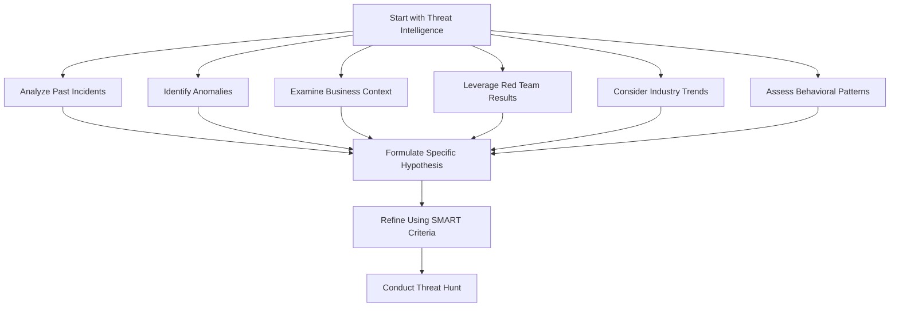

| Revised Date | Comment |
| ------------ | ------- |
| 02.11.2024   | Added page | 

## Introduction

**Effective threat hunting relies on more than just intuition and experience. It demands a structured approach to identifying and investigating potential threats. At the heart of this process is the formulation of well-crafted hypotheses that guide us to uncover hidden adversaries within the networks. A strong hypothesis serves as a focal point, directing efforts towards specific attack vectors, tactics, techniques, and procedures (TTPs) that are relevant to an organization’s unique threat landscape.**

**In this chapter we will explore the essential elements of creating effective threat-hunting hypotheses, including the importance of leveraging threat intelligence, analyzing past incidents, and identifying behavioral anomalies. Additionally, we will highlight practical exampless grounded in the MITRE ATT&CK framework, illustrating how to link the hypotheses to established threat actor behaviors. By employing these strategies, we can enhance our investigative capabilities and better protect our organizations from emerging threats.**

## What is a hypothesis?

Before we go on creating hypotheses, let's just take a moment to clarify what a hypothesis is. As we progess through this chapter, we'll see that an hypothesis is more than just a hunch, and far more than a statement like "we think we have an attacker in our networks".Let's carry on with a definition:

> A hypothesis is a proposed explanation or prediction based on limited evidence, serving as a starting point for further investigation. In the context of threat hunting, it articulates a specific assumption about a potential security threat or vulnerability within a system or organization. A well-formed hypothesis should be testable, allowing security analysts to gather data and conduct investigations to confirm or refute the assumption. It often incorporates elements such as known threat intelligence, behavioral patterns, and business context, ultimately guiding the investigation process and focusing efforts on areas of concern.

## Hypothesis Formulation Process

The diagram below depicts my general workflow for formulating threat-hunting hypotheses. It is organized in a top-down (TD) format and consists of several interconnected steps:

### Description of steps 

#### Start with Threat Intelligence

My process begins by gathering relevant threat intelligence, which serves as the foundation for understanding potential threats. To threat intelligence I reckon:

| Source | Description |
| ------ | ----------- |
| Analyzing Past Incidents | Reviewing previous security incidents helps me identify patterns and areas of vulnerability. |
| Identifying Anomalies | Spotting deviations in normal behavior helps indicating potential threats. |
| Examining Business Context | Understanding the organization's operational environment and priorities informs the relevance of potential threats. |
| Leveraging Red Team Results | Insights gained from red team exercises highlights potential attack vectors and weaknesses. |
| Considering Industry Trends | Staying updated on trends and emerging threats within the industry helps shaping the hypothesis. |
| Assessing Behavioral Patterns | Analyzing user and system behaviors can reveal unusual activities that warrant further investigation. |

##### Tips on Threat Intelligence

| Step | Description |
| ---- | ----------- |
| Start with Known Threat Intelligence | Utilize threat intelligence sources such as MITRE ATT&CK, threat reports, or industry-specific intelligence to form hypotheses around known adversary tactics, techniques, and procedures (TTPs). |
| Analyze Past Incidents and Known Vulnerabilities | Reviewing past incidents or known vulnerabilities can highlight areas of weakness where attackers might focus, allowing you to develop hypotheses around potential attacks or exploitation methods. |
| Identify Anomalous Behaviors in Baseline Data | Analyzing baseline network and endpoint activity can help spot deviations that indicate malicious behavior. |
| Examine Business Context and High-Value Assets | Protecting critical data and systems is crucial. High-value assets like financial records, customer databases, and intellectual property often attract attackers. |
| Leverage Red Team Exercises and Penetration Testing Results | Findings from red team exercises or penetration tests often reveal potential weaknesses in defenses, which can form the basis for hypotheses. |
| Industry Trends and Threat Actor TTPs | Staying informed about industry trends and TTPs used by known threat actors, especially those targeting your sector, can help anticipate likely attack scenarios. |
| Behavioral Patterns and Anomaly Detection | Identifying strange patterns in user or network behavior that differ from normal activity can indicate malicious activity, prompting a hypothesis. |

#### Formulate Specific Hypothesis

All these threat intelligence inputs converge to help formulate a specific hypothesis about a potential threat or vulnerability.

#### Refine Using SMART Criteria

After formulation, the hypothesis is refined based on the SMART criteria (Specific, Measurable, Achievable, Relevant, Time-Bound), ensuring that it is actionable and relevant.

#### Conduct Threat Hunt

Finally, armed with a refined hypothesis, the threat-hunting process is conducted, allowing threat hunters to actively search for signs of malicious activity based on their hypotheses.

## Tips on Forming Good Hypotheses

A good hypothesis should be clear, concise, and based on both qualitative and quantitative data. Following are some tips for crafting effective hypotheses.

### Be Specific

Clearly define what you are investigating. Vague hypotheses lead to scattered efforts. Specify the attack vector, target, or behavior you are concerned about.

**Example**

> Instead of saying, "There may be a breach," specify, "There may be unauthorized access to financial records due to weak password policies."

### Incorporate Threat Intelligence

Utilize relevant threat intelligence to inform your hypothesis. This can include known TTPs from frameworks like MITRE ATT&CK or insights from threat intelligence reports.

**Example**

> "Given the recent rise in phishing attacks targeting our sector, we suspect that employees may be clicking on malicious links in emails."

### Make it Testable

A hypothesis should be framed in a way that allows for testing. Define what success looks like and how you will measure it.

**Example**

> "We will monitor logs for unusual login attempts to admin accounts during off-hours. If we see an increase of 20% over the baseline, we will consider it a potential indicator of compromise."

### Link to Business Context

Ensure your hypothesis aligns with the organization's business context and priorities. This will help justify the effort and resources allocated to the hunt.

**Example**

> "Our organization stores sensitive customer data. We hypothesize that attackers may exploit vulnerabilities in our payment processing system to access this information."

### Use SMART Criteria

Formulate hypotheses that are Specific, Measurable, Achievable, Relevant, and Time-Bound. This structured approach can enhance clarity and focus. This concept originates from management goal-setting principles introduced by George T. Doran in 1981, this framework helps ensure that objectives are clear, actionable, and aligned with organizational priorities, ultimately strengthening the effectiveness of threat hunting efforts.

Using SMART (Specific, Measurable, Achievable, Relevant, Time-Bound) criteria can ensure the hypothesis is actionable:

| Keyword | Description |
| ------- | ----------- |
| Specific | Defines a clear focus, e.g., a particular TTP or high-value asset. | 
| Measurable | Describes what metrics or indicators will validate it. |
| Achievable | Ensures it’s feasible given available resources. |
| Relevant | Aligns with current threat landscape or organizational priorities. |
| Time-Bound | Specifies a timeframe for relevance or monitoring. |

**Example**

> "Within the next month, we will assess access logs for unauthorized logins on our critical database servers to identify any anomalous patterns."

## Examples Based on the MITRE ATT&CK Framework

### Initial Access (Phishing)

| Hypothesis | Basis |
| ---------- | ----- |
| Employees may be susceptible to phishing attacks that aim to harvest credentials, which could lead to unauthorized access to our internal systems. | This is linked to the MITRE ATT&CK technique T1566 (Phishing), where attackers send deceptive emails to lure victims into providing sensitive information. |

### Execution (PowerShell)

| Hypothesis | Basis |
| ---------- | ----- |
| Malicious PowerShell scripts may be executed by threat actors to gain access to sensitive data on endpoints. | Tied to T1086 (PowerShell), where attackers utilize PowerShell for executing malicious payloads or commands in a compromised environment. |

### Persistence (Scheduled Tasks)

| Hypothesis | Basis |
| ---------- | ----- |
| An attacker may establish persistence through scheduled tasks to ensure their payloads execute after a system reboot. | Connected to T1053 (Scheduled Task/Job), which describes how adversaries can create tasks that allow them to maintain access. |

### Privilege Escalation (Credential Dumping)

| Hypothesis | Basis |
| ---------- | ----- |
| Attackers could be attempting to perform credential dumping to escalate privileges on our domain controller. | Relates to T1003 (Credential Dumping), where adversaries obtain account login credentials to exploit privileged accounts. |

### Lateral Movement (Remote Services)

| Hypothesis | Basis |
| ---------- | ----- |
| If attackers are present on the network, they may leverage Windows Remote Management (WinRM) for lateral movement to access other systems. | Associated with T1021 (Remote Services), which includes techniques for remote execution of commands on other machines. |

### Exfiltration (Data Transfer Size Limits)

| Hypothesis | Basis |
| ---------- | ----- |
| We may detect anomalous data exfiltration attempts through bulk transfers during non-business hours, indicating possible data theft. | Tied to T1041 (Exfiltration Over Command and Control Channel), where data is transferred out of the organization. |

### References

1. [SOC Prime Blog: Threat Hunting Hypothesis Examples](https://socprime.com/blog/threat-hunting-hypothesis-examples/)
2. [Cyborg Security Blog: 50 Threat Hunting Hypothesis Examples](https://www.cyborgsecurity.com/blog/50-threat-hunting-hypothesis-examples/)
3. [Splunk Blog: Peak Hypothesis-Driven Threat Hunting](https://www.splunk.com/en_us/blog/security/peak-hypothesis-driven-threat-hunting.html)
4. [Cyborg Security Blog: Art of the Hunt – Building a Threat Hunting Hypothesis List](https://www.cyborgsecurity.com/blog/art-of-the-hunt-building-a-threat-hunting-hypothesis-list/)
5. [SOC Investigation: Threat Hunting Hypothesis Examples – Start for a Good Hunt](https://www.socinvestigation.com/threat-hunting-hypothesis-examples-start-for-a-good-hunt/)
6. [Medium: Threat Hunting – Important Things on How to Start Hunting](https://medium.com/@chandrak.trivedi/threat-hunting-important-things-on-how-to-start-hunting-2b0f2efc90ac)
7. [SANS Institute Whitepapers on Threat Hunting](https://www.sans.org/white-papers/37172/)
8. [Harlow, C. (2015). *What is a Hypothesis?*. The University of Kansas.](https://biology.ku.edu/what-hypothesis)
9. [The University of California, Berkeley. (n.d.). *Hypothesis*.](https://eScholarship.org/uc/item/4gn6n3wq)
10. [Doran, G. T. (1981). “There’s a S.M.A.R.T. Way to Write Management’s Goals and Objectives.” *Management Review*, 70(11), 35-36.](https://www.jstor.org/stable/40604294)
11. [McCarthy, J. (2016). “Hypothesis in Research.” *Research Methods*.](https://www.researchgate.net/publication/316250109_Hypothesis_in_Research)

