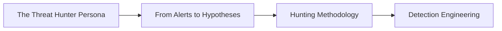
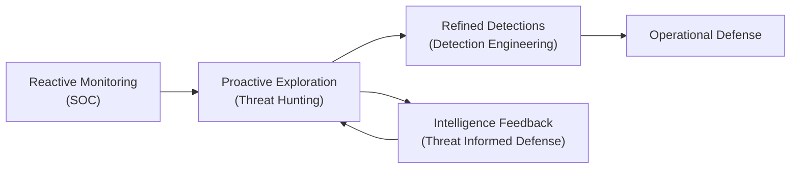
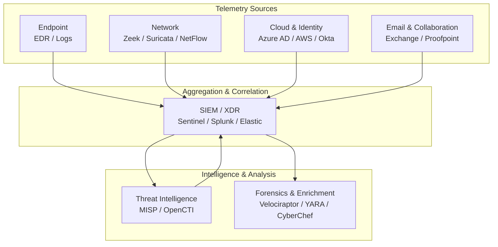
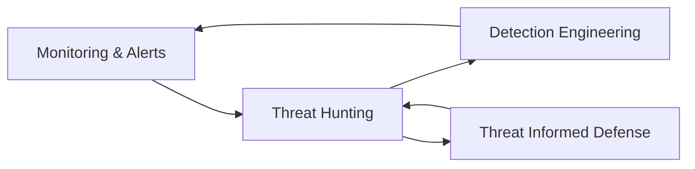
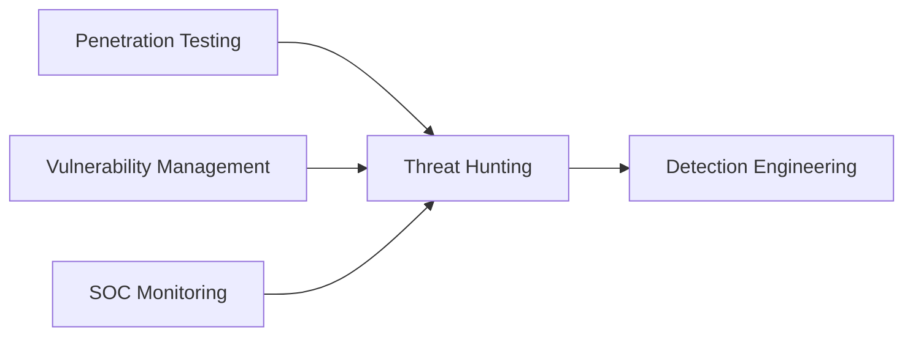
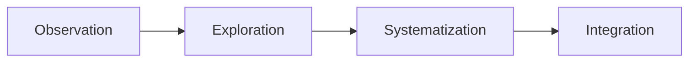

## Introduction 

**This is the third part of my series on defining who the Threat Hunter is. In the previous chapter, we explored the hunter as a persona. The hunter is curious, methodical, and unwilling to accept the surface explanation of an event. This chapter continues that exploration and shows how mindset becomes method.**

**Building on the principles outlined in my article [The Analyst Mindset](/part-1/introduction/analystmindset/), this chapter explores how analytical thinking turns into structured hunting practice. You know, where questions become hypotheses and reasoning becomes method.**

**The mindset of a threat hunter is shaped long before the first query is written. I think maybe you are born with it. It follows the gradual transition from alert handling to exploration, from reaction to anticipation. It also connects this practice to the broader structure of Threat Informed Defense and Detection Engineering, grounding individual reasoning in organizational purpose.**

**Threat hunting, at its core, is not about chasing alerts but about learning from what the alerts do not show. It is the next step in a professional progression; the point where observation becomes hypothesis and analysis becomes investigation. Where we follow trail**

---

## The Transition from Monitoring to Hunting

SOC work teaches structure and discipline. It is a great starting point for becoming a Threat Hunter. It trains analysts to read events, trace alerts, and connect them to evidence. Threat hunting grows out of that same discipline but directs it toward what has not yet been seen. Pretty much like pointing a searchlight out into the dark, knowing that by past experiences to interpet signs. 

The transition is gradual. It begins when analysts start questioning the limits of their detections: *What are we missing? What patterns never fire an alert?* When those questions turn into structured searches, hunting has already begun. Uncovering those dark spots or those places where you got limited visibility - that's important work right there.

The process builds directly on the analyst’s habit of asking questions — a skill refined in the early stages of SOC work and central to the mindset described earlier.  

This is not a break from the SOC but its natural evolution. Threat hunting is what happens when operational experience meets curiosity. It turns response into anticipation and replaces certainty with exploration.  

## Background

Most hunters begin their career in a SOC. The work is structured around alerts, incidents, and procedures. Over time, the repetition reveals a limitation: analysts can only respond to what has already been detected. Anything that evades those detections remains invisible.  

Threat hunting closes that gap. It applies the same analytical discipline used in the SOC but removes the dependency on alerts. Instead of waiting for events to surface, the hunter searches for weak signals and subtle behaviors that hint at intrusion even when no detection has fired. 

The distinction is subtle but fundamental: both roles analyze data, but the hunter does so without being told where to look (in general, nothing is constant). 

## From Reactive to Hypothesis-Driven Work

Security monitoring is built on certainty. Every alert signals that a specific condition has been met. A rule fired, a signature matched, a threshold crossed. Threat hunting begins where that certainty ends.  

The hunter’s question is not *what happened*, but also *what could happen here, and how would it appear if it did?* This shift changes both workflow and intent. Instead of waiting for a predefined condition, the hunter constructs hypotheses. You know from my other articles that hypothesis are structured assumptions about possible adversary behavior, based on how real attackers operate and how the environment might expose traces of that activity.  

The process builds directly on the analyst’s habit of asking questions — a skill refined in the early stages of SOC work and central to the mindset described earlier.  

A hypothesis is not speculation. It is a reasoned scenario anchored in what is technically plausible. It defines what data to examine, what indicators might appear, and what evidence would confirm or reject the idea. Each investigation, whether it proves or disproves the hypothesis, adds to the organization’s collective understanding of its environment.  

Over time, these hunts become a library of insight. What began as a question often ends as a detection or a documented analytic. The result is not a single discovery but a gradual tightening of visibility across the entire landscape.  

## Analytical Foundation

Hunting relies on the same reasoning that defines solid SOC analysis, but extends that reasoning into uncertainty. Hunters learn to balance three perspectives that must coexist if the analysis is to remain grounded.  

The **operational view** explains how data is generated and what normal looks like. The **adversarial view** uses [MITRE ATT&CK](https://attack.mitre.org) to anticipate techniques and map plausible behaviors. The **contextual view** ties technical evidence back to the realities of the business: what systems matter, where risk concentrates, and what impact an attack could have.  

Together, these perspectives form the mental framework that separates random searching from purposeful hunting. Operational knowledge keeps hunts realistic. Adversary insight ensures relevance. Context provides direction. Technology supports the process but does not define it.  

As discussed in [The Analyst Mindset](/part-1/introduction/analystmindset/), awareness of cognitive bias remains essential. Every hypothesis must be tested against data, not belief. The hunter’s discipline is to challenge intuition with evidence.  

## Technical Competence

Threat hunting is a data discipline. The hunter must move through large volumes of telemetry, isolate meaningful patterns, and test assumptions efficiently. Query languages, scripting, and data analysis tools are instruments of reasoning — not ends in themselves.  

Competence grows from understanding how telemetry is structured and what it represents. The ability to trace activity across endpoints, networks, and cloud environments forms the foundation of every hunt. Combined with an understanding of how attackers abuse legitimate tools, this allows the hunter to distinguish noise from signal.  

Documentation is part of that same discipline. A hunt that cannot be repeated cannot be improved. Recording hypotheses, data sources, and reasoning steps turns individual insight into collective capability — something that can be refined and built upon rather than rediscovered.  

## Technology Domains

Even though threat hunting is methodology-driven, it depends on a clear understanding of where evidence lives. A hunter does not need to master every tool but must recognize how telemetry behaves across domains: endpoint, network, cloud, identity, and intelligence.  

Endpoint telemetry reveals process creation, command execution, and persistence. Network data exposes lateral movement, beaconing, and exfiltration. Cloud and identity logs show credential misuse and privilege escalation. Email and collaboration tools often expose initial access or internal spread.  

These sources converge through SIEM or XDR platforms where they can be correlated, queried, and enriched with external intelligence. For deeper analysis, forensics and enrichment tools — from packet captures to YARA rules — provide the precision needed for validation.  

Breadth of understanding outweighs vendor familiarity. A hunter who knows where to look for evidence can adapt to any environment.  

## Integration with the Security Lifecycle

Threat hunting does not stand apart from the rest of security operations. It functions as part of a continuous cycle that links observation, exploration, and refinement. Each validated hypothesis feeds into Detection Engineering, where it becomes a rule, an analytic, or a behavioral model. Improved detections then guide new hunts, closing the loop between exploration and protection.  

The same principle extends upward into Threat Informed Defense. When hunting is guided by intelligence and aligned with adversary behavior, it shapes priorities across the organization. Over time, this feedback loop turns threat hunting from individual curiosity into institutional learning — a process that gradually shifts a company from reactive defense to predictive understanding.  

## Cross-Disciplinary Perspective

Threat hunting gains depth when seen across disciplines. Attackers move fluidly between technologies, and defenders must do the same. Penetration testers expose how systems fail, vulnerability management identifies where weaknesses reside, and SOC analysts see what has already happened. The hunter connects these perspectives into a single operational picture.  

This awareness reveals relationships that isolated teams might overlook. A vulnerability dismissed as minor by one group can represent an open path to persistence when viewed through an adversarial lens. Likewise, an alert that looks harmless in isolation might acquire new meaning when correlated with identity or network data.  

Mature programs encourage this interplay. Collaboration transforms procedural defense into adaptive defense — a key principle of both the PEAK and TAHITI frameworks.  

## Documentation and Knowledge Transfer

Every hunt contributes to organizational knowledge. Even a disproved hypothesis clarifies how the environment behaves and strengthens future analysis. What separates ad-hoc investigation from a mature hunting program is documentation.  

A complete hunting record captures the reasoning behind the hypothesis, the data examined, the logic applied, and the conclusions reached. Over time, these records become a living knowledge base — guiding new hunters, preserving lessons, and enabling comparisons across environments.  

Documentation also ensures reproducibility, which is a hallmark of analytical rigor. A hunt that cannot be explained cannot be trusted. Evidence and reasoning must stand together if findings are to influence detection or response.  

## Continuous Learning

Adversaries evolve faster than technology. Sustained relevance therefore depends on deliberate, structured learning. Reviewing intelligence, reading case studies, and engaging with practitioner communities keeps hunters aligned with active tradecraft.  

Sources such as [The DFIR Report](https://thedfirreport.com), [Red Canary](https://redcanary.com), and [Mandiant](https://www.mandiant.com) provide realistic examples of attacker behavior. The [SANS Internet Storm Center](https://isc.sans.edu) tracks daily anomalies and infrastructure shifts. Together, they form an external learning loop that complements internal review.  

Hunting matures fastest when treated as a shared discipline. Collaboration with peers outside one’s own organization accelerates understanding, validates methods, and prevents isolation. Knowledge grows through exchange, not competition.  

## Maturity Path

Threat hunting capability develops gradually. Many teams start by tracing alerts back to [ATT&CK](https://attack.mitre.org) techniques, then move on to testing small hypotheses. Over time, these informal exercises evolve into structured cycles with defined goals, metrics, and feedback into detection engineering.  

Eventually, hunting becomes part of the organization’s security identity. It informs strategy, shapes engineering, and strengthens incident response. What begins as curiosity matures into a system of continuous improvement. The stages of this development echo the principles in the PEAK model, where experience, process, and collaboration drive operational maturity.  

## Summary

Threat hunting is the disciplined exploration of what lies beyond alerts. It grows out of the SOC’s analytical foundation but applies that reasoning to uncertainty. Its strength lies in structured curiosity, collaboration, and constant learning. The outcome is more than threat discovery. It is the gradual transformation of how an organization perceives itself. Everything from reactive monitoring to proactive understanding. SOC protects what is known. Threat hunting protects the knowledge itself. Together they embody the practical core of Threat Informed Defense.  

## Revision

|Revised Date | Author | Comment |
| ----------- | ------ | ------- |
| 18.10.2025  | Roger Johnsen | Article added |
