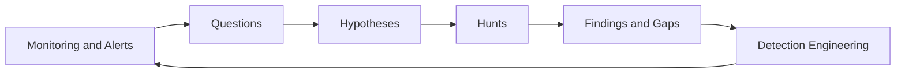
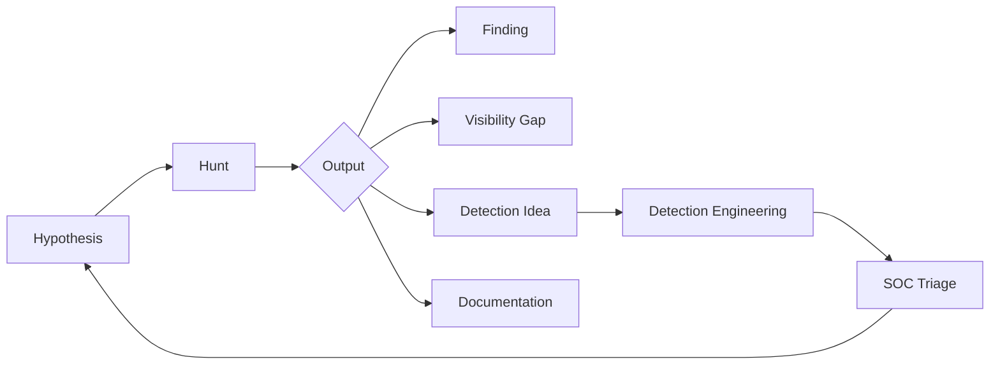
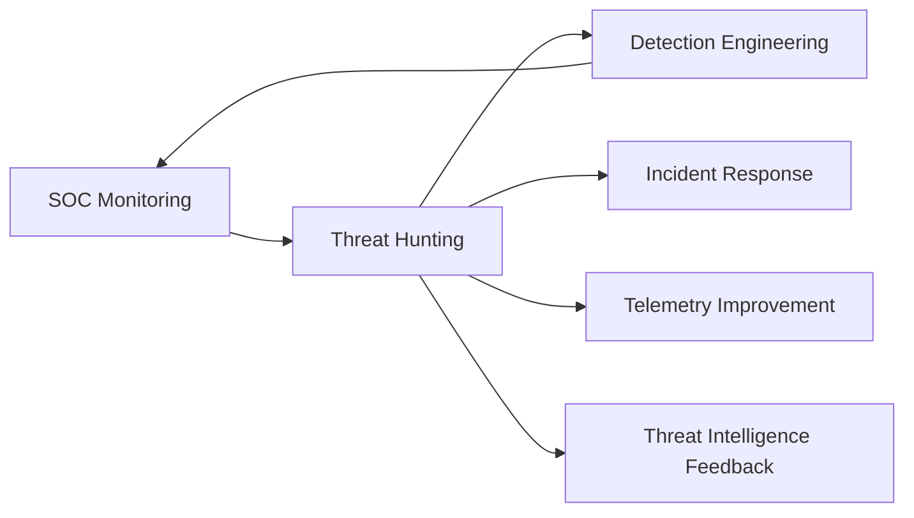

**Author:** *Roger C.B. Johnsen*

## Introduction

**Threat hunters do not all come from the SOC. Some come from incident response, digital forensics, threat intelligence, systems administration, development, network engineering, penetration testing, military environments or self-directed technical work.**

**This chapter focuses on one common and important path: the transition from SOC alert handling to hypothesis-driven threat hunting. It is not the only path into hunting, but it is a useful one to study because alerts teach analysts something valuable about evidence, telemetry, detection limits and operational reality.**

The previous chapter described the threat hunter persona: curious, disciplined, technical enough to reason across domains, and practical enough to turn uncertainty into useful security work. This chapter shows how one part of that persona becomes method.

* A SOC analyst investigating an alert may ask: What does this alert mean?
* A threat hunter may ask: What are our alerts not showing us?

That shift is the focus of this chapter.

Threat hunting is not a rejection of SOC work. It can grow out of it. Good SOC analysts learn patterns, systems, noise, false positives, weak detections and operational reality. Over time, that experience can become something more proactive: structured questions about what the environment would show if an attacker behaved in a certain way.

That is where alerts become hypotheses.



---

## The Transition from Monitoring to Hunting

SOC work is one of the clearest places to see the transition from reactive investigation to proactive hunting. Something fires. An analyst investigates. The case is closed, escalated, tuned, documented or handed over.

That work matters. It teaches structure and discipline. It forces analysts to connect alerts with evidence. It also teaches something else: detections only show what they are designed, configured and able to show.

This is where hunting begins.

* A SOC analyst may ask: Why did this alert fire?
* A threat hunter may ask: What would similar activity look like if this alert did not fire?

That shift is small, but important.

It moves the analyst from reacting to known signals toward exploring possible blind spots. The hunter is still using operational knowledge from the SOC, but the starting point is different. Instead of beginning with an alert, the hunt begins with a question.

## Alerts Are Starting Points, Not Boundaries

Alerts are useful, but they are not the full truth. An alert usually means that a predefined condition has been met. A rule matched. A threshold was crossed. A behaviour looked similar enough to something the detection was built to find.

> An alert is a claim that something may have happened. It is not fact. It is a claim.
>
> -- Roger Johnsen

That does not mean the detection covers the full technique. It does not mean related behaviour is detected. It does not mean the alert name accurately describes what happened. It does not mean the environment has visibility across every system where the behaviour could occur.

A good alert can still raise good hunting questions:

| Alert observation                                | Hunting question                                                               |
| ------------------------------------------------ | ------------------------------------------------------------------------------ |
| Encoded PowerShell was detected on one endpoint. | Where else do we see encoded PowerShell that did not trigger this alert?       |
| A suspicious login was blocked.                  | What similar logins succeeded before the block?                                |
| Malware was quarantined on one host.             | Which systems communicated with the same infrastructure before the quarantine? |
| A user clicked a phishing link.                  | Did any mailbox rules, OAuth grants or unusual sign-ins follow?                |
| Lateral movement was detected from one system.   | What other systems show weaker signs of the same behaviour?                    |

This is one of the natural paths from SOC analysis to hunting. The alert is not ignored. It becomes a clue, a starting point, or a prompt for a broader question.

## From Observation to Hypothesis

A hypothesis is a structured assumption that can be tested. It is not a guess. It is not a feeling. It is not “let us look around and see what we find”.

A useful hunting hypothesis usually contains three things:

1. a behaviour that may occur
2. a reason the behaviour matters
3. a way to test whether the behaviour is visible in the environment

For example:

*"If an attacker uses PowerShell from Office-spawned processes for initial execution, we should see Office processes creating PowerShell, suspicious command-line arguments, or follow-on network activity from affected endpoints."*

This hypothesis gives the hunt direction. It suggests data sources, fields, expected relationships and possible follow-up questions.

A weak version would be:

*"Look for suspicious PowerShell."*

That may still produce something interesting, but it is not very disciplined. It does not explain what behaviour matters, why it matters, or what evidence would support the conclusion.

## A Simple Hypothesis Pattern

A practical hypothesis can often be written like this:

```text
If [threat behaviour] occurs in [our environment],
then [observable traces] should appear in [available data sources].
```

Examples:

| Threat behaviour                             | Observable traces                                                                                              |
| -------------------------------------------- | -------------------------------------------------------------------------------------------------------------- |
| Password spraying against cloud accounts     | repeated failed logins across many users from shared infrastructure, followed by one or more successful logins |
| Office-based initial access                  | Office child processes, suspicious script execution, unusual file writes or outbound connections               |
| Lateral movement using administrative shares | remote logons, service creation, file writes to admin shares and process execution on target hosts             |
| Data staging before exfiltration             | unusual archive creation, large file movement, temporary staging paths or access to sensitive repositories     |
| OAuth abuse                                  | new consent grants, unusual application permissions, mailbox access or suspicious sign-in patterns             |

The point is not to make every hunt formulaic. The point is to make the reasoning visible.

> If the hypothesis cannot be explained, it will be difficult to test. If it cannot be tested, it is not a good hunting hypothesis.
>
> -- Roger Johnsen

## Same Alert, Different Analyst

This is where the difference between alert handling and hunting becomes visible. Imagine an alert for suspicious PowerShell execution. A shallow investigation might conclude:

*"Suspicious PowerShell was observed. Escalate."*

A better SOC investigation might ask:

* Which user ran it?
* Which parent process launched it?
* What command line was used?
* Was the host expected to run administrative scripts?
* Did the process create files, network connections or child processes?
* Is there similar activity on the same host?

A hunt takes the next step:

* Do we see similar PowerShell patterns that did not trigger the alert?
* Is this behaviour common for some administrative groups?
* Do Office applications ever spawn PowerShell in this environment?
* Are encoded commands used legitimately?
* Which hosts show the same parent-child pattern?
* Did the detection catch the behaviour, or only one noisy variant of it?

The alert becomes a doorway into a broader investigation. That is the difference. The SOC investigation asks whether this event matters. The hunt asks what this event teaches us about the environment.

## Example: From Alert to Hypothesis to Detection

Imagine that the SOC receives an alert for encoded PowerShell on a workstation. A narrow investigation may answer the immediate question: who ran it, what command line was used, and whether the activity looks malicious on that host.

A hunt asks a broader question: _What if this alert only caught one visible variant of a wider behaviour?_

That question can become a hypothesis:

```text
If attackers use Office-spawned PowerShell for initial execution, we should see Office processes creating PowerShell, suspicious command-line arguments, unusual child processes, or follow-on network activity from affected endpoints.
```

The hunter may then look across available telemetry:

| Data source            | Purpose                                                                                     |
| ---------------------- | ------------------------------------------------------------------------------------------- |
| EDR process events     | Find Office applications spawning PowerShell, cmd.exe, wscript.exe or similar interpreters. |
| Command-line telemetry | Identify encoded commands, download cradles, suspicious flags or obfuscated strings.        |
| Network telemetry      | Check whether the process or host contacted unusual external destinations.                  |
| Identity data          | Determine whether the user context matches normal administrative behaviour.                 |
| Asset context          | Decide whether the host type makes the behaviour expected or unusual.                       |

The result may be malicious activity. It may be legitimate administration. It may also be a visibility gap.

All three outcomes can be useful. If malicious activity is found, the hunt becomes a finding and may trigger incident response. If the activity is benign but recurring, it can help tune detections or document expected behaviour. If the required telemetry is missing, the hunt produces a logging or coverage requirement.

A useful output might be:

```text
Office applications spawning PowerShell with encoded command-line arguments are rare in this environment. Where observed, the activity should be reviewed with user context, parent process, command-line content and follow-on network activity. Current telemetry is sufficient on managed endpoints, but incomplete for unmanaged devices.
```

That output can become detection logic, triage guidance, or a telemetry improvement task.

This is the point: the alert started the investigation, but the hypothesis made it useful beyond the original case.

## Analytical Foundation

Hunting relies on the same reasoning that defines solid SOC analysis, but extends that reasoning into uncertainty.

Three perspectives matter:

| Perspective      | Question                                                              |
| ---------------- | --------------------------------------------------------------------- |
| Operational view | What is normal or expected in this environment?                       |
| Adversarial view | How could an attacker perform this behaviour?                         |
| Contextual view  | Which systems, users or business processes would make this important? |

Without the operational view, normal behaviour may be treated as suspicious. Without the adversarial view, the hunt may ask irrelevant questions. Without the contextual view, the finding may be technically interesting but operationally unimportant.

Good hunting keeps all three views in tension.

## Telemetry Decides What Can Be Tested

A hypothesis is only useful if the environment has enough data to test it. This is where many hunts become valuable even when they find no malicious activity. They expose what cannot be seen.

A hunter may ask a good question and discover that:

* the required log source is not collected
* the relevant field is not populated
* retention is too short
* endpoint coverage is incomplete
* identity logs are available but not joined to asset context
* network visibility does not cover east-west traffic
* cloud audit logs exist but are not accessible to the SOC

That is not wasted work. It means the hunt has found a visibility gap. A visibility gap is a real finding because it tells the organisation what it cannot currently prove.

## From Hunt to Detection Engineering

A good hunt should leave something behind. Sometimes that is a confirmed finding. Sometimes it is a better understanding of normal behaviour. Sometimes it is a visibility gap. Sometimes it is a detection idea.

This is where threat hunting connects directly to detection engineering.



The handover matters.

A detection engineer does not need a vague statement such as: *"Suspicious behaviour was observed"*. They need behaviour that can be described, tested and operationalised:

| Weak handover                   | Useful handover                                                                                                                                     |
| ------------------------------- | --------------------------------------------------------------------------------------------------------------------------------------------------- |
| Suspicious PowerShell activity. | Office process spawned PowerShell with encoded command-line arguments, followed by outbound network activity from a non-administrative workstation. |
| Possible lateral movement.      | Remote service creation was observed from a workstation to multiple servers using the same privileged account within a short time window.           |
| Strange login behaviour.        | Multiple failed cloud logins across many users from one ASN were followed by a successful login for one account without MFA challenge.              |

This is how hunting improves SOC work. The hunt does not end with the hunter’s curiosity. It becomes something others can use.

## Documentation and Reproducibility

A hunt that cannot be explained cannot be trusted. Documentation is not administration for its own sake. It is part of the analytical discipline. It allows someone else to understand what was tested, what data was used, what assumptions were made and what the result means.

A useful hunting record should include:

* the hypothesis
* the reason for the hunt
* the data sources used
* the query logic or analytic method
* the time range
* the observed results
* the limitations
* the conclusion
* the recommended next step

This makes the hunt repeatable. It also makes it reviewable. If the conclusion is wrong, the documentation helps explain why. If the hunt is useful, the documentation helps others build on it.

## Integration with Security Operations

Threat hunting should not stand apart from the rest of security operations. It should feed the work around it:

* SOC analysts get better triage guidance
* detection engineers get better behavioural logic
* incident responders get better context
* platform teams get clearer telemetry requirements
* threat intelligence becomes locally testable
* vulnerability management gets stronger exploitation context

This is how hunting becomes more than an individual activity. It becomes part of the security feedback loop.



The value of a hunt is not only whether it finds an attacker. The value is whether it improves the organisation’s ability to see, understand and respond.

## What Usually Goes Wrong

Several failure patterns repeat when teams try to move from alerts to hypotheses:

* **Alert gravity:** the team only hunts around existing alerts and never asks what the detections miss.
* **Vague hypotheses:** the hunt starts with “look for suspicious activity” instead of a testable behaviour.
* **Query-first hunting:** the analyst starts with a query they like rather than a question they can explain.
* **Telemetry optimism:** the team assumes the required data exists, is complete and can be trusted.
* **Detection dumping:** hunt output is handed to detection engineering as vague findings rather than usable behaviour.
* **No feedback loop:** the hunt produces a report, but nothing changes in detections, telemetry, documentation or triage.

These failures are ordinary. They are also fixable. The fix is to make the reasoning explicit: what are we testing, what data do we need, what did we observe, what does it mean, and what should improve because of it?

## Working Position for This Book

The movement from alerts to hypotheses is one of the most important transitions in threat hunting. A SOC analyst learns to investigate what has already surfaced. A threat hunter learns to ask what has not surfaced yet, why it may be missing, and how the environment would reveal it if it happened.

That is why threat hunting is not just searching logs. It is structured reasoning applied to security telemetry.

Or as I usually put it:

> An alert tells you that something matched. A hypothesis asks what the alerting logic may never see.
>
> -- Roger Johnsen

## Revision

| Revised Date | Author        | Comment                                                                                                     |
| ------------ | ------------- | ----------------------------------------------------------------------------------------------------------- |
| 2026-07-09   | Roger Johnsen | Rewritten to establish a clearer practitioner voice and align the page with the book’s fundamentals section |
| 2025-10-18   | Roger Johnsen | Article added                                                                                               |
