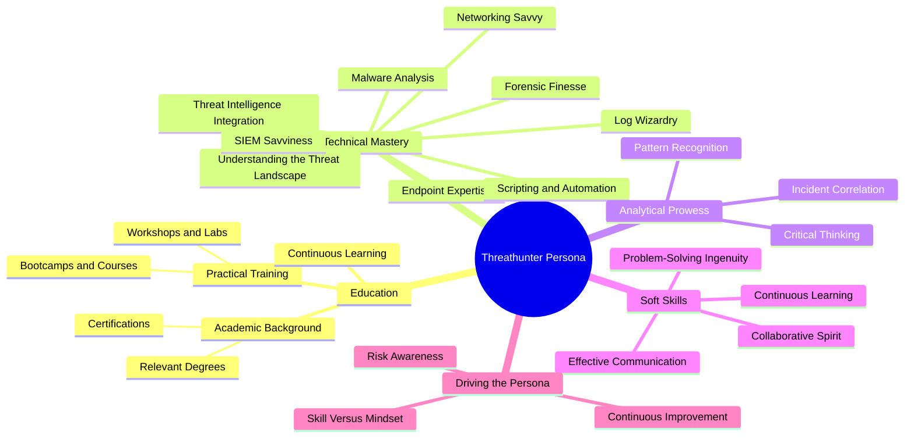
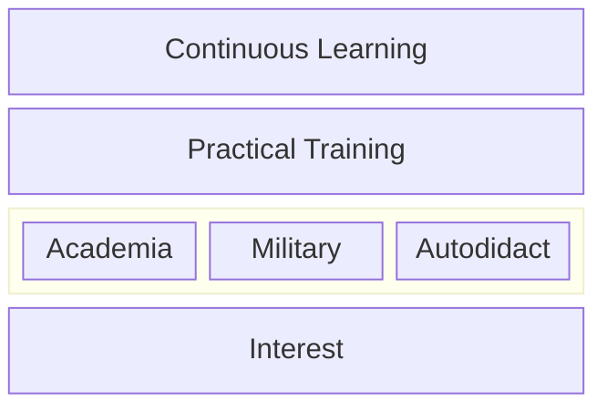
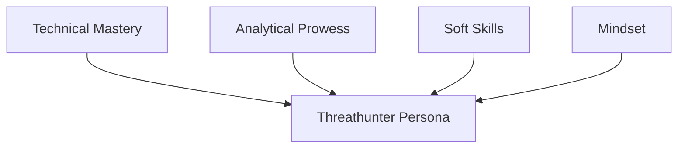

| Revised Date | Comment |
| ------------ | ------- |
| 01.01.2025   | Added page | 

## Introduction

**The role of a threat hunter is, in my opinion, the natural progression for SOC analysts. It represents the culmination of years spent mastering the art of monitoring, analyzing, and responding to security events, while incorporating expertise from related disciplines such as Digital Forensics and Incident Response (DFIR), Computer Security Incident Response Teams (CSIRT), penetration testing, and more.**

**A threat hunter is the ultimate fusion of defensive (blue) and offensive (red) cybersecurity expertise. They embody the concept of a "purple teamer," seamlessly integrating skills from multiple domains to proactively identify and neutralize threats before they can cause harm. Beyond being a practitioner, a threat hunter is a strategist - a professional equipped with multidisciplinary expertise to stay ahead of adversaries in an ever-evolving threat landscape.**

**This chapter explores the unique skills, mindset, and tools that define the modern threat hunter and highlights their pivotal role in advanced cybersecurity operations.**

---

## Mapping the Persona

To start off, I want to depict how I perceive the threat hunter persona. It can be visualized through interconnected aspects of education, technical mastery, analytical prowess, and soft skills. The following mindmap illustrates how these attributes align to create a proficient threat hunter. I'll touch upon these in detail in this chapter. 

---

## Education

Then let us move over to talk about education. I have noticed there are many questions floating about on how to break into threat hunting. To pinpoint the exact path for education for a threat hunter isn't feasible as their background is as diverse as the IT field itself. However, certain educational foundations and ongoing learning paths are crucial for shaping a proficient threat hunter.  

The following diagram captures the core elements that contribute to a threat hunter's education and growth, illustrating the balance between formal education, practical experience, and personal interest. We'll talk about each layer shortly.

### Interest

At its core, a Threat Hunter is driven by an insatiable curiosity and passion for all things IT and cybersecurity. They thrive on understanding how systems operate and are motivated by the challenges of outpacing both rapidly evolving technology and the ever-adaptive tactics of adversaries. This passion isn’t about casual, consumption-based activities like gaming or scrolling through social media, or simply reading the IT news. Instead, it’s about diving deep into the technical fabric of the digital world - dissecting how things work, uncovering why they function the way they do, and constantly seeking to learn and refine their skills. 

Threat Hunters often possess an innate problem-solving mindset, paired with a relentless drive to uncover the unseen. They are the kind of individuals who take apart systems not just to fix them, but to truly understand their inner workings. This relentless pursuit of knowledge spans across multiple domains: networking, operating systems, programming, and threat landscapes. It’s this blend of intellectual curiosity, technical acumen, and an unwavering commitment to staying ahead that forms the foundation of an exceptional Threat Hunter.

And this is just the base layer which this profession is built! As I see it. 

### Education

Having the fundational drive, having _that_ interest in place, it is time to talk about education. An educated threat hunter is invaluable. In this section I will focus on three areas:

* Academia
* Military
* Autodidactism

#### Academia

##### High School

High school lays the foundation for many of the technical skills and scientific thinking that will be crucial later in a career as a threat hunter. While it’s not necessarily required to follow a specific curriculum, choosing relevant subjects such as mathematics, computer science, and the natural sciences provides an advantage in understanding the fundamental concepts needed to master more advanced skills later on. Subjects like biology and physics offer insight into how systems work, while computer science provides a foundation for understanding data processing and programming. Additionally, for those particularly interested in technology, exploring activities like hacking clubs, programming workshops, and Capture The Flag (CTF) competitions can provide early practical experience.

Examples of relevants subjects:

| Science | Technology | Engineering | Mathematics |
| ------- | ---------- | ----------- | ----------- |
| Biology | Computer Science | Aerospace Engineering | Pure Mathematics |
| Chemistry | Information Technology | Civil Engineering | Applied Mathematics |
| Physics | Electronics | Mechanical Engineering | Statistics |
| Earth and Environmental Sciences | | Electrical Engineering | |

##### Degrees

Degrees act as milestones in a continuous learning journey. I typically observe that degrees build on one another, deepening technical understanding while opening doors to more specialized cybersecurity fields:

The following topics often yield strong threat hunters:

- Network security
- Computer security
- Programming and scripting languages
- Data analysis
- Digital forensics
- Network forensics
- Operating systems
- Cryptography
- Malware analysis
- Incident response
- Machine learning
- Cyber threat intelligence
- Statistical analysis
- Reverse engineering

For candidates pursuing a **Master of Science** degree, I focus on what they have done before and whether they have solid hands-on experience. It’s essential to have a strong foundation, as two years of academic study alone isn’t sufficient for the high-level tasks a threat hunter faces.

#### Military

In most regions, military training offers distinct advantages. Military programs often provide experience in critical cybersecurity fields, but more importantly, they teach practical skills. The military emphasizes real-world experience, focusing on solving problems and taking action without much theoretical fluff. For some threat hunters, military experience has fostered a discipline that enhances their effectiveness in high-stress environments.

#### Autodidactism

Not all threat hunters have an academic background, or military. Many are self taught. These individuals represents the ability to learn independently, driven by an insatiable curiosity and passion for understanding how things work. Threat hunters often find themselves navigating areas where formal education may not provide immediate answers. In these moments, the ability to self-teach becomes invaluable.  

Autodidacts immerse themselves in hands-on learning, whether by exploring technical documentation, analyzing logs, or experimenting with virtual labs. They delve into resources like **Hack The Box**, **TryHackMe**, and Capture-the-Flag (CTF) competitions to simulate real-world challenges. This self-guided exploration often bridges gaps left by traditional learning paths, allowing threat hunters to refine their skills and adapt to new technologies and tactics swiftly.  

This independent learning style isn’t about ticking boxes or following a set curriculum; it’s about diving deep into topics of interest, driven by the need to solve problems and uncover answers. Many threat hunters thrive on this autonomy, continuously engaging with blogs, reports like **The DFIR Report**, and tools such as **MITRE ATT&CK** to expand their knowledge and stay updated on emerging threats.  

For a threat hunter, autodidactism is more than just a skill—it’s a mindset. It fosters adaptability and resilience, ensuring that even in the face of novel threats, they can confidently rise to the occasion, armed with the knowledge and experience gained through their own initiative. This is where passion meets practicality, forming a cornerstone of the threat hunter persona.

### Practical Training

Practical training bridges theory and real-world application. Bootcamps, workshops, online webinars/classes, and Capture-the-Flag (CTF) competitions simulate actual attack scenarios and sharpen investigative skills. Platforms like TryHackMe and Hack The Box provide immersive environments for technical growth. CTFs like the SANS Holiday Hack Challenge offer diverse, real-world problems to solve.

### Continuous Learning

Cyber threats are ever-evolving, making continuous learning crucial for staying ahead. As new attack methods emerge, threat hunters must adapt quickly. Attending webinars, conferences, and training sessions, and engaging with online communities such as The DFIR Report, help threat hunters stay current with the latest threats, tools, and tactics.

---

## Technical Mastery

A threat hunter’s technical proficiency spans several domains. Mastery in these areas is what enables them to identify and mitigate sophisticated threats effectively.

| **Term**                     | **Description**                                                                                                                                               |
|------------------------------|---------------------------------------------------------------------------------------------------------------------------------------------------------------|
| **Understanding the Threat Landscape** | Threat hunters are skilled in interpreting adversaries’ Tactics, Techniques, and Procedures (TTPs). Tools like the MITRE ATT&CK framework provide the foundation for mapping these TTPs to potential attack vectors, enabling hunters to anticipate adversary moves and proactively prevent attacks. |
| **Networking Savvy**          | Expertise in network protocols (e.g., TCP/IP, DNS, HTTP/S) allows threat hunters to spot anomalies in traffic that may indicate malicious activity. Tools like Wireshark and Zeek help analyze network traffic for signs of exfiltration, lateral movement, or C2 communication. |
| **Endpoint Expertise**        | Tools like CrowdStrike Falcon and other EDR solutions help threat hunters track unusual endpoint behavior. They investigate activities like PowerShell executions, often signs of malware or attacks like ransomware or credential theft. |
| **Log Analysis**              | Threat hunters examine logs from a variety of sources (e.g., servers, firewalls) to detect suspicious behavior. Tools like Splunk and ELK Stack are used to create complex queries that pinpoint threats like brute-force login attempts or lateral movement. |
| **Threat Intelligence Integration** | Threat intelligence enhances hunting efforts by providing context on adversary tactics. Platforms like MISP and Recorded Future link Indicators of Compromise (IOCs) to known campaigns, enabling hunters to identify patterns and anticipate future threats. |
| **Scripting and Automation**  | Threat hunters leverage scripting (e.g., Python, PowerShell) to automate repetitive tasks like IOC matching, improving efficiency and consistency. Automation ensures faster detection and response to emerging threats. |
| **Malware Analysis**          | Threat hunters analyze malware using tools like Ghidra or Volatility to reverse-engineer malicious code and understand adversaries' capabilities, such as keylogging or data exfiltration techniques. This knowledge helps in crafting targeted defenses. |

---

## Analytical Skills

Analytical skills are integral to threat hunting. These skills allow hunters to interpret complex datasets and uncover hidden threats.

| **Skill**                     | **Description**                                                                                                                                               |
|------------------------------|---------------------------------------------------------------------------------------------------------------------------------------------------------------|
| **Critical Thinking**         | Threat hunters use structured reasoning to assess anomalies. They form hypotheses based on observed patterns and test them to uncover the true cause of suspicious behavior, ensuring precision in threat detection and minimizing false positives. |
| **Pattern Recognition**       | Recognizing patterns within large datasets is crucial for identifying emerging threats. For example, repeated login failures followed by a successful authentication could signal brute-force attacks. Identifying these patterns early allows for proactive defense. |
| **Incident Correlation**      | Threat hunters connect seemingly unrelated events to gain a comprehensive understanding of an attack. By linking phishing emails with suspicious outbound traffic, they can uncover multi-stage attacks, such as data exfiltration or C2 communication. |

---

## Soft Skills

While technical expertise is paramount, soft skills ensure threat hunters can communicate effectively and collaborate across teams.

| **Term**                     | **Description**                                                                                                                                               |
|------------------------------|---------------------------------------------------------------------------------------------------------------------------------------------------------------|
| **Effective Communication**   | Threat hunters must translate complex technical findings into clear, actionable insights for both technical and non-technical stakeholders. This ability ensures swift decision-making and effective incident response. |
| **Collaboration**             | Threat hunters work alongside SOC, intelligence, and incident response teams, ensuring that their insights enhance overall defense strategies. Collaboration amplifies the impact of threat-hunting efforts, making the organization’s defense more resilient. |
| **Problem-Solving Ingenuity** | Threat hunting requires creativity to adapt to evolving threats. Hunters continuously develop new strategies, tools, and methods to outsmart adversaries. Problem-solving ingenuity is key to staying one step ahead. |

---

## Conclusion

Threat hunting requires more than just technical knowledge. It demands a mindset of curiosity, persistence, and adaptability. This mindset ensures hunters not only react to threats but anticipate them, positioning them as proactive defenders in an ever-changing landscape.

---

### Building Team Dynamics

To build an effective threat-hunting team, organizations need to identify individuals who possess both the technical expertise and the right mindset. Collaboration within the security team fosters shared learning and resilience, enhancing overall effectiveness.

---

### Continuous Improvement

Continuous learning is essential for threat hunters to stay ahead of sophisticated adversaries. By embracing new technologies, methodologies, and collaboration, threat hunters refine their approach, improving their ability to detect and neutralize threats.

---

## Resources

These are some of the resources I have used for this chapter.

- [Offsec - What is a Threat Hunter?](https://www.offsec.com/cybersecurity-roles/threat-hunter)
- [WGU - What Is a Threat Hunter?](https://www.wgu.edu/career-guide/information-technology/threat-hunter-career.html)
- [LetsDefend.io - How to Become a Threat Hunter](https://letsdefend.io/blog/how-to-become-a-threat-hunter)
- [Three Key Aspects of Being a Threat Hunter](https://blogs.opentext.com/three-key-aspects-of-being-a-threat-hunter/)
- [Comptia - Your Next Move: Threat Hunter](https://www.comptia.org/blog/your-next-move-threat-hunter)
- [SnapAttack - How to Become a Cyber Threat Hunter](https://www.snapattack.com/become-a-threat-hunter/)
- [CyberSN - Threat Hunter](https://cybersn.com/role/threat-hunter/)

