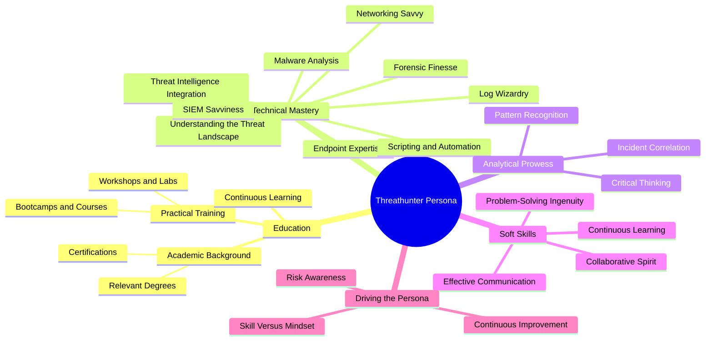

| Revised Date | Comment |
| ------------ | ------- |
| 01.01.2025   | Added page | 

## Introduction

**In the world of cybersecurity, the threathunter role is a unique blend of technical expertise, analytical insights, and interpersonal skills. Perhaps the most important thing: experience! A threathunter proactively identifies and neutralizes threats often overlooked by automated systems, embodying a persona that thrives on curiosity, persistence, and collaboration. This article explores the essential traits and skills that define the threathunter persona, based on what I look for in a threat hunter during job interviews.**

---

### Mapping the Persona

The following mindmap offers a high-level overview of the key aspects that define the threathunter persona. It visually organizes the critical areas of education, technical mastery, analytical prowess, and soft skills, helping to illustrate the interconnected nature of these attributes.

---

### Education

A solid educational foundation is pivotal to developing the threathunter persona. While formal education isn't the sole pathway, it provides a structured understanding of cybersecurity principles.

#### Academic Background

##### Relevant Degrees

Degrees in Computer Science, Cybersecurity, or Information Technology are common among threathunters. These programs cover foundational topics like programming, networking, and system architecture.

Certifications: Certifications such as [Certified Information Systems Security Professional (CISSP)](https://www.isc2.org/Certifications/CISSP), [GIAC Certified Incident Handler (GCIH)](https://www.giac.org/certifications/certified-incident-handler-gcih/), and [Certified Ethical Hacker (CEH)](https://www.eccouncil.org/programs/certified-ethical-hacker-ceh/) validate advanced skills and commitment to the field.

However, certifications doesn't need to be those costly ones that takes forever to complete and master. For instance, AttackIQ offers excellent [free certifications and learning paths](https://www.academy.attackiq.com/learning-paths) on everything from MITRE ATT&CK to Attack & Breach simulation. If you are able to show me badge list on [Credly](https://info.credly.com/) built up on such certficiations, then I am more than happy! 

#### Practical Training

- Bootcamps and Courses: Practical, hands-on training like SANS courses or online platforms such as [TryHackMe](https://tryhackme.com/) and [Hack The Box](https://www.hackthebox.com/) enhance real-world skills.
- Workshops and Labs: Immersive experiences, including capture-the-flag (CTF) competitions, prepare threathunters to tackle complex challenges.

#### Continuous Learning

- What It Entails: Cyber threats evolve rapidly. A threathunter must engage in lifelong learning through webinars, conferences, and resources like [The DFIR Report](https://thedfirreport.com/).
- Application: Staying updated with the latest attack techniques and tools ensures readiness for emerging threats.

---

### Technical Mastery

#### 1. Understanding the Threat Landscape
   - What It Entails: Threathunters possess an in-depth understanding of the tactics, techniques, and procedures (TTPs) of adversaries. Familiarity with frameworks like [MITRE ATT&CK](https://attack.mitre.org/) helps them anticipate and counteract malicious activity.
   - Tool: [MITRE ATT&CK Navigator](https://mitre-attack.github.io/attack-navigator/).
   - Application: Mapping observed attack patterns (e.g., credential dumping) to MITRE ATT&CK techniques to predict the attacker’s next move.

#### 2. Networking Savvy
   - What It Entails: A threathunter’s deep understanding of network protocols (e.g., TCP/IP, HTTP/S, DNS) enables them to analyze and interpret network traffic effectively.
   - Tool: [Wireshark](https://www.wireshark.org/) or [Zeek](https://zeek.org/).
   - Application: Uncovering data exfiltration attempts by investigating anomalies such as repetitive DNS queries.

#### 3. Endpoint Expertise
   - What It Entails: Threathunters leverage endpoint detection tools to monitor and analyze suspicious activity on devices.
   - Tool: [CrowdStrike Falcon](https://www.crowdstrike.com/).
   - Application: Investigating alerts for processes like unusual PowerShell execution and correlating them to uncover hidden threats.

#### 4. Log Wizardry
   - What It Entails: Parsing and analyzing logs from various systems is a cornerstone of the threathunter persona.
   - Tool: [Splunk](https://www.splunk.com/) or [ELK Stack](https://www.elastic.co/what-is/elk-stack).
   - Application: Writing queries to detect brute-force login attempts followed by successful authentication.

#### 5. Threat Intelligence Integration
   - What It Entails: A threathunter enriches their investigations with contextual information from threat intelligence feeds.
   - Tool: [MISP](https://www.misp-project.org/) or [Recorded Future](https://www.recordedfuture.com/).
   - Application: Associating indicators of compromise (IOCs) from logs with known adversary campaigns.

#### 6. Scripting and Automation
   - What It Entails: Automating repetitive tasks to streamline investigations.
   - Tool: Python or PowerShell.
   - Application: Crafting scripts to match suspicious domains against threat intelligence databases.

#### 7. Forensic Finesse
   - What It Entails: Threathunters delve into memory, disk, and network forensics to uncover stealthy threats.
   - Tool: [Volatility](https://www.volatilityfoundation.org/).
   - Application: Analyzing memory dumps to identify malware that operates solely in memory.

#### 8. SIEM Savviness
   - What It Entails: Managing and refining detection rules in Security Information and Event Management (SIEM) systems.
   - Tool: [QRadar](https://www.ibm.com/products/qradar-siem).
   - Application: Creating rules to flag excessive file downloads, indicating potential data theft.

#### 9. Malware Analysis
   - What It Entails: Identifying malicious capabilities in suspicious files.
   - Tool: [Ghidra](https://ghidra-sre.org/).
   - Application: Dissecting an executable to uncover malicious functions like keylogging.

---

### Jack of All Trades

A threathunter must possess a versatile skill set, combining expertise across multiple disciplines:

- DFIR (Digital Forensics and Incident Response): To manage incidents and investigate breaches effectively.
- Programming: Skills in Python, PowerShell, or similar languages for scripting and automation.
- Querying: Proficiency in writing SQL, Splunk queries, or custom data search scripts.
- Data Analysis: Ability to interpret large datasets for patterns and anomalies.
- Network Administration: Understanding network architecture and security.
- Firewall Administration: Basic knowledge of configuring and analyzing firewall rules.
- Operating System Expertise: Familiarity with Windows, Linux, and to some degree, macOS.
- Relevant Knowledge Areas:
  - Cloud Security (AWS, Azure, GCP)
  - Identity and Access Management (IAM)
  - DevSecOps Practices
  - Cryptography Basics

These competencies empower threathunters to adapt and respond effectively to varied challenges in the cybersecurity landscape.

---

### Analytical skills

#### 1. Critical Thinking
   - What It Entails: Threathunters approach problems methodically, forming and testing hypotheses.
   - Application: Investigating anomalous login behavior across geolocations to confirm or rule out compromise.

#### 2. Pattern Recognition
   - What It Entails: Spotting trends and anomalies in vast datasets.
   - Application: Detecting repeated login failures followed by successful access, potentially signaling brute-force attacks.

#### 3. Incident Correlation
   - What It Entails: Connecting seemingly unrelated events to reveal the full scope of an attack.
   - Application: Linking a phishing email, suspicious script execution, and outbound traffic to a known malicious IP address.

---

### Soft Skills That Define the Persona

#### 1. Effective Communication
   - What It Entails: Conveying findings clearly to both technical and non-technical stakeholders.
   - Application: Delivering concise reports to a CISO outlining the impact and mitigation of an identified APT.

#### 2. Collaborative Spirit
   - What It Entails: Partnering with SOC, incident response, and intelligence teams to enhance security posture.
   - Application: Coordinating with SOC analysts to escalate critical alerts for immediate action.

#### 3. Continuous Learning
   - What It Entails: Staying ahead of evolving threats by engaging with resources like [The DFIR Report](https://thedfirreport.com/).
   - Application: Applying insights from recent attack techniques to refine detection capabilities.

#### 4. Problem-Solving Ingenuity
   - What It Entails: Crafting innovative solutions for emerging challenges.
   - Application: Developing methods to identify malicious activity within encrypted traffic by analyzing metadata and traffic patterns.

---

### Driving the Threathunter Persona

As the saying goes, "Everyone can drive a car, but not everyone should be driving a car." This analogy applies aptly to the role of a threathunter. While many may possess the technical skills to analyze data or use tools, not everyone has the mindset, experience, or instincts required for effective threat hunting. 

#### What It Means for Threat Hunting
   - Skill Versus Mindset: Mastering tools is important, but threat hunting requires an innate sense of curiosity, persistence, and the ability to think like an adversary.
   - Risk Awareness: Just as driving demands responsibility and awareness of risks, a threathunter must navigate the complexities of modern cyber threats with precision and caution.
   - Continuous Improvement: Like advanced driving skills honed over time, a threathunter evolves through experience and continuous learning to adapt to the ever-changing threat landscape.

#### Application
   - Team Dynamics: Organizations need to ensure the right individuals are in the "driver’s seat," leading proactive threat-hunting efforts while collaborating with the broader security team.
   - Capability Building: Beyond technical training, fostering a threat-hunting mindset within teams amplifies the organization’s security posture.

---

### Conclusion

The threathunter persona is more than just a role; it’s a mindset. A lifestyle- By combining technical mastery, analytical skills, and interpersonal skills, threathunters proactively safeguard organizations from advanced threats. Continuous learning and a collaborative approach are the hallmarks of this indispensable cybersecurity professional.

## Resources

* [Offsec - What is a threat hunter?](https://www.offsec.com/cybersecurity-roles/threat-hunter)
* [WGU - What Is a Threat Hunter?](https://www.wgu.edu/career-guide/information-technology/threat-hunter-career.html)
* [LetsDefend.io - How to Become a Threat Hunter](https://letsdefend.io/blog/how-to-become-a-threat-hunter)
* [Three key aspects of being a threat hunter](https://blogs.opentext.com/three-key-aspects-of-being-a-threat-hunter/)
* [Comptia - Your Next Move: Threat Hunter](https://www.comptia.org/blog/your-next-move-threat-hunter)
* [SnapAttacl - How to Become a Cyber Threat Hunter: A Guide to Level Up Your Security Team](https://www.snapattack.com/become-a-threat-hunter/)
* [CyberSN - Threat Hunter](https://cybersn.com/role/threat-hunter/)