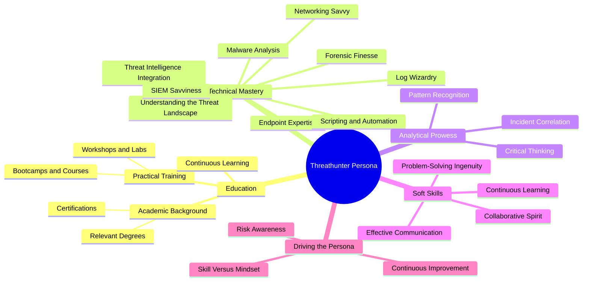
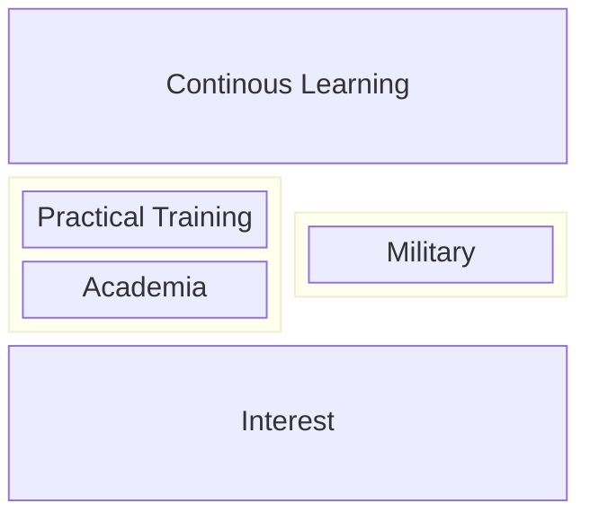
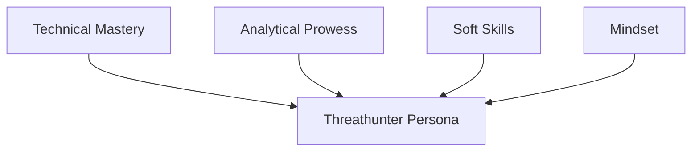

| Revised Date | Comment |
| ------------ | ------- |
| 01.01.2025   | Added page | 

## Introduction

**The role of a threat hunter is, in many ways (in my opinion), the natural progression for SOC analysts. It represents the culmination of years spent mastering the art of monitoring, analyzing, and responding to security events, while incorporating expertise from related disciplines such as Digital Forensics and Incident Response (DFIR), Computer Security Incident Response Teams (CSIRT), penetration testing, and more.**

**A threat hunter is the ultimate fusion of defensive (blue) and offensive (red) cybersecurity expertise. They embody the concept of a "purple teamer," seamlessly integrating skills from both domains to proactively identify and neutralize threats before they can cause harm. Beyond being a practitioner, a threat hunter is a strategist—a professional equipped with multidisciplinary expertise to stay ahead of adversaries in an ever-evolving threat landscape.**

**This chapter explores the unique skills, mindset, and tools that define the modern threat hunter and highlights their pivotal role in advanced cybersecurity operations.**

## Mapping the Persona

To start off, let me depict how I perceive the threat hunter persona. It can be visualized through interconnected aspects of education, technical mastery, analytical prowess, and soft skills. The following mindmap illustrates how these attributes align to create a proficient threat hunter. I'll touch upon these in details in this chapter. 

---

## Education

To pinpoint the exact path for education for a threat hunter isn't feasible as their background is as diverse as the IT field itself. 

### Interest

At its core, a Threat Hunter is motivated by their deep love and interest for the discipline. There's a special kind of people I want to attract - those who lives and breath IT-security and technology. Whenever I conduct job interview I try to drill down into the interest field. For instance, when did your interest start, what made you chose the education path you did? Stuff like that. 

### Education

An educated threat hunter is worth its weight in gold. In general, when I look for a SOC analyst or a Threat Hunter I try figure out if there's an continuation in their education. 

#### Academia

##### High School

| Science | Technology | Engineering | Mathematics |
| ------- | ---------- | ----------- | ----------- |
| Biology |	Computer Science | Aerospace Engineering | Pure Mathematics |
| Chemistry	| Information Technology | Civil Engineering	| Applied Mathematics |
| Physics | Electronics	| Mechanical Engineering | Statistics |
| Earth and Environmental Sciences | |	Electrical Engineering | 	

##### Degrees

Like as for high school, I also regard degrees as stackable and an continuation of the chosen education path. 

Stating which studies are important or not is futile at this level. From my experience, universities has a tendency to mix and mash topics into a degree and it is inherently different to keep track of who offers what. Instead, by looking at the curriculum I have found that the following topics often yields good threat hunters (and SOC analysts):

- Network security
- Computer security
- Programming and scripting languages
- Data analysis
- Digital forensics
- Network forensics
- Operating systems
- Cryptography
- Malware analysis
- Incident response
- Machine learning
- Cyber threat intelligence
- Statistical analysis
- Reverse engineering

When it comes to "Master of Science" degrees, I pay extra attention to what the candidate has done prior. Often, if there are no prior IT relevant education or experience, then that's a red flag. Two years of study doesn't make you prepared for the work you are to embark upon (actually it is, but it takes more effort than people are willing to invest).

#### Military

I have choosen to include the military as a separate and distinct path when it comes to education. In my experience, which may differ from militaries in other countries, is that the military offers mostly the same topics as public (and private) schools do. However, the military has an unique way of teaching what you actually need to do your assigned job - no fluff and straight into action, and it is all based on experience. Thus, practical training comes included! 

#### Practical Training

Hands-on training bridges the gap between theory and practice. Bootcamps, workshops, online webinars/classes and Capture-the-Flag (CTF) competitions simulate real-world scenarios, sharpening investigative and problem-solving skills. Platforms like TryHackMe and Hack The Box offer immersive environments for honing technical expertise. CTFs like SANS Holiday Hack Challenge offers a myriad of relevant objectives to solve and learn from each year. 

#### Continuos learning

A strong educational foundation is crucial to the threathunter persona. While formal education provides structure, continuous learning shape a hunter's ability to adapt. Cyber threats evolve rapidly, making continuous learning indispensable. Webinars, conferences, and resources like The DFIR Report ensure hunters stay abreast of emerging attack techniques. Continous learning is about taking certfications and classes, whatever measure to learn something new outside of academia. Think of it this way: you have studied hard to learn the basics, you tried and trained the concepts out in the field. Now it is time to expand further.

---

## Technical Mastery

Proficiency in technical domains underpins a threat hunter’s success. This mastery extends across diverse areas, enabling them to identify and neutralize sophisticated threats.

Here’s the updated table with more detailed descriptions:

| **Term**                     | **Description**                                                                                                                                               |
|------------------------------|---------------------------------------------------------------------------------------------------------------------------------------------------------------|
| **Understanding the Threat Landscape** | Threat hunters excel at identifying and interpreting adversaries’ Tactics, Techniques, and Procedures (TTPs), which are the behavioral patterns used in cyberattacks. Frameworks like MITRE ATT&CK provide a structured approach to map these TTPs and assess potential attack vectors. This allows hunters to anticipate the adversary's next move, making the defense strategy proactive rather than reactive. |
| **Networking Savvy**          | A deep understanding of network protocols (e.g., TCP/IP, DNS, HTTP/S) is vital for detecting subtle anomalies in network traffic that could signal malicious activities. Threat hunters use tools like Wireshark to capture and analyze packets or Zeek for network monitoring to detect and investigate suspicious traffic patterns, such as data exfiltration, lateral movement, or Command and Control (C2) communication. |
| **Endpoint Expertise**        | Proficiency in Endpoint Detection and Response (EDR) tools like CrowdStrike Falcon enables threat hunters to track and investigate endpoint activities. They focus on unusual system behaviors, such as unexpected PowerShell executions, which could indicate malicious actions like ransomware deployment or credential theft. EDR tools often provide detailed forensic data that aids in identifying the root cause of the attack and understanding the attacker’s techniques. |
| **Log Analysis**              | Threat hunters parse and correlate logs from various sources like firewalls, servers, and security devices to detect hidden patterns indicative of malicious activity. Tools like Splunk and ELK Stack allow them to craft complex queries to identify specific events, such as brute-force login attempts, privilege escalation, or lateral movement across the network. Detailed log analysis is key in uncovering stealthy attacks that evade traditional detection mechanisms. |
| **Threat Intelligence Integration** | Threat intelligence enhances threat hunting efforts by providing timely and contextual data about emerging threats, attack methodologies, and known adversary tactics. Platforms like MISP and Recorded Future aggregate Indicators of Compromise (IOCs) and link them to known threat actor campaigns. This helps hunters identify patterns in adversary behavior, predict future actions, and link current investigations to broader threat landscapes. |
| **Scripting and Automation**  | Threat hunters leverage scripting languages like Python or PowerShell to automate repetitive tasks such as IOC matching, data aggregation, and anomaly detection. Automation not only saves time but also improves consistency in investigations. By creating custom scripts, hunters can rapidly deploy countermeasures, detect changes in system configurations, and ensure a more efficient response to complex threats. |
| **Malware Analysis**          | Malware analysis helps threat hunters understand the functionality and purpose of malicious code used by adversaries. Using tools like Ghidra (for static analysis) or Volatility (for memory analysis), they reverse-engineer files, examine code, and analyze system memory to uncover techniques like code injection, keylogging, or ransomware triggers. This analysis aids in crafting effective defenses and understanding the tools and techniques used by specific threat actors. |

---

## Analytical Skills

Analytical skills are integral to threat hunting, empowering hunters to interpret data and connect disparate events.

Here’s the table with detailed descriptions for the new content:

| **Skill**                     | **Description**                                                                                                                                               |
|------------------------------|---------------------------------------------------------------------------------------------------------------------------------------------------------------|
| **Critical Thinking**         | Threat hunters use structured reasoning and analytical thinking to assess anomalies within the environment. By forming hypotheses based on initial observations, they systematically test and refine their theories to uncover the true cause of suspicious behavior. This critical thinking process allows them to distinguish between benign activity and genuine threats, enabling them to respond with precision and minimize false positives. |
| **Pattern Recognition**       | The ability to spot trends or deviations within large datasets is essential for identifying emerging threats. Threat hunters look for recurring patterns, such as repeated login failures followed by successful authentications, which can indicate brute-force or credential stuffing attacks. Recognizing these patterns early allows them to detect attacks in progress and take preventative actions before significant damage occurs. |
| **Incident Correlation**      | Threat hunters excel in connecting seemingly unrelated events to build a comprehensive understanding of a potential attack. For instance, correlating phishing emails with suspicious outbound traffic could reveal adversary activities like data exfiltration or Command and Control (C2) communications. By understanding the full context of an incident, hunters can trace an attack back to its origin and uncover hidden, multi-stage adversary actions. |

---

## Soft Skills

While technical expertise is vital, soft skills ensure effective collaboration and communication within security teams and with stakeholders.

| **Term**                     | **Description**                                                                                                                                               |
|------------------------------|---------------------------------------------------------------------------------------------------------------------------------------------------------------|
| **Effective Communication**   | Threat hunters must be skilled in translating complex technical findings into clear, actionable insights for both technical and non-technical audiences. This involves not only technical reporting but also presenting information in a way that informs decision-makers, helps prioritize actions, and ensures the response aligns with organizational goals. Clear incident reporting enhances the organization’s ability to understand and act on threats quickly and efficiently. |
| **Collaboration**             | Threat hunters work closely with Security Operations Center (SOC), intelligence, and incident response teams to enhance the overall security posture. Effective collaboration across teams ensures that threat hunting insights are integrated into broader defense strategies, improves information sharing, and helps identify emerging threats faster. By pooling resources and expertise, teams can improve detection capabilities and provide a more comprehensive response to attacks. |
| **Problem-Solving Ingenuity** | The ever-evolving nature of cyber threats demands that threat hunters approach challenges with creativity and resourcefulness. They continuously devise new strategies, tools, and methods to outmaneuver adversaries and detect evolving tactics. Whether developing custom detection rules or innovating on existing tools, problem-solving ingenuity allows hunters to stay one step ahead of attackers and improve defense mechanisms in response to new threats. |
---

## Conclusion

Threat hunting requires more than technical skills. It demands a mindset characterized by curiosity, persistence, and adaptability. This mindset ensures that hunters not only react to threats but also anticipate them, staying ahead in an ever-changing landscape.

### Building Team Dynamics

Organizations must identify and nurture individuals with both the skills and mindset for effective threat hunting. Collaboration within the security team fosters shared learning and resilience.

### Continuous Improvement

Threat hunters evolve through experience, embracing new technologies and methodologies to refine their approach. This commitment to growth enhances their ability to protect against sophisticated adversaries.

The threathunter persona is more than a role; it’s a lifestyle. Combining technical mastery, analytical acumen, and interpersonal skills, threat hunters proactively defend organizations from advanced threats. Through continuous learning and collaboration, they form an indispensable component of modern cybersecurity defenses.

## Resources

These are some of the resources I have used for this chapter.

- [Offsec - What is a Threat Hunter?](https://www.offsec.com/cybersecurity-roles/threat-hunter)
- [WGU - What Is a Threat Hunter?](https://www.wgu.edu/career-guide/information-technology/threat-hunter-career.html)
- [LetsDefend.io - How to Become a Threat Hunter](https://letsdefend.io/blog/how-to-become-a-threat-hunter)
- [Three Key Aspects of Being a Threat Hunter](https://blogs.opentext.com/three-key-aspects-of-being-a-threat-hunter/)
- [Comptia - Your Next Move: Threat Hunter](https://www.comptia.org/blog/your-next-move-threat-hunter)
- [SnapAttack - How to Become a Cyber Threat Hunter](https://www.snapattack.com/become-a-threat-hunter/)
- [CyberSN - Threat Hunter](https://cybersn.com/role/threat-hunter/)

