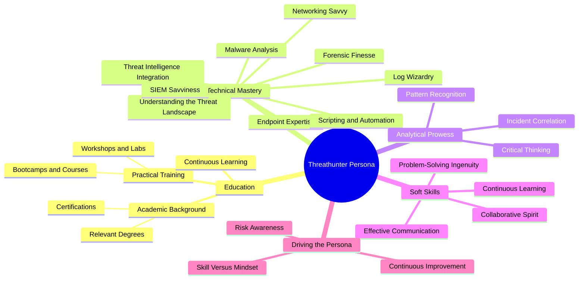
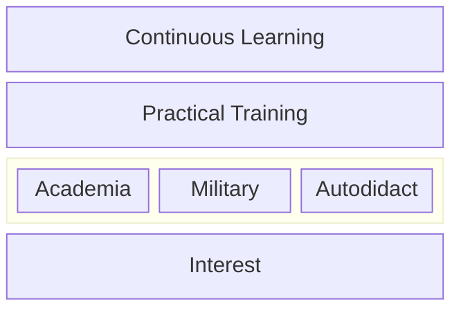
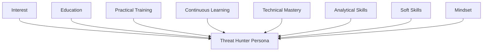

| Revised Date | Comment |
| ------------ | ------- |
| 11.01.2025   | Added page | 

## Introduction

**The role of a threat hunter is, in my opinion, the natural progression for SOC analysts, representing the culmination of years spent mastering the art of monitoring, analyzing, and responding to security events while drawing expertise from related disciplines like Digital Forensics and Incident Response (DFIR), Computer Security Incident Response Teams (CSIRT), and penetration testing. A threat hunter embodies the fusion of defensive (blue) and offensive (red) cybersecurity expertise, exemplifying the “purple teamer” by integrating skills from multiple domains to proactively identify and neutralize threats. More than a practitioner, they are strategists equipped with multidisciplinary expertise to stay ahead of adversaries in an ever-evolving threat landscape. This chapter delves into the unique skills, mindset, and tools that define the modern threat hunter and underscores their pivotal role in advanced cybersecurity operations**

---

## Mapping the Persona

A colleague of mine said something like this during one of our long discussions on threat hunting and penetration testing, and I want to start off this chapter with his statement paraphrased: 

> A threat hunter and a penetration tester share the same fascination for finding security holes—one by probing systems directly, the other by analyzing the traces left behind. Both are driven by curiosity and the thrill of discovery, but while the penetration tester emulates the adversary to break in, the threat hunter follows their digital footprints to uncover breaches that may already exist. 

With basis in this, I want to depict further how the threat hunter persona can be perceived. I will tru to visualize it through interconnected aspects of education, technical mastery, analytical prowess, and soft skills. The following mindmap illustrates how these attributes align to create a proficient threat hunter. I'll touch upon these in detail in this chapter. 

## Education

Let us talk about education for a minute. There are many questions floating about on how to break into threat hunting. To pinpoint the exact path for education for a threat hunter isn't feasible as their background is as diverse as the IT field itself. However, certain educational foundations and ongoing learning paths are crucial for shaping a proficient threat hunter.  

The following diagram captures the core elements that contribute to a threat hunter's education and growth, illustrating the balance between formal education, practical experience, and personal interest. We'll talk about each layer shortly.

### Interest

At its core, a Threat Hunter is driven by an insatiable curiosity and passion for all things IT and cybersecurity. They thrive on understanding how systems operate and are motivated by the challenges of outpacing both rapidly evolving technology and the ever-adaptive tactics of adversaries. This passion isn’t about casual, consumption-based activities like gaming or scrolling through social media, or simply reading the IT news. Instead, it’s about diving deep into the technical fabric of the digital world - dissecting how things work, uncovering why they function the way they do, and constantly seeking to learn and refine their skills. 

Threat Hunters often possess an innate problem-solving mindset, paired with a relentless drive to uncover the unseen. They are the kind of individuals who take apart systems not just to fix them, but to truly understand their inner workings. This relentless pursuit of knowledge spans across multiple domains: networking, operating systems, programming, and threat landscapes. It’s this blend of intellectual curiosity, technical acumen, and an unwavering commitment to staying ahead that forms the foundation of an exceptional Threat Hunter. You might recognize this from classical tales told by penetration testers on how they came to be penetration testers. I firmly belive that the exactly applies for threat hunters as well.

### Education

Having the fundational drive, having _that_ interest in place, it is time to talk about education. An educated threat hunter is invaluable. But, what exactly does it mean to have an education? In this section I will focus on three areas:

* Academia
* Military
* Autodidactism

#### Academia

##### High School

High school lays the foundation for many of the technical skills and scientific thinking that will be crucial later in a career as a threat hunter. While it’s not necessarily required to follow a specific curriculum, choosing relevant subjects such as mathematics, computer science, and the natural sciences provides an advantage in understanding the fundamental concepts needed to master more advanced skills later on. Subjects like biology and physics offer insight into how systems work, while computer science provides a foundation for understanding data processing and programming. Additionally, for those particularly interested in technology, exploring activities like hacking clubs, programming workshops, and Capture The Flag (CTF) competitions can provide early practical experience.

Examples of relevants subjects:

| Science | Technology | Engineering | Mathematics |
| ------- | ---------- | ----------- | ----------- |
| Biology | Computer Science | Aerospace Engineering | Pure Mathematics |
| Chemistry | Information Technology | Civil Engineering | Applied Mathematics |
| Physics | Electronics | Mechanical Engineering | Statistics |
| Earth and Environmental Sciences | | Electrical Engineering | |

The subjects should as we well be seen in connection with other topics in this article for clarity on topics important to being a threat hunter. You might be surprised by seeing biology mentioned here. Biology matters beause it emphasizes principles like pattern recognition, behavioral analysis, and adaptation—essential skills that can be used in countering modern cyber threats. Just as biological systems rely on identifying anomalies to detect predators or infections, threat hunters analyze network traffic and logs to uncover malicious activity. Behavioral analysis, inspired by how organisms respond to environmental changes, helps hunters predict attacker movements and strategies. Additionally, the concept of adaptation from evolutionary biology teaches hunters how to refine their methods to stay ahead of increasingly sophisticated adversaries. These parallels make biology a valuable lens for understanding and combating dynamic cyber threats. I learnt this from one of my students, which had an fascinating capability to see connections between the most surprising things. 

##### Degrees

I view degrees as milestones in the continuous learning journey of cybersecurity professionals. Each degree should ideally build upon the last, deepening technical understanding while opening doors to more specialized fields in cybersecurity:  

While academic qualifications are important, the true strength of a cybersecurity professional lies in their ability to combine formal education with practical, hands-on experience. Certain topics are particularly valuable for aspiring threat hunters, including:  

- Network security  
- Computer security  
- Programming and scripting languages  
- Data analysis  
- Digital forensics  
- Network forensics  
- Operating systems  
- Cryptography  
- Malware analysis  
- Incident response  
- Machine learning  
- Cyber threat intelligence  
- Statistical analysis  
- Reverse engineering  

These subjects provide a solid foundation for developing the critical skills required in threat hunting and advanced cybersecurity roles. However, it’s crucial to understand that a degree — while valuable — won’t cover everything you’ll encounter in the job market. You’ll face challenges and technologies that require you to learn independently and adapt quickly.  

Success in cybersecurity requires a commitment to continuous self-education. Practical experience paired with academic knowledge creates a well-rounded professional capable of tackling complex, evolving threats. Be prepared to go beyond what you’ve learned in school, as the willingness to explore, adapt, and grow on your own is what truly sets top-tier professionals apart.

#### Military

Some threat hunters have their education from other places than traditional academia. Some have training from the military. In most regions, military training offers distinct advantages. Military programs often provide experience in critical cybersecurity fields, but more importantly, they teach practical skills. The military emphasizes real-world experience, focusing on solving problems and taking action without much theoretical fluff. For some threat hunters, military experience has fostered a discipline that enhances their effectiveness in high-stress environments.

#### Autodidactism

Not all threat hunters come from academic or military backgrounds; many are self-taught. These individuals rely on their insatiable curiosity and passion for understanding systems. They excel at independent learning, often exploring technical documentation, analyzing logs, or experimenting in virtual environments to simulate real-world challenges. This self-directed approach fills gaps left by traditional education, enabling threat hunters to quickly adapt to evolving technologies and tactics. It's not about following a set curriculum but about solving problems and uncovering insights through deep exploration. 

Autodidactism goes beyond skill—it’s a mindset that fosters adaptability and resilience, empowering threat hunters to stay ahead of emerging threats through initiative and determination. Passion and practicality merge here, forming a vital aspect of the threat hunter persona.

#### Summary of education

In my career, I have interviewed and employed many people. Some have had great academic education, some came from the military, and some were self-taught. From my point of view, there is room for everyone in this field as long as they have the interest and passion for it. In the end, we must be able to learn from each other, regardless of our backgrounds.

### Practical Training

As discussed earlier, education provides a strong foundation, but practical training is equally important. We cannot rely solely on theory in cybersecurity; real-world experience is essential for developing the skills necessary to tackle complex threats. Practical training bridges the gap between theoretical knowledge and real-world application. Training from work, bootcamps, workshops, online webinars/classes, and Capture-the-Flag (CTF) competitions simulate actual attack scenarios and sharpen investigative skills. Platforms like TryHackMe and Hack The Box offer immersive environments for technical growth, while CTFs like the SANS Holiday Hack Challenge present diverse, real-world problems to solve. Additionally, there are countless learning portals offering free content, allowing individuals to gain valuable skills without a financial commitment. These hands-on experiences not only reinforce learned concepts but also foster critical thinking, creativity, and problem-solving abilities. When interviewing candidates or assembling threat hunting teams, I look for individuals who have engaged in such practical training, as it shows a commitment to continuous learning and an ability to apply knowledge in dynamic, real-world situations.

### Continuous Learning

Cyber threats are ever-evolving, making continuous learning crucial for staying ahead. As new attack methods emerge, threat hunters must adapt quickly. Attending webinars, conferences, and training sessions, and engaging with online communities such as The DFIR Report, help threat hunters stay current with the latest threats, tools, and tactics. For clarity, re-read the paragrah "Practical Training" above. 

## Technical Mastery

A threat hunter’s technical proficiency spans several domains. Mastery in these areas is what enables them to identify and mitigate sophisticated threats effectively.

| Term | Description | 
| ---- | ----------- |
| Understanding the Threat Landscape | Threat hunters are skilled in interpreting adversaries’ Tactics, Techniques, and Procedures (TTPs). Tools like the MITRE ATT&CK framework provide the foundation for mapping these TTPs to potential attack vectors, enabling hunters to anticipate adversary moves and proactively prevent attacks. |
| Networking Savvy | Expertise in network protocols (e.g., TCP/IP, DNS, HTTP/S) allows threat hunters to spot anomalies in traffic that may indicate malicious activity. Tools like Wireshark and Zeek help analyze network traffic for signs of exfiltration, lateral movement, or C2 communication. |
| Endpoint Expertise| Tools like CrowdStrike Falcon and other EDR solutions help threat hunters track unusual endpoint behavior. They investigate activities like PowerShell executions, often signs of malware or attacks like ransomware or credential theft. |
| Log Analysis | Threat hunters examine logs from a variety of sources (e.g., servers, firewalls) to detect suspicious behavior. Tools like Splunk and ELK Stack are used to create complex queries that pinpoint threats like brute-force login attempts or lateral movement. |
| Threat Intelligence Integration | Threat intelligence enhances hunting efforts by providing context on adversary tactics. Platforms like MISP and Recorded Future link Indicators of Compromise (IOCs) to known campaigns, enabling hunters to identify patterns and anticipate future threats. |
| Scripting and Automation | Threat hunters leverage scripting (e.g., Python, PowerShell) to automate repetitive tasks like IOC matching, improving efficiency and consistency. Automation ensures faster detection and response to emerging threats. |
| Malware Analysis | Threat hunters analyze malware using tools like Ghidra or Volatility to reverse-engineer malicious code and understand adversaries' capabilities, such as keylogging or data exfiltration techniques. This knowledge helps in crafting targeted defenses. |

## Analytical Skills

Analytical skills are integral to threat hunting. These skills allow hunters to interpret complex datasets and uncover hidden threats.

| Skill | Description |
| ----- | ----------- |
| Critical Thinking | Threat hunters use structured reasoning to assess anomalies. They form hypotheses based on observed patterns and test them to uncover the true cause of suspicious behavior, ensuring precision in threat detection and minimizing false positives. |
| Pattern Recognition | Recognizing patterns within large datasets is crucial for identifying emerging threats. For example, repeated login failures followed by a successful authentication could signal brute-force attacks. Identifying these patterns early allows for proactive defense. |
| Incident Correlation| Threat hunters connect seemingly unrelated events to gain a comprehensive understanding of an attack. By linking phishing emails with suspicious outbound traffic, they can uncover multi-stage attacks, such as data exfiltration or C2 communication. |

## Soft Skills

While technical expertise is paramount, soft skills ensure threat hunters can communicate effectively and collaborate across teams.

| Term | Description |
| ---- | ----------- |
| Effective Communication | Threat hunters must translate complex technical findings into clear, actionable insights for both technical and non-technical stakeholders. This ability ensures swift decision-making and effective incident response. |
| Collaboration | Threat hunters work alongside SOC, intelligence, and incident response teams, ensuring that their insights enhance overall defense strategies. Collaboration amplifies the impact of threat-hunting efforts, making the organization’s defense more resilient. |
| Problem-Solving Ingenuity | Threat hunting requires creativity to adapt to evolving threats. Hunters continuously develop new strategies, tools, and methods to outsmart adversaries. Problem-solving ingenuity is key to staying one step ahead. |

## Conclusion

This chapter was particularly challenging to write, as there are as many facets to threat hunting and hunters as there are stars in the night sky. I am pretty sure I have forgotten to mention many gems, too. Anyway - threat hunting requires more than just technical knowledge; it demands a mindset of curiosity, persistence, and adaptability. This mindset ensures that hunters not only react to threats but also anticipate them, positioning them as proactive defenders in an ever-changing landscape.

To build an effective threat-hunting team, organizations need to identify individuals who possess both technical expertise and the right mindset. Collaboration within the security team fosters shared learning and resilience, which in turn enhances the team's overall effectiveness.

Continuous learning is essential for threat hunters to stay ahead of sophisticated adversaries. By embracing new technologies, methodologies, and collaboration, threat hunters refine their approach and improve their ability to detect and neutralize threats.

---

## Resources

These are some of the resources I have used for this chapter.

- [Offsec - What is a Threat Hunter?](https://www.offsec.com/cybersecurity-roles/threat-hunter)
- [WGU - What Is a Threat Hunter?](https://www.wgu.edu/career-guide/information-technology/threat-hunter-career.html)
- [LetsDefend.io - How to Become a Threat Hunter](https://letsdefend.io/blog/how-to-become-a-threat-hunter)
- [Three Key Aspects of Being a Threat Hunter](https://blogs.opentext.com/three-key-aspects-of-being-a-threat-hunter/)
- [Comptia - Your Next Move: Threat Hunter](https://www.comptia.org/blog/your-next-move-threat-hunter)
- [SnapAttack - How to Become a Cyber Threat Hunter](https://www.snapattack.com/become-a-threat-hunter/)
- [CyberSN - Threat Hunter](https://cybersn.com/role/threat-hunter/)

