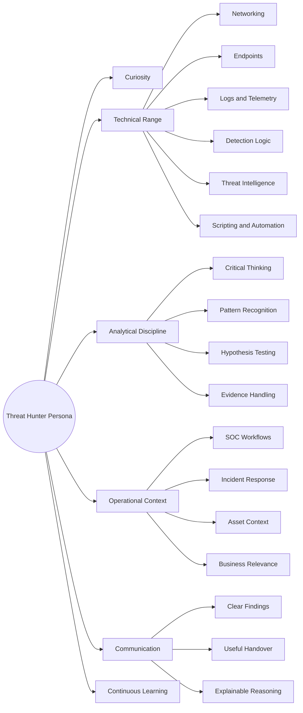

**Author:** *Roger C.B. Johnsen*

## Introduction

**A threat hunter is not a superhero profile. It is not a job title that automatically appears after a few years in a SOC. It is a combination of curiosity, technical range, analytical discipline and enough operational experience to know when the data does not support the story.**

**Many threat hunters come from SOC, incident response, digital forensics, threat intelligence, penetration testing, systems administration or development. The background matters less than the ability to ask good questions, understand systems, test assumptions and explain the result clearly.**

That is the persona this chapter is about.

I do not see the threat hunter as someone who sits above the SOC. A good hunter should make the SOC better. The work should improve detections, expose visibility gaps, produce better questions, and give analysts stronger context for future investigations.

Threat hunting is not only about technical skill. It is also about judgement.

---

## Mapping the Persona

A colleague once described the relationship between penetration testing and threat hunting in a way that stuck with me:

> A penetration tester and a threat hunter may share the same fascination for finding weaknesses. The penetration tester probes systems directly. The threat hunter studies the traces, behaviours and assumptions that may reveal what has already happened, or what the environment would fail to see.
>
> -- Paraphrased from a discussion with a colleague

That comparison is useful, but it should not be taken too far.

A threat hunter does not need to be a penetration tester. A hunter does not need to be a malware reverser, forensic examiner, detection engineer, SOC analyst and intelligence analyst at the same time.

But the role does benefit from range.

A threat hunter should understand enough across several domains to ask better questions and know when to involve someone else.

```mermaid
flowchart LR
  A((Threat Hunter Persona))

  A --> B[Curiosity]
  A --> C[Technical Range]
  A --> D[Analytical Discipline]
  A --> E[Operational Context]
  A --> F[Communication]
  A --> G[Continuous Learning]

  C --> C1[Networking]
  C --> C2[Endpoints]
  C --> C3[Logs and Telemetry]
  C --> C4[Detection Logic]
  C --> C5[Threat Intelligence]
  C --> C6[Scripting and Automation]

  D --> D1[Critical Thinking]
  D --> D2[Pattern Recognition]
  D --> D3[Hypothesis Testing]
  D --> D4[Evidence Handling]

  E --> E1[SOC Workflows]
  E --> E2[Incident Response]
  E --> E3[Asset Context]
  E --> E4[Business Relevance]

  F --> F1[Clear Findings]
  F --> F2[Useful Handover]
  F --> F3[Explainable Reasoning]
```

This diagram is not a certification path. It is a way of describing the mix of qualities that make threat hunting useful in practice.

## Curiosity

Curiosity is the starting point. A threat hunter should want to understand how systems work, why something behaves the way it does, and what might be missing from the current view. This is not the same as casually following cybersecurity news or collecting tools. It is a deeper interest in systems, behaviour, evidence and failure modes.

Useful curiosity sounds like this:

* Why does this process normally run this way?
* Why does this account behave differently from similar accounts?
* Why is this log source missing from these systems?
* Why does this detection catch the symptom but not the behaviour?
* What would we expect to see if this hypothesis were true?
* What would we expect to see if it were false?

That kind of curiosity is practical. It turns uncertainty into questions that can be tested.

Curiosity without structure becomes wandering. Structure without curiosity becomes checklist work. Threat hunting needs both.

## Background and Education

There is no single educational path into threat hunting. Some hunters come from university. Some come from military or government environments. Some come from SOC operations. Some come from systems administration, development, network engineering, forensics, intelligence or offensive security. Some are largely self-taught.

That variety is not a weakness. It is one of the strengths of the field.

Threat hunting benefits from people who have seen systems from different angles. A former sysadmin may understand normal operational weirdness better than a pure security specialist. A former incident responder may understand attacker behaviour and containment pressure. A developer may read scripts and automation more naturally. A SOC analyst may understand alert fatigue, triage reality and detection limitations.

Formal education can be useful, especially when it builds technical and analytical foundations. Relevant areas include:

* networking
* operating systems
* security monitoring
* digital forensics
* incident response
* programming and scripting
* data analysis
* statistics
* malware analysis
* threat intelligence
* cloud security
* identity and access management

But education is not enough on its own. A degree may give a person useful foundations, but it does not automatically make them a hunter. Certifications may show effort and direction, but they do not replace evidence handling, operational judgement or the ability to reason through messy data.

## Practical Training

Threat hunting is learned by doing. Reading about hunting helps, but the skill develops when the analyst works with data, forms hypotheses, writes queries, checks assumptions, documents findings and gets things wrong in useful ways.

Practical training may come from many places:

* SOC work
* incident response cases
* internal investigations
* lab environments
* CTFs
* detection engineering work
* malware or log analysis exercises
* platforms such as TryHackMe and Hack The Box
* SANS Holiday Hack Challenge and similar practical events
* personal projects
* mentoring and peer review

The important part is not the logo on the training platform. The important part is whether the activity forces the analyst to think, test, explain and improve. A good lab teaches more than tool usage. It teaches what evidence looks like, what missing evidence feels like, and how easily a confident conclusion can be wrong.

## Continuous Learning

Threat hunting requires continuous learning because environments change. Attack techniques change. Logging platforms change. Cloud services change. Endpoint products change. Identity systems change. Business systems change. Even normal behaviour changes. AI-assisted tooling will change parts of the work, but not the need for judgement.

> A hunter who only understands last year’s environment will eventually start asking weak questions.
>
> -- Roger Johnsen

Continuous learning does not mean chasing every trend. It means maintaining enough technical and operational awareness to keep asking relevant questions.

Useful learning habits include:

* reading incident reports
* following DFIR write-ups
* studying detection logic
* reviewing attacker techniques
* testing ideas in labs
* reading product documentation
* learning from SOC analysts and responders
* revisiting old assumptions when the environment changes

The goal is not to know everything. The goal is to remain useful when the terrain moves.

## Technical Range

A threat hunter needs technical range, not technical omniscience. The hunter does not need to be the best person in every domain, but they need enough understanding to reason across domains and ask for help intelligently.

| Area                     | Why it matters                                                                                                                     |
| ------------------------ | ---------------------------------------------------------------------------------------------------------------------------------- |
| Networking               | Many behaviours only make sense when the analyst understands protocols, flows, DNS, proxy data and unusual communication patterns. |
| Endpoints                | Process execution, parent-child relationships, file activity, persistence and command-line behaviour are central to many hunts.    |
| Logs and telemetry       | Hunting depends on knowing what data exists, what fields mean, and where collection gaps may distort the picture.                  |
| Detection logic          | A hunter should understand how detections are written, tuned, tested and handed over to operations.                                |
| Threat intelligence      | Intelligence can shape hypotheses, but it must be translated into behaviour that can be tested locally.                            |
| Scripting and automation | Scripting helps with enrichment, parsing, repeatable analysis and reducing manual work.                                            |
| Forensics                | Forensic thinking helps the hunter understand traces, timelines, artefacts and evidentiary limits.                                 |
| Cloud and identity       | Modern environments often centre on identity, SaaS, cloud control planes and audit logs.                                           |
| Malware and tradecraft   | Understanding attacker tooling and behaviour helps the hunter recognise suspicious patterns without relying only on IOCs.          |

This range matters because hunts often cross boundaries. An authentication anomaly may involve identity, endpoint, network, cloud logs and user behaviour. A suspicious PowerShell event may require understanding Windows internals, command-line behaviour, parent processes, EDR telemetry and detection logic.

The hunter does not need to solve every part alone. But they should have enough range to recognise when a problem needs deeper analysis. That includes enough basic malware reverse engineering to extract useful indicators, understand suspicious behaviour, and know when the work should be handed to someone with deeper reversing expertise.

## Analytical Discipline

Technical range without analytical discipline is dangerous. A hunter may find something rare, strange or interesting. That does not make it malicious. Analytical discipline means slowing down enough to test the conclusion.

A threat hunter should ask:

* What is the hypothesis?
* What data supports it?
* What data contradicts it?
* Is this rare, or just unfamiliar to me?
* Is the field populated consistently?
* Is the query logic sound?
* Could this be normal administrative activity?
* What would I expect to see next if this were malicious?
* What would change my mind?

This is where the persona becomes more than curiosity. A useful hunter can tolerate uncertainty without rushing to a dramatic conclusion. They can say “this is suspicious, but not proven”. They can document limitations. They can separate evidence from interpretation.

That is not hesitation. That is quality control.

## Communication

Threat hunting output must be understandable to other people. A hunter may do excellent analysis, but if the result cannot be used by the SOC, detection engineers, incident responders or system owners, the value is limited.

Good communication means explaining:

* what was tested
* why it was tested
* what data was used
* what was observed
* what the observation means
* what remains uncertain
* what should happen next

The audience matters.

A SOC analyst may need triage guidance. A detection engineer may need behaviour and logic. An incident responder may need scope and evidence. A manager may need risk and decision points. A system owner may need a clear action.

A threat hunter who cannot communicate clearly will struggle to turn findings into security improvement.

## Collaboration

Threat hunting is often presented as individual expert work. In reality, it depends heavily on collaboration.

The hunter may need:

* SOC analysts to explain alert patterns
* detection engineers to operationalise logic
* incident responders to handle confirmed compromise
* platform teams to fix logging or telemetry gaps
* threat intelligence analysts to provide adversary context
* system owners to explain normal behaviour
* vulnerability teams to connect exposure and exploitation paths

This is why the threat hunter persona should not be built around ego. A hunter who treats the SOC as beneath them will produce friction. A hunter who treats detection engineering as an afterthought will produce weak handovers. A hunter who ignores system owners will misunderstand normal operations.

Good hunting improves the work around it.

## What Usually Goes Wrong

The threat hunter persona is often misunderstood.

Some patterns repeat:

* **The hero hunter:** the hunter is treated as an elite individual who sits above the SOC instead of improving it.
* **The tool operator:** the hunter becomes the person who uses the “hunt” tab in a product.
* **The IOC searcher:** the hunter mostly searches for known indicators and calls it proactive investigation.
* **The query collector:** the hunter writes clever queries but does not turn the output into findings, detections, documentation or better questions.
* **The red-team tourist:** the hunter borrows offensive language but does not understand the environment well enough to test real assumptions.
* **The silent analyst:** the hunter finds useful things but cannot explain them clearly enough for others to act.

None of these are good models for the role. Threat hunting needs people who can think, test, explain and improve.

## Working Position for This Book

The threat hunter persona is not a fixed personality type. It is a working combination of curiosity, technical range, analytical discipline, operational context and communication.

A hunter does not need to know everything. They do need to know how to ask better questions, how to test assumptions, how to handle uncertainty and how to turn observations into useful security work.

For the rest of this book, this matters because threat hunting should not become identity work. It should not be about who gets to call themselves a hunter. It should be about the quality of the work.

Or as I usually put it:

> A threat hunter is not defined by the title. A threat hunter is defined by the quality of the questions they ask and what their work leaves behind.
>
> -- Roger Johnsen

The next chapter, **From Alerts to Hypotheses**, continues this line of thought. It shows how the hunter’s mindset turns into method: how curiosity becomes process, and how experience evolves into structured exploration.

## Resources

These are some of the resources I have used for this chapter.

* [OffSec - What is a Threat Hunter?](https://www.offsec.com/cybersecurity-roles/threat-hunter)
* [WGU - What Is a Threat Hunter?](https://www.wgu.edu/career-guide/information-technology/threat-hunter-career.html)
* [LetsDefend.io - How to Become a Threat Hunter](https://letsdefend.io/blog/how-to-become-a-threat-hunter)
* [Three Key Aspects of Being a Threat Hunter](https://blogs.opentext.com/three-key-aspects-of-being-a-threat-hunter/)
* [CompTIA - Your Next Move: Threat Hunter](https://www.comptia.org/blog/your-next-move-threat-hunter)
* [SnapAttack - How to Become a Cyber Threat Hunter](https://www.snapattack.com/become-a-threat-hunter/)
* [CyberSN - Threat Hunter](https://cybersn.com/role/threat-hunter/)

## Revision

| Revised Date | Comment                                                                                                     |
| ------------ | ----------------------------------------------------------------------------------------------------------- |
| 2026-07-09   | Rewritten to establish a clearer practitioner voice and align the page with the book’s fundamentals section |
| 2025-10-28   | Updated page with reference to next chapter                                                                 |
| 01-01-2025   | Added page                                                                                                  |
