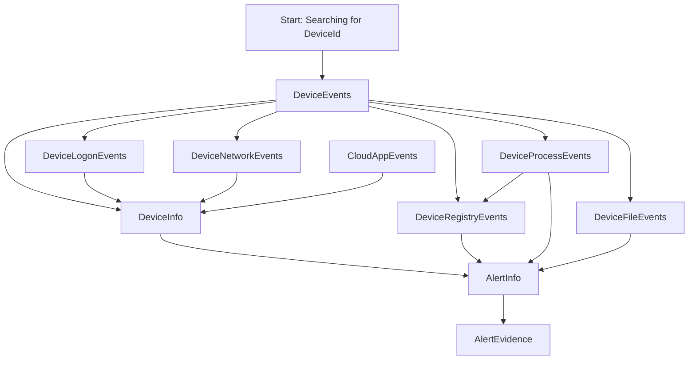
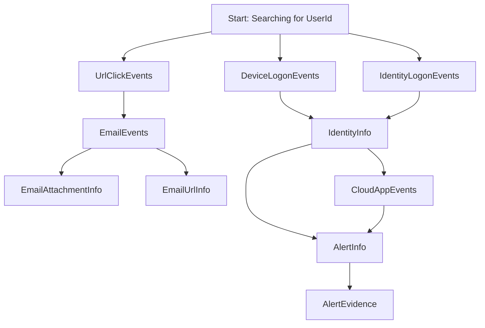

|Revised Date | Author | Comment |
| ----------- | ------ | ------- |
| 21.03.2025  | Roger Johnsen | Article added |

## Introduction

**For threat hunters, having a comprehensive understanding of these tables is crucial to identifying, investigating, and mitigating potential security threats. Each table in Microsoft Defender Advanced Hunting provides unique insights into various aspects of an organization's environment—such as device activity, user behavior, network connections, and email threats. By correlating data across these tables, threat hunters can uncover patterns, detect anomalies, and trace the pathways of potential attacks. This approach enables proactive threat detection and enhances the ability to respond effectively to incidents, ensuring the security and integrity of the organization's systems and data.**

---

| **Table Name**       | **Description**                      | **Purpose**                                               | **Key Columns (Focus)**                                 | **Threat Hunting Use Cases**                                | **MITRE ATT&CK Techniques**                                 |
|-----------------------|--------------------------------------|----------------------------------------------------------|--------------------------------------------------------|-------------------------------------------------------------|------------------------------------------------------------|
| `DeviceEvents`        | General device activity             | Centralized repository for device-related events like file, process, network, and registry changes | `Timestamp`, `DeviceId`, `ActionType`, `FileName`, `SHA256` | Investigating process executions, file modifications, anomalies | [T1003 (Credential Dumping)](https://attack.mitre.org/techniques/T1003/), [T1082 (System Discovery)](https://attack.mitre.org/techniques/T1082/)       |
| `DeviceInfo`          | Device information and context      | Provides essential device metadata to contextualize events | `DeviceId`, `DeviceName`, `Domain`, `OSPlatform`, `LastSeen` | Identifying vulnerable systems, tracking device behavior     | [T1202 (Indicator Removal on Host)](https://attack.mitre.org/techniques/T1202/), [T1016 (System Network Configuration Discovery)](https://attack.mitre.org/techniques/T1016/) |
| `DeviceLogonEvents`   | Logon/logoff events on devices      | Tracks authentication activity to detect unauthorized access | `Timestamp`, `DeviceId`, `AccountName`, `IPAddress`    | Detecting lateral movement, credential theft                | [T1078 (Valid Accounts)](https://attack.mitre.org/techniques/T1078/), [T1566 (Phishing)](https://attack.mitre.org/techniques/T1566/)                   |
| `DeviceProcessEvents` | Process creation/termination events | Logs details of processes to trace malware or anomalies    | `Timestamp`, `ProcessId`, `ProcessCommandLine`, `FileName` | Identifying malicious processes, suspicious behavior         | [T1059 (Command and Scripting Interpreter)](https://attack.mitre.org/techniques/T1059/), [T1086 (PowerShell)](https://attack.mitre.org/techniques/T1086/) |
| `DeviceFileEvents`    | File-related events                 | Monitors file modifications to identify suspicious actions | `Timestamp`, `DeviceId`, `FileName`, `ActionType`, `SHA256` | Detecting ransomware activity, data exfiltration            | [T1486 (Data Encrypted for Impact)](https://attack.mitre.org/techniques/T1486/), [T1027 (Obfuscated Files or Information)](https://attack.mitre.org/techniques/T1027/) |
| `DeviceNetworkEvents` | Network connections                 | Logs network activity to spot anomalies or threats         | `Timestamp`, `RemoteIP`, `RemotePort`, `LocalIP`       | Command-and-control detection, unusual network traffic      | [T1071 (Application Layer Protocol)](https://attack.mitre.org/techniques/T1071/), [T1105 (Ingress Tool Transfer)](https://attack.mitre.org/techniques/T1105/) |
| `DeviceRegistryEvents`| Registry modifications              | Tracks changes to registry keys to detect persistence techniques | `Timestamp`, `RegistryKey`, `ActionType`, `ValueData`  | Persistence mechanisms, malware configuration changes        | [T1547 (Boot or Logon Autostart Execution)](https://attack.mitre.org/techniques/T1547/), [T1112 (Modify Registry)](https://attack.mitre.org/techniques/T1112/) |
| `EmailEvents`         | Email-related threats               | Analyzes email metadata for suspicious activities           | `Timestamp`, `SenderFromAddress`, `RecipientEmailAddress` | Phishing campaigns, malware delivery                        | [T1566 (Phishing)](https://attack.mitre.org/techniques/T1566/), [T1189 (Drive-by Compromise)](https://attack.mitre.org/techniques/T1189/)              |
| `EmailAttachmentInfo` | Email attachment details            | Contains attachment metadata for email threat analysis      | `Timestamp`, `FileName`, `FileSize`, `SHA256`          | Identifying malicious attachments                            | [T1204 (User Execution)](https://attack.mitre.org/techniques/T1204/), [T1036 (Masquerading)](https://attack.mitre.org/techniques/T1036/)               |
| `EmailUrlInfo`        | URLs in emails                      | Tracks and evaluates URLs found within email messages       | `Timestamp`, `Url`, `NetworkMessageId`                 | Tracking phishing URLs, anomalous behavior                  | [T1566 (Phishing)](https://attack.mitre.org/techniques/T1566/), [T1204 (User Execution)](https://attack.mitre.org/techniques/T1204/)                   |
| `UrlClickEvents`      | User interactions with URLs         | Monitors user clicks on URLs for risk assessment           | `Timestamp`, `Url`, `ClickAction`, `AccountName`       | Tracking malicious URL clicks                              | [T1566 (Phishing)](https://attack.mitre.org/techniques/T1566/), [T1189 (Drive-by Compromise)](https://attack.mitre.org/techniques/T1189/)              |
| `CloudAppEvents`      | Cloud application activity          | Tracks interactions with cloud services for threat detection | `Timestamp`, `Application`, `ActionType`, `IPAddress`  | Investigating cloud access anomalies                        | [T1078 (Valid Accounts)](https://attack.mitre.org/techniques/T1078/), [T1082 (System Discovery)](https://attack.mitre.org/techniques/T1082/)           |
| `IdentityLogonEvents` | Identity logon events               | Provides insights into user authentication activity         | `Timestamp`, `AccountName`, `IPAddress`, `LogonType`   | Compromised accounts, MFA bypass detection                  | [T1078 (Valid Accounts)](https://attack.mitre.org/techniques/T1078/), [T1530 (Data from Cloud Storage Object)](https://attack.mitre.org/techniques/T1530/) |
| `IdentityInfo`        | Identity-related information        | Consolidates user identity information for correlation      | `AccountSid`, `AccountName`, `Domain`, `ObjectId`      | Enriching investigations with user context                  | [T1087 (Account Discovery)](https://attack.mitre.org/techniques/T1087/), [T1580 (Cloud Infrastructure Discovery)](https://attack.mitre.org/techniques/T1580/) |
| `AlertInfo`           | Security alert details              | Serves as a summary of triggered security alerts            | `Timestamp`, `AlertId`, `Title`, `Severity`            | Investigating and prioritizing security incidents           | [T1518 (Software Discovery)](https://attack.mitre.org/techniques/T1518/), [T1135 (Network Share Discovery)](https://attack.mitre.org/techniques/T1135/) |
| `AlertEvidence`       | Evidence related to alerts          | Provides specific data supporting the context of alerts     | `Timestamp`, `AlertId`, `EntityType`, `FileName`       | Understanding the scope and impact of alerts               | Varies depending on alert type                             |
| `ExternalData`        | External threat intelligence data   | Enables integration of external threat data for correlation | `Depends on source`                                    | Enriching hunting with threat intelligence feeds             | Custom, based on external data source                      |

## On pivoting

There are many tables in Defender and it is possible to pivoting between the tables. In threat hunting, "pivoting" refers to the process of using a specific piece of information or data point, such as a `DeviceId`, `UserId`, or `FileHash`, to navigate across different data sources or tables. The goal is to correlate events and uncover related details that might help in tracking down a threat. 

For example, if you discover a suspicious process on a device, you can use the `DeviceId` to "pivot" to other tables, like `DeviceNetworkEvents` to check for unusual network activity or `DeviceLogonEvents` to see if unauthorized access occurred on that same device. It’s like following breadcrumbs across a connected web of data to piece together the story of how a threat might have unfolded. 

Think of it as a detective chasing leads to unravel the bigger picture—it’s a cornerstone of effective threat hunting!

For instance, say you have a `DeviceId`. Armed with this id you can basically take any table in the graph below and move between the other tables depicted:

Similarly, you can do the same using, say, the UserID:

These are just two examples, think of all the possibilities that opens up when you start joining resultsets on other pivotpoints to connect data! 