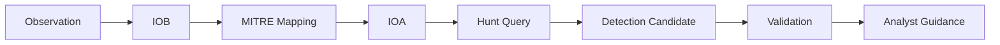
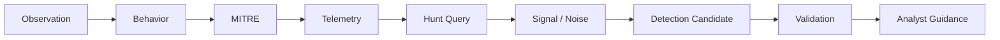

__Author:__ _Roger C.B. Johnsen_

## Introduction

**There are findings in threat hunting that most organizations treat as the end of the investigation. A suspicious process. An unusual command line. A strange authentication pattern. A tool found on disk. The list goes on. The case gets scoped, the immediate risk is handled and everyone moves on.**

**But for a threat hunter, a finding should not only answer what happened. It should create a better question: how would we find this again?**

**That question is where threat hunting starts to overlap with detection engineering. Detection engineering is not just writing rules. It is the process of turning behavior, telemetry and context into something an analyst can act on. Threat hunters are useful in that process because they often see suspicious behavior before it becomes mature detection logic.**

{}
The information in this article is also relevant for SOC analysts.
{} 

---

## Why Threat Hunters Matter to Detection Engineering

Threat hunters work close to the raw investigation process. They look at process trees, command lines, authentication flows, network connections, file activity, registry changes, named pipes, remote services, cloud events, and whatever else the investigation requires. They move between data sources. They pivot. They compare. They ask whether the data supports the hypothesis or whether the hypothesis needs to change. This gives hunters a practical view of how suspicious behavior appears in telemetry.

A threat hunter can say:

```text
This behavior appears as an executable in a user-writable location launched by explorer.exe, followed by an outbound connection to an uncommon domain and a file write in the user's temp directory.
```

That is much more useful than:

```text
Suspicious executable observed.
```

The first version describes behavior. The second version describes a feeling. Detection engineering needs behavior.

---

## From Observation to Behavior

A raw observation is rarely enough. The starting point is not what the attacker happened to use. The starting point is what the attacker had to do.

Consider this:

```text
powershell.exe executed on a workstation
```

That may or may not matter. PowerShell is common in many environments.

Now add context:

```text
powershell.exe was launched by winword.exe
```

That is more interesting. A Microsoft Office process spawning PowerShell is not something most users do during normal work.

Add command-line context:

```text
powershell.exe was launched by winword.exe with an encoded command line
```

Now the behavior is stronger. Add follow-on activity:

```text
powershell.exe was launched by winword.exe with an encoded command line, wrote a file to a user-writable path, and initiated outbound network communication shortly after execution
```

Now we have something that begins to look like detection engineering material. The observation has become behavior. The goal is not only to collect interesting facts. The goal is to describe what happened in a way that can be tested, searched for, and potentially detected again.

---

## IOC, IOB and IOA

Threat hunters need to separate three related but different concepts.

> The term IOB is not as universally standardized as IOC or IOA, and some teams simply refer to this as behavioral indicators. I use it here as a 1 distinction: the behavior itself sits between the concrete artifact and the telemetry pattern used for detection.

| Type | Meaning                 | Detection Value                                                    |
| ---- | ----------------------- | ------------------------------------------------------------------ |
| IOC  | Indicator of Compromise | A concrete artifact observed in a case                             |
| IOB  | Indicator of Behavior   | What the actor or tool did                                         |
| IOA  | Indicator of Attack     | How that behavior appears in telemetry as attack-relevant activity |

An IOC might be:

```text
evil.exe
```

or:

```text
hxxps://example-c2-domain[.]com/payload.bin
```

or:

```text
SHA256: 4f2c...
```

These are useful for scoping and immediate response. They help answer questions like:

* Where else did this file appear?
* Did any other host connect to this domain?
* Has this hash been seen before?

IOCs are campaign artifacts, not attack logic. They are useful for scoping and rapid campaign detection, but they should not be confused with the behavior that made the attack possible. They are also fragile. The attacker can change the filename, hash, path, domain, infrastructure, or tool.

An IOB is more durable:

```text
Executable staging in a user-writable location followed by execution and outbound communication
```

This describes what happened without depending on one filename or one hash.

An IOA moves one step closer to detection logic:

```text
A process launched from a user-writable directory creates a new outbound network connection shortly after execution, where the executable has low prevalence in the environment.
```

This is much closer to something a detection engineer can work with.

The basic flow looks like this:

```text
Observation -> IOB -> MITRE Mapping -> IOA -> Hunt Query -> Detection Candidate
```

The goal is not to ignore IOCs. They are useful. But they should not be the only thing the hunter hands over.

---

## Keep IOC Rules Separate

IOCs should not be baked into the behavioral detection logic. A behavioral rule should detect the action. IOC rules can be added as a separate safety net for known campaign artifacts such as IP addresses, domains, hashes, usernames, or user-agent strings. This keeps the behavioral rule durable. It also allows campaign-specific IOC rules to be added, tuned, or removed without weakening the core detection. The behavioral rule should still make sense the day the attacker changes infrastructure, filenames, accounts, or tools.

---

## MITRE Is Classification, Not Detection Logic

MITRE ATT&CK is useful. It gives us a shared language for adversary behavior. But MITRE is not detection logic. If a hunter maps an observation to `T1105 - Ingress Tool Transfer`, that tells us what class of behavior we are dealing with. It does not tell us exactly what to detect.

Tool transfer can appear in many ways:

* Browser download to a user-writable directory
* PowerShell download cradle
* `curl` or `wget` execution
* `certutil` used to retrieve a remote file
* Archive download followed by extraction
* External network connection followed by file creation
* Remote share copy
* Cloud storage download
* BITS job creation

All of these may map to the same technique, but they do not produce identical telemetry. That is why the MITRE mapping is not the end of the work. It is a classification step.

The detection work starts when the hunter asks:

```text
How does this behavior appear in our data?
```

---

## From IOB to IOA

The practical value of the IOB -> IOA transition is that it forces the hunter to translate behavior into telemetry.

A simple example:

| Step                | Example                                                                                                                  | Purpose                                                            |
| ------------------- | ------------------------------------------------------------------------------------------------------------------------ | ------------------------------------------------------------------ |
| Observation         | `winword.exe` launched `powershell.exe`                                                                                  | A concrete event observed in telemetry                             |
| IOB                 | User-facing application spawned a scripting interpreter                                                                  | Describes the behavior without depending on one exact process pair |
| MITRE mapping       | Command and Scripting Interpreter, User Execution, and possibly Phishing if document or email context exists             | Classifies the behavior using a shared language                    |
| IOA                 | Office process spawning a scripting interpreter with suspicious command-line arguments                                   | Describes how the behavior appears as attack-relevant telemetry    |
| Hunt query          | Search process events for Office parent processes launching PowerShell, CMD, WScript, CScript, or MSHTA                  | Turns the behavior into something the hunter can search for        |
| Detection candidate | Alert on Office-to-scripting-interpreter chains with suspicious command-line patterns or follow-on network/file activity | Turns the hunting logic into a candidate for operational detection |

This is where threat hunters contribute directly. A detection engineer may write the final production logic, but the hunter often understands the behavior, the investigative context, and the weak signals that made the activity suspicious in the first place.

The handover should preserve that thinking.

---

## The Detection Contribution Flow

The work usually follows a pattern:



The exact order may vary in real investigations. Sometimes the hunter starts with a MITRE technique. Sometimes the starting point is a SOC alert, a malware sample, a red team observation, or a strange process chain. The value of the model is not that every hunt must follow it perfectly. The value is that it forces the hunter to move from isolated facts toward reusable detection knowledge.

---

## Hunt Query vs Detection Rule

A hunt query and a detection rule are not the same thing. This is one of the most common mistakes in detection work. Someone writes a useful hunt query, sees that it finds interesting things, and wants to turn it directly into an alert. Sometimes that works. Often it does not.

* A **hunt query** is exploratory. It can be broad, noisy, interactive, and interpretation-heavy. It helps a human think.
* A **detection rule** is operational. It runs continuously, enters the SOC queue, consumes analyst time, and must support triage. It needs enough precision and context to help an analyst make a decision.
* A hunt query can change quickly. A detection rule must be maintained.
* A good hunt query can still be a bad alert.

That does not make the query bad. It means more engineering is needed before it becomes production detection logic.

> A note from the field: different SIEMs and detection platforms have their own quirks and limitations. A detection rule may not support elaborate joins, long lookback windows, complex sequence logic, or heavy statistical operations. What works as a hunt query may need to be simplified, split into multiple rules, or moved into a different detection layer before it can run reliably in production.

---

## Noise as Information

Noise is not only false positives. In threat hunting, noise also refers to the natural disorder found in telemetry from a real environment. Endpoints execute thousands of processes. Users authenticate, fail, retry, browse, download, copy, mount shares, launch scripts, and trigger background tasks. Servers talk to other servers. Management tools perform legitimate administrative actions. Security tools scan, enrich, block, quarantine, and report. Business systems behave differently across teams, locations, and time.

* To a SOC analyst working an alert queue, much of this may appear as noise.
* To a threat hunter, it is raw material.

The goal is not always to remove noise. The goal is to understand what the noise represents, how it behaves, and whether patterns emerge when the data is viewed from another angle.

There are two useful forms of noise to separate:

* **Environmental noise** tells you how the environment actually behaves.
* **Alert noise** tells you how detection logic behaves inside that environment.

Environmental noise shows you admin behavior, developer behavior, software deployment, security tooling, business applications, service accounts, background jobs, retries, failures, and all the other activity that makes the environment messy.

Alert noise shows you what happens when detection logic meets reality. It may reveal that a rule is too broad, that severity is wrong, that analyst guidance is weak, that enrichment is missing, or that normal activity differs from the assumptions behind the detection.

A noisy alert is not automatically useless. It may be an unfinished detection, a poorly contextualized detection, or a correct detection deployed into an environment we do not yet understand.

A SOC analyst may say:

```text
This alert is noisy.
```

A threat hunter should ask:

```text
Why is it noisy?
```

That question can lead to better detection design. Maybe the alert should suppress known admin tooling. Maybe it should split workstation behavior from server behavior. Maybe it should enrich with device role, user role, parent process, signer, prevalence, execution path, or follow-on network activity. Maybe it should be downgraded in one context and upgraded in another.

Noise becomes information when the analyst changes the question!

---

## False Positives as Design Feedback

False positives are part of alert noise, but they should not only be counted. They should be classified. A false positive can tell you something important about the detection, the telemetry, or the environment.

| What the false positive tells you                                    | What it may mean                                                                                 |
| -------------------------------------------------------------------- | ------------------------------------------------------------------------------------------------ |
| The detection assumes something that is not true in the environment  | The rule was built on an incorrect assumption about normal behavior                              |
| The query logic is too broad                                         | The detection matches too many generic patterns                                                  |
| The data source lacks needed context                                 | Additional telemetry or enrichment is required                                                   |
| The detection needs enrichment                                       | Fields such as device role, user role, signer, path, prevalence, or parent process may be needed |
| The behavior is common for a specific team, tool, or system          | The detection may need scoped logic or environment-specific tuning                               |
| The detection should be split into variants                          | One rule may be trying to cover too many different behaviors                                     |
| The severity is too high                                             | The detection may be useful, but not as urgent as originally assumed                             |
| The triage guidance is unclear                                       | Analysts do not have enough information to make a decision                                       |
| The rule catches benign behavior that resembles adversary tradecraft | The behavior may still be worth tracking, but it needs better context                            |

Useful false positive categories include:

| Category                | Example                                                                                   | Detection lesson                                                       |
| ----------------------- | ----------------------------------------------------------------------------------------- | ---------------------------------------------------------------------- |
| Expected admin behavior | Remote execution from a known admin platform                                              | Suppress, scope, or enrich with known administrative tooling           |
| Business process        | An application legitimately performs unusual file operations                              | Understand the business workflow before tuning the rule                |
| Developer behavior      | Build tools, scripts, and test frameworks trigger suspicious patterns                     | Separate developer workstations or build systems from normal endpoints |
| Security tooling        | EDR, vulnerability scanners, deployment systems, or testing tools mimic attacker behavior | Identify and tag trusted security tooling                              |
| Weak query logic        | The rule matches too many generic command-line patterns                                   | Tighten the logic or add additional behavioral conditions              |
| Missing context         | The alert lacks device role, user role, signer, path, prevalence, or other enrichment     | Improve enrichment before promoting the rule                           |
| Bad assumption          | The behavior was assumed rare, but is normal in the environment                           | Revisit the hypothesis behind the detection                            |

A false positive is only wasted if nobody learns from it.

---

### Practical Example - Office Spawning PowerShell

Let us walk through a simple example:

A common suspicious pattern is a Microsoft Office process launching a scripting interpreter. On its own, this is not enough to prove malicious activity. Office automation, legacy macros, business workflows, and security testing can all create similar behavior.

But it is still a useful starting point because the behavior is meaningful.

### Starting Observation

The starting observation:

```text
winword.exe launched powershell.exe
```

This observation tells us that a user-facing application spawned a scripting interpreter. That is the first important step. We are no longer looking only at a process name. We are looking at a relationship between processes.

### Turning the Observation into Behavior

The behavior can be described more generally:

```text
User-facing application spawned a scripting interpreter.
```

This is an IOB. It describes what happened without depending on the exact process names.

The specific observation was `winword.exe` launching `powershell.exe`, but the broader behavior may also include other Office applications launching scripting or execution tools such as:

* `cmd.exe`
* `powershell.exe`
* `pwsh.exe`
* `wscript.exe`
* `cscript.exe`
* `mshta.exe`

This makes the hunt more durable. We are not only searching for one executable pair. We are searching for a class of suspicious behavior.

### MITRE Mapping

Possible mappings include:

| Technique                                     | Why it may apply                                              | Evidence needed                                                                    |
| --------------------------------------------- | ------------------------------------------------------------- | ---------------------------------------------------------------------------------- |
| T1059 - Command and Scripting Interpreter | PowerShell is a command and scripting interpreter             | `powershell.exe`, `pwsh.exe`, `cmd.exe`, or similar interpreter execution          |
| T1204 - User Execution                    | The behavior may have started when the user opened a document | Evidence that the user opened or interacted with the file                          |
| T1566 - Phishing                          | The document may have been delivered through email            | Email delivery, attachment metadata, sender context, or URL evidence               |
| T1105 - Ingress Tool Transfer             | The command may have downloaded a payload                     | Network connection, download command, file creation, or external transfer evidence |

The mapping depends on the full context. Do not force a technique if the evidence is not there. MITRE helps classify the behavior. It does not replace the investigation.

### From Behavior to IOA

The IOA describes how the behavior appears in telemetry as attack-relevant activity.  A simple IOA could be:

```text
Office application spawned a scripting interpreter with suspicious command-line arguments.
```

A stronger IOA would include follow-on activity:

```text
Office application spawned a scripting interpreter with suspicious command-line arguments, followed by file creation in a user-writable directory and outbound network communication.
```

The second version is stronger because it describes a sequence. It connects execution, staging, and communication. That sequence is more useful for detection engineering than the original observation alone.

### Example Hunt Query

```sql
DeviceProcessEvents
| where InitiatingProcessFileName in~ ("winword.exe", "excel.exe", "powerpnt.exe", "outlook.exe")
| where FileName in~ ("powershell.exe", "pwsh.exe", "cmd.exe", "wscript.exe", "cscript.exe", "mshta.exe")
| project
    Timestamp,
    DeviceName,
    InitiatingProcessFileName,
    InitiatingProcessCommandLine,
    FileName,
    ProcessCommandLine,
    AccountName,
    ReportId
| order by Timestamp desc
```

This query is useful for hunting. It is not automatically a production detection.

### Detection Candidate

A production detection may need more context before it is useful for the SOC. Useful additions could include:

* Suspicious command-line arguments
* Encoded commands
* Download-related keywords
* User-writable execution paths
* Low-prevalence child processes
* Follow-on network activity
* Follow-on file creation
* Exclusion of known business macros or management tooling

The detection candidate should focus on the behavior, not only the executable names. A better detection candidate could be described as:

```text
Alert when an Office application launches a scripting interpreter with suspicious command-line characteristics, especially when followed by file creation in a user-writable directory or outbound network communication.
```

### Expected False Positives

Potential benign sources include:

* Internal Office automation
* Legacy macros
* Document management systems
* Security testing
* Admin-created scripts
* Business workflows using Office as a launcher

These false positives are not just noise. They are design feedback. They tell us what context the rule needs before it can become useful detection logic.

### Analyst Guidance

When this alert fires, the analyst should check:

* Which document was opened?
* Where did the document come from?
* Was it email-delivered?
* What command line was executed?
* Was the command encoded or obfuscated?
* Did the process write files?
* Did it connect externally?
* Did it spawn additional processes?
* Is the behavior known for this user or device?
* Did similar behavior occur elsewhere?

The value is not only in the alert. The value is in the investigation path the alert creates.

---

## Detection-Ready Handover

When a threat hunter finds something that may become a detection, the handover should not be limited to a query. A query without explanation is fragile. The next person may not understand why it exists, what it is supposed to find, what it misses, or when it becomes misleading.

A useful detection handover should include:

```markdown
## Behavior

What happened?

## Why It Matters

Why could this represent adversary activity?

## MITRE Mapping

Which ATT&CK technique or sub-technique best describes the behavior?

## Required Telemetry

Which logs, tables or sensors are needed?

## Example Hunt Query

How was the behavior found?

## Detection Candidate

What logic could be operationalized?

## Expected True Positives

What malicious or suspicious activity should this detect?

## Expected False Positives

What benign activity may look similar?

## Severity

How serious is it if the detection is true?

## Confidence

How reliable is the signal?

## Validation Method

How can we test that the detection works?

## Known Limitations

What will this detection miss?

## Analyst Triage Guidance

What should the SOC analyst check first?

## Suggested Response Actions

What should happen if the alert is confirmed?
```

The goal is to make the finding detection-ready. Not production-ready. Detection-ready. The hunter does not always need to finish the production rule, but the hunter should provide enough behavioral and investigative context for detection engineering to continue the work.

---

## Where This Gets Difficult

This workflow is simple on paper and harder in real environments. Telemetry may be missing. Data quality may be poor. Some tables may not contain the fields needed to prove the behavior. Retention may be too short. Endpoint coverage may be uneven. Cloud, identity, network, and endpoint data may not line up cleanly.

Before proposing a detection, ask:

* Do we have the events needed to prove the behavior?
* Do the logs contain enough detail?
* Are timestamps precise enough for sequence correlation?
* Are fields parsed consistently?
* Can the behavior be separated from normal activity?

If the answer is no, the output may be a logging requirement, parser improvement, or telemetry improvement rather than a rule. There is also an operational trade-off. More context can make a detection better, but it can also make the logic harder to maintain. A detection that depends on too many joins, assumptions, or enrichment sources may become fragile.

When telemetry is missing, the output of the hunt may be a logging requirement rather than a detection rule. That is still a useful result. A hunter who can explain which data source is missing, why it matters, and what question it would answer has contributed to detection engineering.

If the IOA cannot be found in your own telemetry, that is a data gap, not an IOC problem. The answer is not to compensate with more indicator lists. The answer is to understand which telemetry is missing, why it matters, and whether the organization should collect it.

Threat hunters should therefore be honest about confidence and limitations. Sometimes the right output is not a production detection. Sometimes the right output is a hunt query, a telemetry gap, a logging requirement, a tuning recommendation, or a better triage guide.

That is still detection engineering value.

---

## What This Means for Threat Hunters

The work is not finished when the finding is explained. A threat hunter should be able to move from observation to behavior, from behavior to telemetry, and from telemetry to something the organization can search for, validate, and potentially detect again.

The pivot chain in summary:



That chain is the difference between a finding that stays in a case note and a finding that improves detection capability. For a threat hunter, the next question is often the most important one:

```text
How would we find this again?
```

## What This Means for SOC Analysts

SOC analysts should not treat an alert as truth. **An alert is a claim made by detection logic**. That claim may be strong, weak, precise, vague, well-contextualized, or misleading. The analyst's job is not only to read the alert name, but to understand what the detection actually observed. This distinction matters.

A detection may be named:

```text
BloodHound Activity Observed
```

But the underlying logic may not detect BloodHound itself. It may only detect a small fragment of activity that can be associated with BloodHound-style enumeration, such as SMB access, LDAP queries, or other directory-related behavior. That means the alert does not prove that BloodHound was used. It means the observed activity may be consistent with one part of BloodHound-like behavior, or with other legitimate or suspicious activity that uses similar protocols and access patterns.

For SOC analysts, the first questions should be:

* What did the detection actually match?
* Which fields, events, or conditions triggered the alert?
* Does the alert name overstate what the logic proves?
* What additional evidence would confirm or weaken the hypothesis?
* Is this a single weak signal, or part of a broader sequence?
* Does the observed activity make sense for this user, device, role, or system?
* Are there related process, authentication, network, directory, or file events?

This is where SOC analysis becomes more than alert handling. A good analyst separates the alert label from the evidence. The alert may point in the right direction, but the investigation must determine whether the direction is valid. Detection names should guide investigation. They should not replace it. A good SOC does not only close alerts. It tests the claim made by the alert, documents what was actually observed, and feeds that knowledge back into detection engineering.


---

## Resources

* [MITRE ATT&CK](https://attack.mitre.org/)
* [MITRE ATT&CK - T1059 Command and Scripting Interpreter](https://attack.mitre.org/techniques/T1059/)
* [MITRE ATT&CK - T1105 Ingress Tool Transfer](https://attack.mitre.org/techniques/T1105/)
* [Microsoft Defender Advanced Hunting](https://learn.microsoft.com/en-us/defender-xdr/advanced-hunting-overview)
* [Sigma Rule Specification](https://sigmahq.io/docs/basics/rules.html)
* [Atomic Red Team](https://atomicredteam.io/)

---

## Revision

| Revised Date | Author        | Comment       |
| ------------ | ------------- | ------------- |
| 28.06.2026   | Roger Johnsen | Article added |
